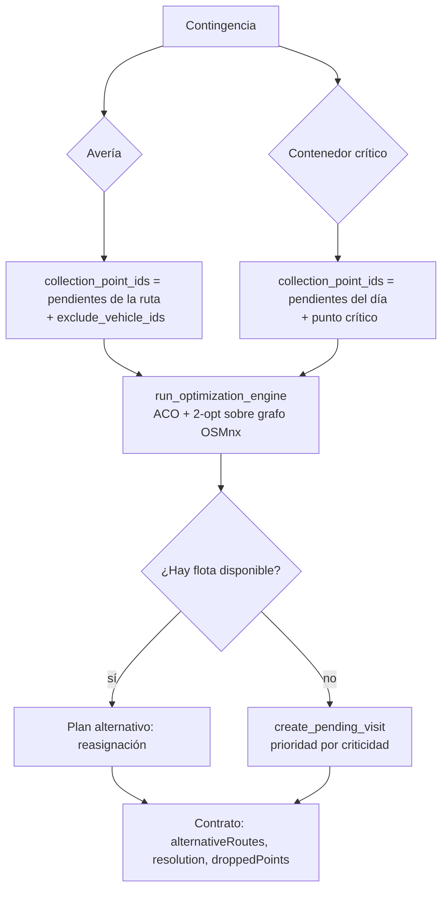

# ADR-003: Recuperación ante contingencias por re-optimización ACO localizada

| Campo | Valor |
|-------|-------|
| **Estado** | Aceptado |
| **Fecha** | 2026-09-11 |
| **Fase** | 0 — Contrato, ADR y red de seguridad |
| **Decisión** | Reutilizar el motor ACO sobre una instancia modificada (re-optimización localizada); alternativas de reinserción diferidas a post-grado |

## Contexto

El ciclo operativo ya cierra: **semana → plan ACO → contingencias → resultado real**. Cuando
ocurre una contingencia, el backend reejecuta el motor principal —ACO para CVRP
(`aco_vrp_osmnx`)— sobre una instancia modificada:

- **Avería de camión** (`services/contingency_service.py`, `_run_vehicle_breakdown`): toma las
  paradas **pendientes** de la ruta averiada, excluye ese vehículo y reoptimiza con el escenario
  `broken_vehicle`.
- **Contenedor crítico** (`services/operational_recalc_service.py`,
  `_run_critical_container_recalc`): toma los puntos **restantes del día** más el contenedor
  crítico y reoptimiza con el escenario `saturated` (forzado si el llenado ≥ 90 %).

Ambos comparten el motor (`optimization_service.run_optimization_engine`), que resuelve con
**ACO** (`_aco_cvrp` en `optimization_service.py`, `aco_parallel.py`) más **refinamiento 2-opt**
local, sobre el **grafo vial OSMnx**.

La pregunta de diseño es: **¿es el algoritmo correcto para el caso, o corresponde otro?**

El problema, en términos académicos, no es "reoptimizar un VRP":

| Caso | Naturaleza | Enfoque “de libro” |
|---|---|---|
| Avería de camión | *Dynamic VRP* / recuperación de disrupción: **reinserción** sobre rutas en curso | Reinsertar paradas liberadas con mínimo desvío |
| Contenedor crítico | **Inserción dinámica** de una parada urgente en un plan ya publicado | *Cheapest / regret insertion* |
| Sin flota disponible | **Decisión de servicio**: qué atender y qué postergar | Modelo de prioridad / penalización (SLA) |

El re-solve ACO **sí responde a la mecánica** (asigna las paradas liberadas a la flota
disponible), pero no es la formulación específica: no modela el estado comprometido de las rutas
existentes ni la estabilidad del plan. Este ADR fija la decisión para la defensa y delimita qué
queda como trabajo posterior.

## Decisión

**Reutilizar el motor ACO existente como re-optimización localizada**, sin introducir un segundo
motor de recuperación.

### Reglas

1. **Un solo solver.** No se añade un motor de recuperación separado: se reutiliza ACO + 2-opt.
2. **Aislamiento.** Solo se reoptimiza el subconjunto afectado (`collection_point_ids`), no la red
   completa del día.
3. **Dry-run seguro.** `simulate_*` corre con `auto_dispatch=False` y hace `rollback`; el flujo
   real (`handle_*`) confirma y notifica. La simulación guionada del día encadena eventos en una
   sola transacción y revierte todo (`day_simulation_service.build_day_simulation`). Para poder
   validar el plan **antes** de comprometerlo, el dry-run resuelve también rutas `pending`
   (`_resolve_route(..., allow_inactive=True)`); el flujo real exige `in_progress`.
4. **Contrato explícito.** La resolución se expone en el resultado (`resolution`:
   `reassigned` / `pending` / `no_change`), junto con `droppedPoints` y la geometría del plan
   alternativo (`alternativeRoutes`).
5. **Descarte con prioridad.** Cuando no hay flota, los puntos pasan a `PendingVisit` mediante
   `create_pending_visit`, cuya prioridad ya incorpora criticidad
   (`planning_service.compute_pending_priority`, `domain/criticality.py`).
6. **Prioridad de llenado en el solver.** Los recálculos de contingencia activan
   `priority_fill_level=True`, de modo que el ACO favorece contenedores críticos (≥ 80 %) y en
   riesgo de calendario cuando la flota es justa (boost de la heurística en
   `aco_parallel._pick_candidate`).
7. **KPIs comparables.** El «antes» es la distancia del **día completo** (rutas optimizadas
   vigentes del plan); el «después» de la avería es `antes − ruta averiada + recálculo`, de modo
   que ambas cifras describen la jornada y el delta tiene sentido. Si falta la distancia de la
   ruta averiada no hay base comparable: `distanceDeltaKm` queda en `None` y el subconjunto
   recalculado se expone aparte como `subsetDistanceKm`. El aviso nombra a los **vehículos
   receptores reales** (los del plan alternativo resuelto por el motor); si no se pueden
   identificar, cae al conteo de la flota del día (rutas optimizadas del plan menos el averiado),
   nunca a los `available` de la BD. El contenedor crítico no tiene «antes» 1:1 porque reoptimiza
   el resto del día.

## Limitaciones aceptadas

Estas son las concesiones conscientes de la decisión; se documentan aquí para que la defensa no
las descubra como sorpresas:

- **Ignora el estado comprometido de otras rutas.** El re-solve no considera la carga ya
  recogida, la posición actual ni la jornada restante de los vehículos receptores.
- **No minimiza la desviación respecto al plan publicado.** Optimiza distancia, no
  *estabilidad del plan* (mover paradas de vehículo tiene costo operativo real).
- **El descarte no es una decisión explícita.** Hoy se degrada a pendientes cuando **no hay
  flota**; no hay un criterio de triage “qué se sacrifica primero” a nivel de contingencia.
- **Latencia no apta para tiempo real.** Un ACO completo tarda segundos–minutos; sirve para
  demo y reoptimización periódica, no como respuesta instantánea en campo.
- **El solver puede elegir unidades fuera del plan del día.** En contingencia los vehículos
  candidatos son los `available` de la BD; si la flota del día está `in_route`, el plan alternativo
  puede recaer en un camión libre que no estaba en la jornada. El aviso nombra al receptor real
  para no engañar, pero el conjunto receptor no se restringe al plan.
- **Resuelto en Fase 2:** `create_pending_visit` ya **no** acepta un parámetro `priority`; la
  prioridad se deriva siempre de `compute_pending_priority` (incluye criticidad y `priority_boost`),
  eliminando el argumento muerto que ignoraban los llamadores.

## Alternativas consideradas

### Cheapest / regret insertion — **diferida**

- **Pros:** rápida, preserva el plan, respeta capacidad/jornada del vehículo receptor.
- **Contras:** requiere modelar el estado de las rutas en curso; no mejora la asignación global.
- **Estado:** post-grado (ver [recuperacion-disrupciones.md](../post-grado/recuperacion-disrupciones.md)).

### ALNS / LNS — **diferida**

- **Pros:** estado del arte en dynamic VRP; optimiza costo **y** estabilidad.
- **Contras:** implementación y calibración costosas; riesgo de regresión pre-defensa.
- **Estado:** post-grado.

### OR-Tools con `Disjunctions` — **diferida**

- **Pros:** expresa de forma natural “enviar otro camión o dejar el sector sin atender”
  (parada opcional con costo); comparación académica fuerte.
- **Contras:** integración pesada; ya previsto en el backlog.
- **Estado:** post-grado (ver [or-tools-baseline.md](../post-grado/or-tools-baseline.md)).

### Segundo motor de recuperación dedicado — **descartada**

- **Pros:** podría especializar la respuesta.
- **Contras:** duplica lógica, duplica mantenimiento y duplica superficie de fallo justo donde la
  demo es más sensible; contradice el alcance congelado.
- **Descartada.**

## Consecuencias

### Positivas

- **Un solo solver** que mantener y explicar; coherencia con el capítulo de tesis (mismo motor
  para plan y contingencia).
- **Determinista y reproducible** (semillas fijas), ideal para defensa.
- **Dentro del alcance congelado** (“contingencias: avería, contenedor crítico”).
- **Dry-run seguro**: la simulación no toca la operación real.
- El descarte ya hereda **prioridad por criticidad** vía `compute_pending_priority`.

### Negativas / trade-offs

- Estabilidad del plan **no optimizada** (se medirá, no se optimizará, en esta fase).
- Latencia no apta para tiempo real.
- El estado comprometido de otras rutas no se modela.

### Neutras

- La API de contingencias **no cambia de forma**; los campos nuevos son **aditivos**
  (`alternativeRoutes`, `resolution`, `droppedPoints`).
- Se introduce el KPI de **estabilidad del plan** en la simulación (presentación, no solver).

## Plan de comparación (post-grado)

Para convertir la limitación en aporte, la línea de trabajo posterior medirá, para cada
contingencia:

| Métrica | Definición |
|---|---|
| **Estabilidad del plan** | `1 − paradas reasignadas / paradas del plan` |
| **Desviación vs plan publicado** | paradas movidas de vehículo / desvío de km |
| **Tiempo de respuesta** | segundos desde el evento hasta el plan alternativo |
| **Cobertura y km** | KPIs ya existentes (`kpis.distanceKm`, `coveragePct`) |

Comparación: **baseline = re-solve ACO actual** versus **capa de recuperación** (insertion →
ALNS) y **OR-Tools** con paradas opcionales.

## Implementación por fases

| Fase | Entregable |
|------|-----------|
| A | ADR de contingencias + entrada de roadmap (**este documento**) |
| B | Triage priorizado del descarte (`droppedDetails`) + KPIs numéricos en el contrato |
| C | UI de estabilidad del plan en la simulación |
| B+ | El ACO prioriza contenedores críticos en contingencia (`priority_fill_level=True`) |
| Post-grado | [Capa de recuperación ante disrupciones](../post-grado/recuperacion-disrupciones.md) |

**Estado de implementación:** A, B, C y B+ implementadas y verificadas (2026-09-11). La capa de
recuperación ante disrupciones queda en backlog post-grado.

## Enmienda: representación del "tramo" durante la simulación (opción B)

| Campo | Valor |
|-------|-------|
| **Estado** | Aceptado |
| **Fecha** | 2026-09-11 |
| **Decisión** | Fusionar el plan alternativo con las rutas base no afectadas (opción B); descartar el reemplazo total (A) y el replan completo (C) |

### Contexto

La simulación guionada del día pausa en cada contingencia y, al continuar, actualiza el tramo
que se anima. El reemplazo total anterior (`applyStepRoutes`) cambiaba **todo** el tramo por
`alternativeRoutes`. Como `alternativeRoutes` es la **reasignación del subconjunto liberado**
(`collection_point_ids`), no el plan completo del día, el mapa perdía los vehículos no afectados: en
el plan `dailyPlanId=2` pasaba de `TR-01 + TR-03` a **solo** `TR-11`, ocultando a `TR-03`, que
seguía trabajando. Además, el selector de camiones quedaba con etiquetas sin ruta visible.

### Decisión

**Fusionar** el plan alternativo con el tramo vigente (`mergeStepRoutes`), conservando las rutas
base no afectadas y sustituyendo solo las comprometidas:

- **Avería** (`target.vehicleId`): se retira la ruta del vehículo averiado —queda fuera de servicio
  aunque no haya flota disponible— y se anexan las alternativas.
- **Contenedor crítico** (sin vehículo objetivo): se retiran las rutas cuyas etiquetas el motor
  vuelve a planificar (presentes en `alternativeRoutes`); el resto se conserva y se anexan las
  alternativas. Es la política "reemplazar solo lo que solapa" por etiqueta de vehículo.
- Las alternativas se deduplican por etiqueta de vehículo y sus `routeId` sintéticos se reasignan si
  colisionan con los del plan base (la animación usa `routeId` como identidad).
- Si el paso no trae plan alternativo: en la avería igualmente sale el vehículo averiado; en el
  contenedor crítico el tramo queda intacto.

Resultado real (plan 2): tras la avería, el tramo pasa a `TR-03 + TR-11`.

### Sub-decisiones

1. **Rojo solo en paradas `completed`.** El resaltado responde a "cuando se pase por un
   contenedor"; la parada `next` y las `pending` conservan su estilo. La leyenda lo explica.
2. **"Estabilidad del plan" es un resumen global del día.** El selector de camiones filtra la
   **vista del mapa**, no las métricas; la tarjeta lista todos los pasos a propósito.
3. **`fleet` del selector = unión de `baseRoutes` + `alternativeRoutes` de todo el día.** Es
   intencional: mantiene una lista estable aunque el tramo fusione o retire rutas entre pasos.

### Alternativas descartadas

- **Opción A (reemplazo total):** simple, pero perdía los camiones no afectados y dejaba vehículos
  fantasma en el selector; el mock y el backend divergían.
- **Opción C (replan completo del día):** la más fiel, pero cambia el contrato y el motor (coste,
  recalibración de semillas) y excede el alcance congelado.

### Limitación: doble conteo

La fusión no elimina la limitación del solver: el re-solve no modela el estado comprometido de las
rutas no afectadas (ver *Limitaciones aceptadas*), así que una ruta base y una alternativa pueden
**compartir puntos**, o un vehículo receptor puede aparecer mostrando solo los puntos recibidos (no
su ruta completa). Es una consecuencia visual de la formulación actual; la resolución real
(`insertion`/ALNS) queda en post-grado y la eliminaría de raíz.

### Referencias de implementación

- `src/features/route-playback/daySimulationUx.ts` (`mergeStepRoutes`),
  `src/features/route-playback/useDaySimulation.ts` (`continueStep`),
  `src/features/optimization/DaySimulationPanel.tsx`, `src/features/optimization/DaySimulationPage.tsx`.
- `src/features/route-playback/daySimulationUx.test.ts`, `e2e/day-simulation.spec.ts`,
  `src/data/mock/daySimulation.ts`.

## Referencias

- Código backend:
  `services/contingency_service.py` (`handle_vehicle_breakdown`, `simulate_vehicle_breakdown`,
  `_run_vehicle_breakdown`, `simulate_daily_contingency`),
  `services/operational_recalc_service.py` (`handle_critical_container_recalc`,
  `simulate_critical_container_recalc`, `collect_remaining_day_point_ids`),
  `services/optimization_service.py` (`run_optimization_engine`, `_aco_cvrp`, `_two_opt`),
  `services/aco_parallel.py`, `services/planning_service.py` (`compute_pending_priority`,
  `create_pending_visit`), `domain/criticality.py`.
- API: `POST /api/v1/contingencies/vehicle-breakdown`,
  `POST /api/v1/contingencies/critical-container-recalc`,
  `POST /api/v1/planning/daily/{id}/simulate-contingency`.
- Frontend: `src/core/api/contingencies.ts`,
  `src/features/optimization/OptimizationContingencySimulator.tsx`,
  `src/features/optimization/DaySimulationPanel.tsx`,
  `src/features/route-playback/useDaySimulation.ts`.
- Documentos: [plan-flujo-operativo.md](../plan-flujo-operativo.md) (Fase 3),
  [adr-criticidad.md](./adr-criticidad.md) (ADR-002),
  [post-grado/README.md](../post-grado/README.md).
