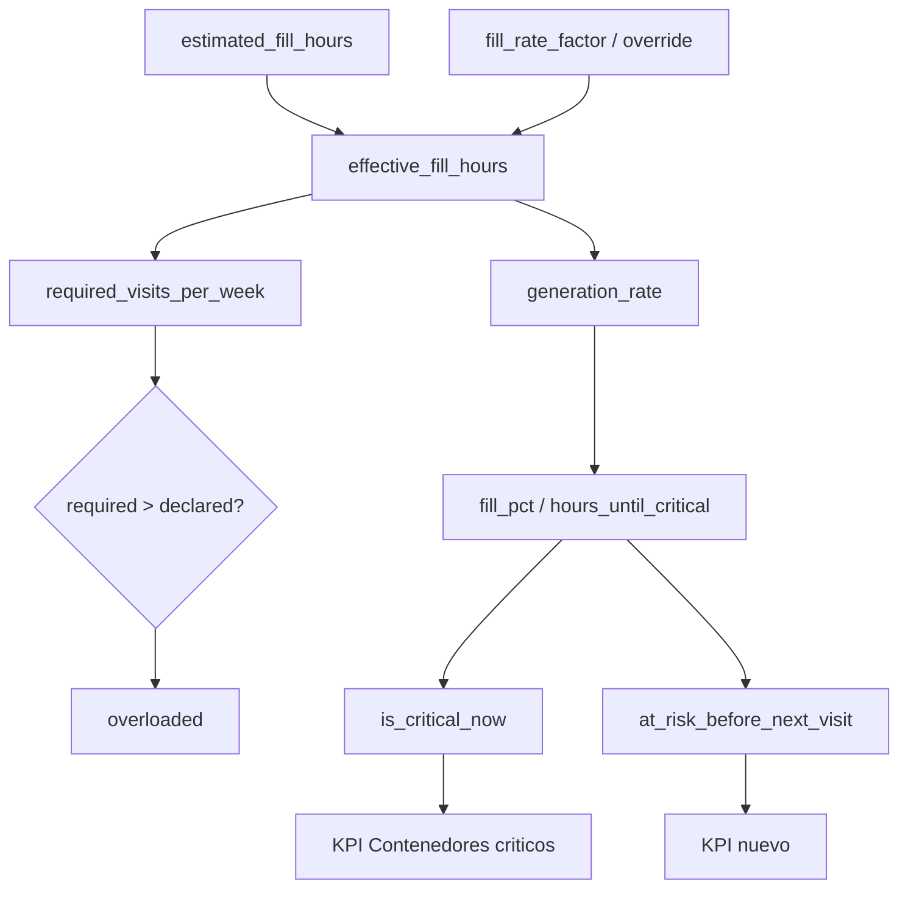

# ADR-002: Modelo único de criticidad de contenedores

| Campo | Valor |
|-------|-------|
| **Estado** | Aceptado |
| **Fecha** | 2026-09-11 |
| **Fase** | 0 — Contrato, ADR y red de seguridad |
| **Decisión** | Umbral único 80 % + KPI de riesgo separado + frecuencia híbrida + factores de velocidad |

## Contexto

La etiqueta "contenedor crítico" aparece hoy con **definiciones distintas y contradictorias** en el backend, como si un contenedor pudiera estar "lleno siempre":

| Consumidor | Regla actual | Archivo |
|---|---|---|
| Dashboard "Contenedores críticos" | `fill_pct >= 80` | `services/dashboard_service.py` |
| Status de catálogo "critico" | `fill_pct > 90` | `services/collection_point_service.py` |
| Contexto de optimización | `fill_pct > 90` | `services/collection_point_service.py` |
| Monitoreo | `ratio >= 0.8` | `services/catalog_service.py` |
| Priorización ACO | `>= 80 / >= 60` | `services/route_constraints.py`, `services/aco_parallel.py` |
| Cobertura de críticos (KPI) | `fill_pct >= 80` | `services/optimization_service.py` |
| Frontend `fillStatusFromLevel` | `> 90 / >= 70` | `src/core/types/collectionPoint.ts` |

Además, existe un umbral **configurable y muerto** `operational.fill_threshold_pct = 80` (admin) que nadie consume, y la **frecuencia declarada** (`VisitSchedule.visits_per_week`) se siembra con una fórmula independiente de la **tasa física** (`estimated_fill_hours`), por lo que ambas son ruido entre sí.

El problema de modelado de fondo: "crítico" mezcla **tres conceptos ortogonales**, y la UI los presenta como un estado permanente.

- **Urgencia** (transitoria): `fill_pct`, `hours_until_critical`.
- **Carga estructural** (estable): cuántas visitas por semana exige la tasa de generación.
- **Riesgo operativo** (dinámico): ¿rebosará antes de la próxima recolección programada?

## Decisión

### D1 — Umbral único de 80 %, gobernado por admin

`CRITICAL_FILL_PCT = 80` es la única constante de estado. El status "critico" del catálogo y el KPI del dashboard se alinean a 80. El valor configurable `operational.fill_threshold_pct` (admin) pasa a **gobernar** ese umbral en vez de estar muerto. La lógica de dominio no consulta la BD: el umbral se resuelve en la capa de servicio y se inyecta.

### D2 — El riesgo de calendario es un KPI nuevo, no reemplaza al crítico

- "Contenedores críticos" (KPI principal) se mantiene como **estado**: `fill_pct >= umbral`.
- Se añade un KPI nuevo **"En riesgo antes de la próxima visita"** (`at_risk_before_next_visit`), que combina urgencia y agenda.
- La narrativa y las demos no se rompen; el nuevo indicador es aditivo.

### D3 — Frecuencia híbrida (requerida vs declarada)

- `required_visits_per_week` se deriva de la física.
- `visits_per_week` declarada se conserva como el compromiso operativo (puede venir de planeación o de seeds).
- `overloaded = required > declared`: la brecha auditable entre lo que exige la generación y lo que se sirve.
- `priority_boost` permanece como override manual explícito.

### D4 — Velocidad de llenado ajustable por zona y por contenedor

- `sectors.fill_rate_factor` (por zona poblada; `> 1` = se llena más rápido).
- `collection_points.fill_rate_factor_override` (caso puntual; `NULL` = hereda del sector).

## Modelo y fórmulas

```python
effective_fill_rate_factor(point) = point.fill_rate_factor_override
                                     or point.sector.fill_rate_factor or 1.0
effective_fill_hours(point)       = estimated_fill_hours(point) / effective_fill_rate_factor(point)
generation_rate_kg_per_hour(point) = capacity_kg(point) / effective_fill_hours(point)
required_visits_per_week(point)    = clamp(ceil(168 / effective_fill_hours(point)), 1, 7)
```

`estimated_fill_hours` pasa a significar **"horas a llenarse en densidad normal"**; el factor expresa intensidad de zona/uso.



## Alternativas consideradas

### Opción B — "Crítico" = más de 2 visitas semanales

- **Pros:** estable, planificable, reutiliza un campo existente.
- **Contras:** ciega a la urgencia del día (un contenedor programado 3 veces/semana puede estar al 95 % y no marcarse); el umbral ">2" es tan arbitrario como el 80 %; con los seeds actuales marcaría casi ninguno.
- **Descartada** como definición única; se conserva como **clasificación estructural separada** (`overloaded`), nunca como el "crítico".

### Mantener el estado actual

- **Pros:** cero esfuerzo.
- **Contras:** definiciones contradictorias persisten; la UI sigue mostrando "crítico" como permanente; el umbral configurable sigue muerto.

## Consecuencias

### Positivas

- Una sola fuente de verdad (`domain/criticality.py`) con una única constante.
- KPI de estado y KPI de riesgo desacoplados: narrativa estable + información accionable.
- La frecuencia se vuelve auditable contra la física; las zonas pobladas y casos puntuales se modelan explícitamente.
- La migración es incremental y con red de seguridad (tests de caracterización + flag).

### Negativas / trade-offs

- Más campos y una migración de seeds; hay que recalibrar para que las métricas no salgan triviales.
- El riesgo de calendario requiere cruzar la agenda por punto (cálculo más costoso).

### Neutras

- Se introduce el flag `CRITICALITY_MODEL` (`state` | `risk`), por defecto `state`, para desplegar por fases sin cambiar comportamiento.

## Implementación por fases

| Fase | Entregable |
|------|-----------|
| 0 | ADR, tests de caracterización, flag `CRITICALITY_MODEL` (**este documento**) |
| 1 | `domain/criticality.py` + umbral único gobernado por admin |
| 2 | Migrar consumidores a `criticality` (mismo comportamiento) |
| 3 | Factores de velocidad por zona y por contenedor (migraciones `027`, `028`) |
| 4 | Frecuencia híbrida (`required` vs `declared`, `overloaded`) |
| 5 | Reseeding coherente (tasa ↔ agenda) |
| 6 | KPI nuevo de riesgo de calendario |
| 7 | Consumidores avanzados (ACO, pendientes, alertas, contingencias) |
| 8 | UI semántica temporal + validación integral |

## Referencias

- Código (estado actual): `backend/app/services/dashboard_service.py`, `backend/app/services/collection_point_service.py`, `backend/app/services/catalog_service.py`, `backend/app/services/route_constraints.py`, `backend/app/services/aco_parallel.py`, `backend/app/services/optimization_service.py`, `backend/app/domain/waste_generation.py`, `backend/app/db/models/visit_schedule.py`
- Config: `backend/app/config.py` (`CRITICALITY_MODEL`), `backend/app/schemas/admin.py` (`fill_threshold_pct`)
- Red de seguridad: `backend/tests/test_criticality_contract.py`
- ADR relacionado: [adr-001-simulacion-principal.md](./adr-001-simulacion-principal.md)
