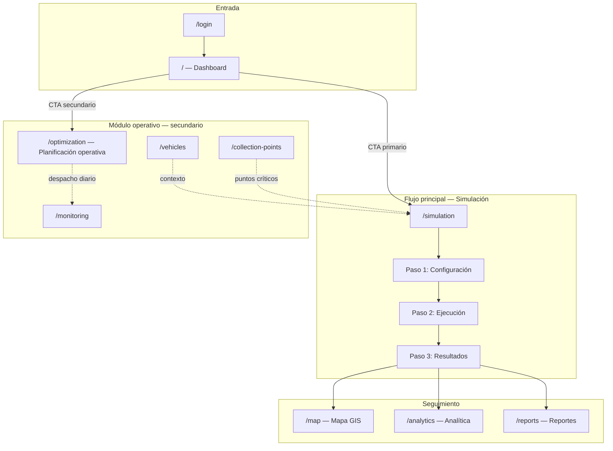

# Documento UX — Flujo objetivo y mapa de pantallas

## 1. Propósito

Definir el recorrido canónico de FEROMAP para el **planificador municipal** y el **evaluador en defensa de tesis**, priorizando la evaluación de escenarios y el desempeño del algoritmo frente a la operación diaria de rutas.

## 2. Usuario principal

| Rol | Acceso al flujo | Objetivo |
|-----|-----------------|----------|
| **Planificador** | Simulación, Optimización, Analítica, Reportes | Configurar escenarios, ejecutar simulaciones, analizar resultados |
| **Administrador** | Igual que planificador + Administración | Mismo flujo + configuración del sistema |
| **Evaluador (defensa)** | Observa como planificador | Verificar que el sistema guía, ejecuta y muestra impacto medible |

**Roles excluidos del flujo de simulación:** conductor (monitoreo operativo), residente (consulta de recolección propia).

## 3. Roles y permisos confirmados

Fuente: `src/core/auth/permissions.ts`

| Ruta | administrador | planificador | conductor | residente |
|------|:---:|:---:|:---:|:---:|
| `/` (Dashboard) | ✓ | ✓ | ✓ | ✓ |
| `/simulation` | ✓ | ✓ | — | — |
| `/optimization` | ✓ | ✓ | — | — |
| `/analytics` | ✓ | ✓ | — | — |
| `/reports` | ✓ | ✓ | — | — |
| `/monitoring` | ✓ | ✓ | ✓ | — |

**Acciones que requieren `canOptimize` (admin o planificador):**
- Ejecutar simulación / optimización
- Despachar rutas tras una corrida

## 4. Flujo canónico (ruta principal)

```
Dashboard
   │
   └─► [Nueva simulación]  ──►  /simulation
                                    │
                    ┌───────────────┼───────────────┐
                    ▼               ▼               ▼
              Paso 1            Paso 2            Paso 3
           Configurar      Ejecutar simulación   Resultados
                    │               │               │
                    └───────────────┴───────────────┘
                                    │
                    ┌───────────────┼───────────────┐
                    ▼               ▼               ▼
                 /map          /analytics       /reports
              (rutas)      (evolución)        (exportar)
```

### Descripción por etapa

1. **Dashboard** — Punto de entrada. CTA primario: *Nueva simulación*. Resumen de última corrida.
2. **Configurar** (`/simulation`, paso 1) — Escenario, condiciones ambientales/operativas, vista previa del escenario derivado.
3. **Ejecutar** (paso 2) — Confirmación de parámetros, progreso del motor ACO, logs.
4. **Resultados** (paso 3) — KPIs comparativos (baseline vs optimizado), mapa, acciones de seguimiento.
5. **Analítica / Reporte** — Agregación histórica y exportación para evidencia de tesis.

## 5. Rol de Optimización (Opción A)

| Aspecto | Simulación (`/simulation`) | Optimización (`/optimization`) |
|---------|---------------------------|-------------------------------|
| **Propósito** | Evaluar escenarios y algoritmo | Planificación operativa del día |
| **Prioridad en navegación** | Principal (arriba) | Secundaria (sección operativa) |
| **CTA en Dashboard** | Primario | Secundario / enlace de ayuda |
| **Usuario típico** | Planificador evaluando hipótesis | Planificador despachando rutas |
| **Salida esperada** | KPIs de impacto, comparación | Rutas listas para despacho |

La Optimización **no compite** con el CTA principal del Dashboard. Se accede cuando el usuario ya conoce el flujo de simulación o necesita operación diaria.

## 6. Mapa de pantallas



### Pantallas de soporte (no parte del flujo canónico)

| Pantalla | Función en el ecosistema |
|----------|--------------------------|
| `/vehicles` | Contexto de flota; enlace a simulación con vehículos asignables |
| `/collection-points` | Contexto de llenado; enlace con puntos críticos |
| `/monitoring` | Seguimiento en tiempo real post-despacho |
| `/admin` | Configuración del sistema (solo administrador) |
| `/profile` | Preferencias de usuario |

## 7. Estado actual vs objetivo

| Elemento | Estado (Fase 6) |
|----------|-----------------|
| CTA Dashboard | ✅ CTA primario → `/simulation` |
| Orden en menú | ✅ Simulación antes que Planificación operativa |
| Wizard Simulación | ✅ 3 pasos; copy «Ejecutar simulación» |
| Variables UI | ✅ Conectadas, informativas o «Próximamente» (Fase 3) |
| Post-resultados | ✅ Barra de acciones + deep links (Fase 4) |
| Separación módulos | ✅ Banners + historial operativo (Fase 5) |
| Demo y docs | ✅ Guion, manual, checklist (Fase 6) |

## 8. Principios de diseño acordados

1. **Un camino obvio** — El usuario nuevo debe encontrar "Nueva simulación" sin leer documentación.
2. **Progresión guiada** — Configurar → Ejecutar → Interpretar, en ese orden.
3. **Honestidad funcional** — Solo mostrar controles cuyo efecto se pueda explicar (ver matriz de variables).
4. **Separación de propósitos** — Simulación evalúa; Optimización opera.
5. **Evidencia para tesis** — Todo resultado debe poder llegar a Analítica o Reporte.
