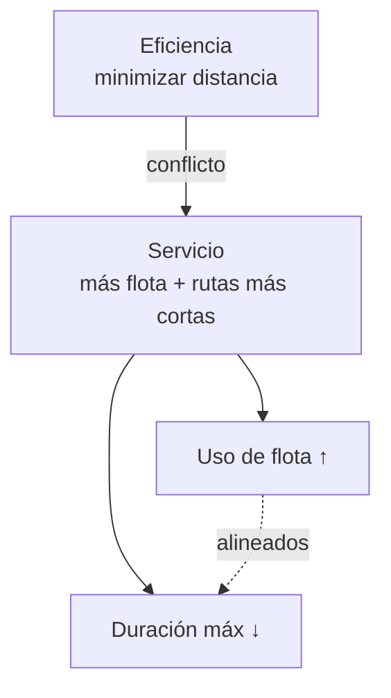

# Especificación — Motor de optimización multiobjetivo (distancia · flota · tiempo de servicio)

| Campo | Valor |
|-------|-------|
| **Estado** | Propuesta — pendiente de aprobación |
| **Fecha** | 2026-09-15 |
| **Fase** | 13 — Optimización multiobjetivo |
| **Alcance** | Motor ACO/VRP: función objetivo, métricas por vehículo, política de flota semanal, persistencia de ETA |
| **Código de referencia** | `backend/app/services/optimization_service.py` · `backend/app/services/aco_parallel.py` · `backend/app/services/weekly_operational_service.py` · `backend/app/domain/crew_service_time.py` |
| **Relación** | Continúa [ADR-003 dotación/tiempo de servicio](../fase-8/adr-dotacion-tiempo-servicio.md), [ADR-004 vertedero](../fase-9/adr-vertedero-multi-viaje.md), [ADR-008 ventanas por zona](../fase-3/adr-008-ventanas-por-zona.md); resuelve la limitación "Multi-objetivo" de [limites-solver.md](../fase-3/limites-solver.md) |

## 1. Propósito

Hoy el motor ACO resuelve un CVRP **monoobjetivo por distancia**: la única meta es minimizar kilómetros. La consecuencia observable es que, con la configuración base y la demanda demo, **siempre usa 2 camiones** (los dos primeros de la flota por `id`) y deja el resto ocioso, con jornadas al 100 % de uso.

Este documento especifica cómo extender el motor para que **valore tres objetivos** de forma explícita, configurable y verificable:

1. **Eficiencia** — minimizar la distancia recorrida (ya existe; se formaliza).
2. **Uso de flota** — emplear más vehículos a lo largo de la planificación (día y horizonte semanal).
3. **Tiempo de servicio** — rutas con duración razonable y, preferiblemente, por debajo de la jornada estipulada.

El resultado debe ser un **compromiso configurable** (frontera de Pareto), no un número fijo.

## 2. Problema y hallazgos (línea base)

Verificado sobre el estado actual (`/api/v1/simulations/optimize`, instancia demo, `seed=42`):

| Hecho | Evidencia |
|---|---|
| La flota se arma completa (8 de 10 vehículos con conductor), ordenada por `Vehicle.id` | `build_optimization_vehicle_units` |
| El ACO **llena los vehículos en orden**: camión 1 a tope, luego 2, … | `build_ant_solution` (`for v_idx in range(n_vehicles)`) |
| Las rutas con ≤2 nodos se descartan → camiones vacíos no aparecen | `_compute_kpis` (`active_routes = [r for r in routes if len(r) > 2]`) |
| La aptitud es **solo distancia** + penalización por rebose | `_evaluate_solution`, `build_ant_solution` (`cost + overflow_cost`) |
| `kpiView="co2"` **no** altera el solver | `schemas/simulation.py` ("no altera el fitness del solver") |
| El tiempo de servicio es **20 min/parada** (dotación 6) y domina la jornada | `BASE_SERVICE_SECONDS = 1200` en `crew_service_time.py` |
| La jornada base es 12 h (06:00–18:00) y recortable con `estimatedDurationHours` | `cap_shift_budget_seconds` |
| `shift_utilization_pct` es **agregado y capado a 100**, no por ruta | `_solution_operational_metrics` |
| Los territorios `sector→conductor` existen pero la BD tiene los **52 sectores sin conductor** | `build_sector_driver_map`, tabla `sectors` |
| El plan semanal optimiza **cada día por separado** (sin acoplamiento) | `generate_weekly_operational_plan` |
| Las **ETA no se persisten** en rutas reales (`estimated_arrival_at = None`) | `_persist_routes` |
| Se fuerza que **TR-01** tenga al menos una parada (ancla de demo) | `_ensure_demo_anchor_vehicle_route` |

**Medición de referencia** (instancia demo, escenario `normal`):

| Configuración | Puntos | Camiones usados | Duración por camión |
|---|---|---|---|
| Jornada 12 h | 60 | 2 → `TR-01`, `TR-03` | 12,17 h · 11,11 h |
| Jornada 8 h | 60 | 3 → `TR-01`, `TR-03`, `TR-11` | 7,83 h · 7,90 h · 6,39 h |
| Jornada 12 h (catálogo) | 120 | 4 → `TR-01`, `TR-03`, `TR-11`, `TR-04` | 12,03 · 11,99 · 11,99 · 8,90 h |

Conclusión: el número de camiones es **emergente** (mínimo necesario por tiempo/capacidad), no una cuota. La distancia es el único objetivo; la flota y la duración son efectos secundarios no controlados.

## 3. Objetivos y relaciones



- **Eficiencia vs Servicio**: más camiones activos ⇒ más viajes a base ⇒ más distancia.
- **Flota y duración están alineados**: ambos se logran repartiendo la carga.

Por tanto el compromiso se reduce a **un eje de servicio** contra el de eficiencia, modulado por pesos (`λ`).

## 4. Modelo multiobjetivo

```
min   w_d · (D / D_ref)                 # eficiencia (normalizada)
    + w_b · (σ_horas / μ_horas)         # equidad de carga (coef. de variación)
    + w_t · (T_max / H_jornada)         # makespan normalizado

sujeto a:
    capacidad_v, jornada_v, vertedero, ventanas  (ya existentes)
    cobertura total de los puntos programados
    activeVehicles ≥ min_active_vehicles          (si el parámetro está definido)
```

Definiciones:

| Símbolo | Significado |
|---|---|
| `D` | Distancia total de la flota (m) |
| `D_ref` | Distancia de referencia de la corrida (p. ej. la baseline) |
| `horas_v` | Duración de la ruta del vehículo `v` = viaje + `paradas_v · 20 min` + descargas |
| `σ_horas`, `μ_horas` | Desviación y media de `horas_v` sobre vehículos activos |
| `T_max` | `max(horas_v)` (makespan) |
| `H_jornada` | Presupuesto de turno efectivo (`shift_budget_sec / 3600`) |
| `w_d`, `w_b`, `w_t` | Pesos normalizados expuestos como parámetros |

Normalizar los tres términos a `[0,1]` es **requisito** para que los pesos sean comparables e independientes de la escala de la instancia.

**Compatibilidad**: con `w_b = w_t = 0` y `min_active_vehicles = null`, la función objetivo es idéntica a la actual (solo distancia + rebose) y los KPIs deben ser **idénticos** (ver RNF-2).

## 5. KPIs (métricas de verificación)

### 5.1 Por día

| KPI | Fórmula | Objetivo |
|---|---|---|
| `distanceKm` | existente `{current, optimized}` | eficiencia |
| `activeVehicles` | nº de rutas con paradas > 0 | flota |
| `fleetUtilizationPct` | `activeVehicles / assignableVehicles × 100` | flota |
| `vehicleWorkloadHours` | `[horas_v]` | servicio |
| `maxRouteHours` | `max(horas_v)` | servicio |
| `shiftSlackHours` | `H_jornada − maxRouteHours` | servicio |
| `finishUnderTargetPct` | % rutas activas con `horas_v ≤ H_objetivo` | servicio |
| `workloadStdHours` | `σ(horas_v)` | equidad |
| `fairnessIndex` | `1 − σ_horas / μ_horas` (0–1) | equidad |

### 5.2 Horizonte semanal

| KPI | Fórmula | Objetivo |
|---|---|---|
| `distinctVehiclesWeek` | nº de `vehicleCode` distintos en la semana | flota |
| `vehicleDaysUsed` | Σ días-usados por vehículo (camión-día) | flota |
| `usageStdDays` | `σ(días_v)` | rotación |
| `rotationIndex` | `1 − σ_días / μ_días` | rotación |

> Nota de compatibilidad: `shift_utilization_pct` (agregado) se **conserva** tal cual; los KPIs nuevos son aditivos.

## 6. Requerimientos funcionales

### RF-1 · Eficiencia (formalización)
- **Enunciado**: el motor DEBE minimizar la distancia total sujeta a las restricciones vigentes.
- **Métrica**: `distanceKm.optimized`.
- **Criterio**: `distanceKm.optimized ≤ 0.60 × distanceKm.current` (escenario base).
- **Implementación**: ya existe (`_evaluate_solution`, ACO).
- **Verificación**: test de aceptación con instancia fija y `seed=42`.

### RF-2 · Equidad de carga entre camiones
- **Enunciado**: el motor DEBE aceptar `w_b` (`workload_balance_weight`) que module la penalización por desbalance de horas de servicio.
- **Métrica**: `workloadStdHours`, `fairnessIndex`.
- **Criterio**: monotonía — al aumentar `w_b`, `workloadStdHours` **no aumenta** (instancia y seed fijos).
- **Implementación**: `_vehicle_workloads_s` (nuevo) + término en `_evaluate_solution`/`build_ant_solution` + construcción "camión menos cargado".
- **Verificación**: test paramétrico `w_b ∈ {0, 0.5, 2, 5}`.

### RF-3 · Uso de flota por día
- **Enunciado**: el motor DEBE aceptar `min_active_vehicles` (restricción) para garantizar un mínimo de vehículos activos por día.
- **Métrica**: `activeVehicles`, `fleetUtilizationPct`.
- **Criterio**: con `min_active_vehicles = 3`, `activeVehicles ≥ 3`.
- **Implementación**: restricción en la construcción/aceptación del ACO; si es infactible (< puntos que el mínimo), degradar con *warning* explícito.
- **Verificación**: test de restricción + caso infactible.

### RF-4 · Duración de servicio y holgura
- **Enunciado**: el motor DEBE minimizar la duración máxima por ruta (`w_t`) y reportar holgura respecto a la jornada.
- **Métrica**: `maxRouteHours`, `shiftSlackHours`, `finishUnderTargetPct`, `vehicleWorkloadHours`.
- **Criterio**: `maxRouteHours ≤ H_objetivo` para ≥ 90 % de rutas activas; `shiftSlackHours ≥ 1 h`.
- **Implementación**: **requiere** desglose por ruta en `_solution_operational_metrics` (hoy solo agrega) y término `w_t · T_max / H_jornada`.
- **Verificación**: test unitario de métrica + corrida con `H_objetivo = 8`.

### RF-5 · Rotación de flota en el horizonte
- **Enunciado**: la generación semanal DEBE rotar la flota para que en la semana se usen al menos `K` vehículos distintos, con reparto justo de días.
- **Métrica**: `distinctVehiclesWeek`, `vehicleDaysUsed`, `usageStdDays`, `rotationIndex`.
- **Criterio**: `distinctVehiclesWeek ≥ 6` (de 8 asignables); `usageStdDays ≤ 1`.
- **Implementación**: `generate_weekly_operational_plan` — añadir política de rotación (uso acumulado de la semana) al armar la flota de cada día.
- **Verificación**: test de horizonte sobre `operational_plan_json`.

### RF-6 · Persistencia de ETA por punto
- **Enunciado**: el sistema DEBE persistir la hora estimada de recolección por parada.
- **Métrica**: `RouteWaypoint.estimated_arrival_at` no nulo.
- **Criterio**: 100 % de waypoints `collection` con ETA.
- **Implementación**: `_persist_routes` (hoy lo deja en `None`); la ETA ya se calcula en el ACO (`arrival`, `elapsed_after_visit`).
- **Verificación**: test de persistencia.

### RF-7 · Puntualidad (opcional, si el alcance lo permite)
- **Enunciado**: el sistema DEBE medir el cumplimiento de la ventana prometida por punto.
- **Métrica**: `windowCompliancePct`, `latenessMin`.
- **Criterio**: `windowCompliancePct ≥ 95 %`.
- **Implementación**: ventanas ya existentes como restricción dura (`build_customer_time_windows`, `is_visit_feasible_with_window`); añadir penalización blanda y KPI.
- **Verificación**: test con ventanas de zona configuradas.

## 7. Requerimientos no funcionales

| ID | Requerimiento | Criterio | Nota |
|---|---|---|---|
| RNF-1 | **Determinismo** | Con `seed` fijo, dos corridas producen KPIs idénticos | El ACO ya usa `seed=42` |
| RNF-2 | **Compatibilidad** | Con `w_b = w_t = 0` y sin `min_active_vehicles`, los KPIs son idénticos a la versión actual | Regresión byte a byte |
| RNF-3 | **Rendimiento** | Tiempo de cómputo ≤ 15 s (base actual ≈ 2,8 s) | El cálculo por ruta es O(nº rutas) |
| RNF-4 | **Configurabilidad** | Pesos editables vía admin/request sin redeploy | Patrón `aco_ants` |
| RNF-5 | **Trazabilidad** | Todo objetivo aparece en `kpis` y `engineMetrics` | Para verificación y defensa |
| RNF-6 | **No romper territorios** | Con territorios activos, equidad aplica dentro de cada zona | Ver §13 riesgo R-4 |

## 8. Criterios de aceptación

- **AC-1 (no sacrificar demasiado)**: con los pesos activos, `distanceKm.optimized ≤ 1.15 × distanceKm.optimized(w=0)`.
- **AC-2 (ganar servicio)**: en ese punto, `activeVehicles ≥ 3` **y** `maxRouteHours ≤ H_objetivo` (8 h).
- **AC-3 (horizonte)**: `distinctVehiclesWeek ≥ 6` de 8 en una semana demo.

Lectura: *"se acepta hasta 15 % más de distancia si a cambio se sube de 2 a ≥3 camiones y la jornada baja a ≤8 h"*.

## 9. Contrato de parámetros

| Parámetro | Tipo | Default | Rango | Precedencia |
|---|---|---|---|---|
| `workload_balance_weight` (`w_b`) | float | `0.0` | `[0, 10]` | request > caso > admin |
| `makespan_weight` (`w_t`) | float | `0.0` | `[0, 10]` | request > caso > admin |
| `min_active_vehicles` | int \| null | `null` | `[1, flota asignable]` | request > caso > admin |
| `max_route_hours_target` (`H_objetivo`) | float | `8.0` | `[1, 18]` | request > caso > admin |
| `weekly_fleet_rotation` | bool | `false` | — | plan semanal |

**Plomería (sigue el patrón vigente de `aco_ants`/`aco_alpha`)**:

```
config.py                          Settings.<param>
schemas/admin.py                   AlgorithmSettings + AlgorithmSettingsUpdate
services/admin_service.py          DEFAULT_ALGORITHM[<param>]
schemas/simulation.py              OptimizeRequest.<param>            (ad-hoc)
schemas/case_study.py + domain     CaseStudyDefaultParameters.<param> (defaults del caso)
run_optimization_engine            resolved_<param> = get_algorithm_settings(db) + override
   ↓
_aco_cvrp(...) / _optimize_by_sector_assignment(...)
   ↓
build_ant_solution(...) · _evaluate_solution(...)
```

## 10. Contrato de salida (adiciones a `kpis`)

```json
{
  "activeVehicles": 3,
  "fleetUtilizationPct": 37.5,
  "vehicleWorkloadHours": [7.83, 7.90, 6.39, 0.0, 0.0, 0.0, 0.0, 0.0],
  "maxRouteHours": 7.90,
  "shiftSlackHours": 4.10,
  "finishUnderTargetPct": 100.0,
  "workloadStdHours": 0.69,
  "fairnessIndex": 0.91,
  "weekly": {
    "distinctVehiclesWeek": 6,
    "vehicleDaysUsed": 15,
    "usageStdDays": 0.82,
    "rotationIndex": 0.89
  }
}
```

Aditivo: no se elimina ni renombra ningún KPI existente.

## 11. Plan de implementación por fases

| Fase | Entregable | Archivos principales | Verificación | Riesgo |
|---|---|---|---|---|
| **13.0** | Este documento + ADR + tests de caracterización (fijar KPIs actuales) | `docs/fase-13/`, `backend/tests/` | Suite existente verde | Bajo |
| **13.1** | Métricas por ruta + KPIs nuevos (con `w=0` sin cambios) | `optimization_service.py` (`_solution_operational_metrics`, `_compute_kpis`), `schemas/` | Tests unitarios; RNF-2 | Bajo |
| **13.2** | Términos de equidad y makespan en la aptitud + construcción balanceada | `aco_parallel.py` (`build_ant_solution`, `_evaluate_solution`), `optimization_service.py` (`_aco_cvrp`) | Test paramétrico; AC-1/AC-2 | Medio |
| **13.3** | `min_active_vehicles` (restricción) | construcción ACO | Test de restricción + infactible | Medio |
| **13.4** | Rotación de flota semanal | `weekly_operational_service.py` | Test de horizonte; AC-3 | Medio |
| **13.5** | Persistencia de ETA | `optimization_service.py` (`_persist_routes`) | Test de persistencia | Bajo |
| **13.6** | Puntualidad (opcional) | `route_constraints.py`, `_compute_kpis` | KPI de cumplimiento | Medio |
| **13.7** | UI: panel de pesos + insignias de equidad/flota | `src/features/optimization/`, `src/features/planning/weekly/` | Vitest + e2e | Medio |

### Decisiones de diseño

- **D1 — Normalización obligatoria**: los tres términos se normalizan a `[0,1]`; sin esto los pesos no son interpretables.
- **D2 — Construcción balanceada**: la construcción secuencial actual concentra carga por diseño; el término de equidad del fitness solo no basta. Se cambia a sesgo por "camión menos cargado" preservando la elección de cliente por feromona.
- **D3 — Local search inter-ruta**: `_two_opt` solo reordena dentro de una ruta. La equidad necesita un operador que mueva/intercambie paradas entre rutas (`_rebalance_pass`).
- **D4 — Ancla de demo**: `_ensure_demo_anchor_vehicle_route` fuerza TR-01 siempre. Si la rotación debe descansar TR-01, el ancla se limita a modo demo (flag) para no sesgar el resultado experimental.
- **D5 — Feromonas**: el depósito usa `pheromone_q / cost`; al cambiar el costo se recalibra `pheromone_q` (documentar en 13.2).
- **D6 — Convergencia**: se reporta el costo combinado **y** la distancia por separado (hoy `aco_convergence` solo lleva km).

## 12. Estrategia de verificación

### Nivel 1 — Unitario (determinista, pytest)
- `_vehicle_workloads_s` con rutas sintéticas y horas esperadas exactas.
- `fairnessIndex`, `maxRouteHours`, `shiftSlackHours`, `activeVehicles`, `fleetUtilizationPct`.
- `distinctVehiclesWeek` / `usageStdDays` sobre un `operational_plan_json` sintético.

### Nivel 2 — Paramétrico / aceptación
- Barrido de cada peso con instancia y `seed` fijos; aserciones de **dirección** (monotonía) y de AC-1/AC-2.
- Reutiliza el patrón de `backend/app/services/aco_sensitivity_service.py`.
- Produce la **tabla y la curva de Pareto** (distancia vs flota vs jornada) → evidencia de tesis.

### Nivel 3 — Regresión
- `just test` (pytest) y `just defense-verify` en verde.
- **RNF-2**: test que compara el dict de KPIs con `w=0` contra la línea base caracterizada en 13.0.

### Casos de prueba nombrados (propuesta)
```
test_vehicle_workloads_seconds_exact
test_kpi_active_vehicles_counts_nonempty_routes
test_kpi_max_route_hours_and_slack
test_fairness_index_monotonic_with_weight
test_min_active_vehicles_constraint_enforced
test_min_active_vehicles_infeasible_warns
test_zero_weights_reproduce_baseline_kpis
test_weekly_rotation_increases_distinct_vehicles
test_eta_persisted_on_collection_waypoints
```

## 13. Riesgos y mitigaciones

| ID | Riesgo | Mitigación |
|---|---|---|
| R-1 | Escala de `λ` dependiente de la instancia | Normalización obligatoria (D1) |
| R-2 | `λ` alto estanca la convergencia ACO | Reportar costo combinado; recalibrar `pheromone_q`; barrido acotado |
| R-3 | La equidad sola no logra equidad (construcción concentra) | Construcción balanceada (D2) + local search (D3) |
| R-4 | Con territorios activos, la equidad solo reparte dentro de zona | Documentar dos modos; medir con territorios OFF para reparto global |
| R-5 | El ancla TR-01 sesga la rotación | Flag de demo (D4) |
| R-6 | Más camiones = más costo real | El trade-off es explícito y medible (AC-1) |
| R-7 | `activeVehicles` cuenta rutas, no "trabajo" | Usar también `vehicleWorkloadHours` para descartar camiones casi vacíos |

## 14. Fuera de alcance

- Cambiar la metaheurística (sigue siendo ACO).
- Consumo de combustible dependiente de carga o tanque/autonomía (descartado: no limita en esta instancia).
- Optimización conjunta de la semana para **consistencia temporal** del residente (previsibilidad entre días). Es trabajo futuro; aquí solo se cubre ETA + puntualidad del día.
- Reescritura del balanceador de territorios.

## 15. Glosario

| Término | Significado |
|---|---|
| **Makespan** | Duración de la ruta más larga de la flota (`T_max`) |
| **Equidad de carga** | Reparto balanceado de horas de servicio entre camiones |
| **Uso de flota** | Cuántos vehículos de la flota participan (día u horizonte) |
| **Frontera de Pareto** | Conjunto de soluciones no dominadas en eficiencia vs servicio |
| **ETA** | Hora estimada de recolección por punto |
| **Rotación** | Reparto justo de días de trabajo entre vehículos en la semana |

## 16. Referencias

- [ADR-003 dotación y tiempo de servicio](../fase-8/adr-dotacion-tiempo-servicio.md)
- [ADR-004 vertedero y multi-viaje](../fase-9/adr-vertedero-multi-viaje.md)
- [ADR-008 ventanas por zona](../fase-3/adr-008-ventanas-por-zona.md)
- [Límites del solver ACO](../fase-3/limites-solver.md) — hoy declara "Multi-objetivo: no" en el fitness
- Código: `backend/app/services/optimization_service.py`, `backend/app/services/aco_parallel.py`, `backend/app/services/weekly_operational_service.py`, `backend/app/domain/crew_service_time.py`, `backend/app/services/aco_sensitivity_service.py`
- Tests: `backend/tests/test_optimization_engine.py`, `backend/tests/test_landfill_multi_trip.py`, `backend/tests/test_fase8_acceptance.py`
- Estado de módulos: [estado-modulos.md](../estado-modulos.md)
