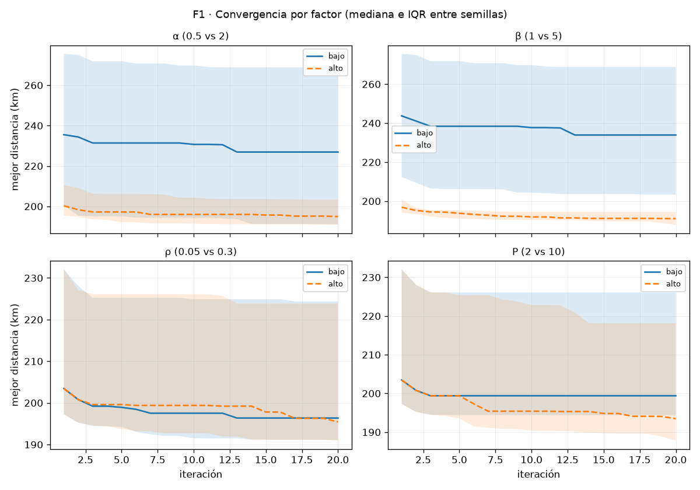
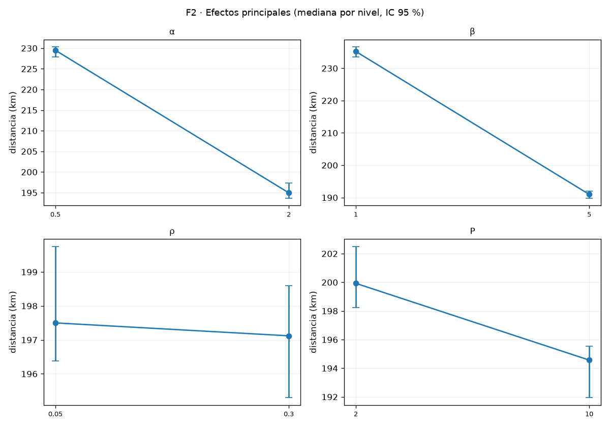
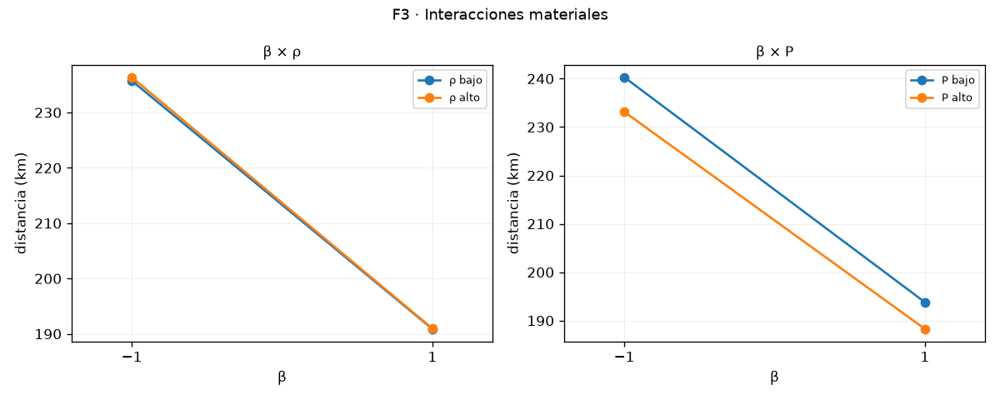
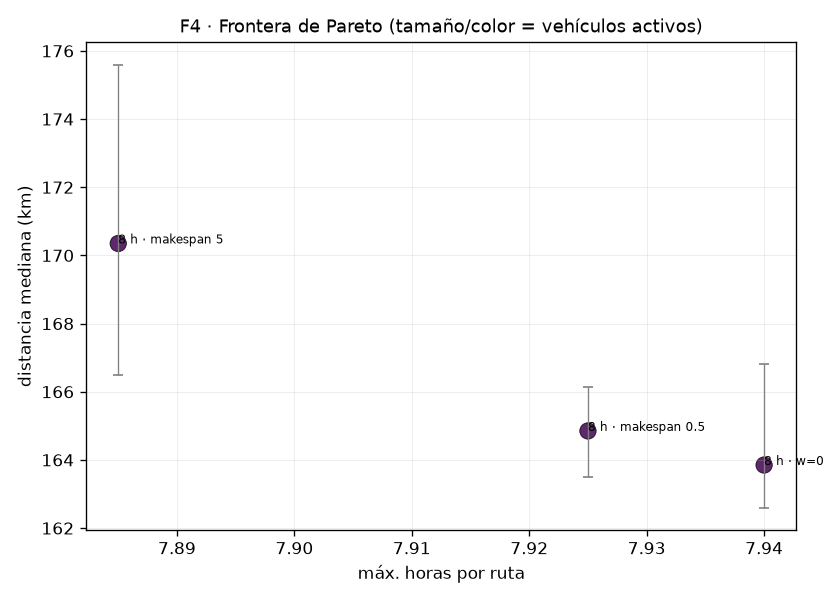

# Evidencia — Calibración metodológica del motor ACO (Fase 13)

| Campo | Valor |
|---|---|
| **Generado desde** | `calibration_sweeps` (`just calib-report`, 0 CPU) |
| **Protocolo declarado** | δ = 5.07 km · n = 10 semillas · I = 20 · perfil estándar 12×20 α1 β3 ρ0.12 Q1 · escenario `normal` |
| **Factorial de referencia** | `calibration_sweeps` id 4 |
| **Relación** | [plan-calibracion-metodologica.md](./plan-calibracion-metodologica.md) · [backlog](./backlog-calibracion-metodologica.md) |

## 1. Protocolo y trazabilidad (T1)

| Fase | Corrida | Semillas | Fecha |
|---|---|---|---|
| noise | id 2 | 10 | 2026-09-17T23:25:50.653418+00:00 |
| factorial | id 4 | 10 | 2026-09-18T01:27:24.278008+00:00 |
| budget | id 7 | 10 | 2026-09-18T02:25:10.074305+00:00 |
| nocut | id 9 | 10 | 2026-09-18T02:45:41.447630+00:00 |
| identify | id 11 | 10 | 2026-09-18T03:13:04.918049+00:00 |
| validate | id 13 | 10 | 2026-09-18T13:24:00.936311+00:00 |
| objective | id 20 | 10 | 2026-09-18T17:22:28.886841+00:00 |
| rsm | id 15 | 10 | 2026-09-18T14:13:08.937765+00:00 |

Contexto del factorial de referencia: escenario `normal` · presupuesto declarado `20` casos × `10` semillas = `200` corridas · trabajo `240–240` ant-iteraciones · iteraciones fijas: `True`.

Hiperparámetros estándar del protocolo: `{'acoAlpha': 1.0, 'acoBeta': 3.0, 'acoRho': 0.12, 'pheromoneQ': 1.0}` · perfil `{'acoAnts': 12, 'acoIterations': 20}`.

## 2. Ruido base y umbrales (T2)

### C1 · Ruido base (10 semillas válidas de 10 corridas)

| Métrica | Valor |
|---|---|
| Mediana | 193.6 km |
| Media | 192.89 km |
| DE entre semillas (s) | 3.4 km |
| CV | 1.76 % |
| Rango | 187.0 – 198.5 km |
| IQR | 1.85 km |
| IC 95 % de la media | [190.46, 195.32] |
| δ declarado | 5.07 km (1 % de la referencia voraz) |
| Referencia voraz | 506.6 km |
| Iteraciones ejecutadas | [20] |
| Corridas con corte | 0 |

**Contraste con el umbral heredado:** 0.5 % del mejor global = 0.94 km; la DE medida es 3.4 km, es decir **3.62× el umbral**. Ese umbral clasificaba de «estable» lo que solo era indistinguible.

**Semillas necesarias** para que el IC de una diferencia quepa en ±δ: 6 (pareado, cota pesimista √2·s) y 5 (sin emparejar). Se usaron 10.

**Convergencia:** la mediana de las corridas alcanza el 1 % de su valor final en la iteración 8 (peor caso: 20).

**Límites declarados:**
- El ruido pareado (el que gobierna las comparaciones entre configuraciones) no se mide con una sola configuración: aquí se reporta la cota pesimista √2·s. C3 lo ajusta.
- Una sola instancia y un solo escenario: no hay generalización entre instancias.

## 3. Efectos e interacciones del factorial 2⁴ (T5)

### C3 · Factorial 2⁴ + centros

Esquinas: 16 · centros: 4 · semillas: 10 · δ = 5.07 km

#### Configuraciones (ordenadas por mediana)

| Configuración | Mediana km | IQR | DE | Iter. (mediana) | Δ vs centro | IC 95 % Δ | ¿equivalente? |
|---|---|---|---|---|---|---|---|
| α2 β5 ρ0.3 P10 | 186.6 | 2.17 | 2.12 | 20.0 | -8.2 | [-11.15, -6.65] | no |
| α2 β5 ρ0.05 P10 | 188.8 | 2.83 | 2.12 | 19.0 | -6.7 | [-11.6, -3.7] | no |
| α0.5 β5 ρ0.3 P10 | 189.7 | 3.98 | 2.99 | 19.0 | -6.0 | [-9.2, -2.8] | no |
| α0.5 β5 ρ0.05 P10 | 189.95 | 3.82 | 2.7 | 19.0 | -4.9 | [-9.1, -2.5] | no |
| α2 β5 ρ0.3 P2 | 192.85 | 2.33 | 1.81 | 4.0 | -3.0 | [-7.25, 1.4] | no |
| α2 β5 ρ0.05 P2 | 193.5 | 3.3 | 2.0 | 4.0 | -1.6 | [-7.25, 1.4] | no |
| α0.5 β5 ρ0.05 P2 | 194.5 | 3.67 | 2.95 | 4.0 | -0.75 | [-2.75, 0.65] | sí |
| α0.5 β5 ρ0.3 P2 | 194.55 | 0.97 | 2.64 | 4.0 | 0.2 | [-2.75, 1.2] | sí |
| centro 1 · perfil estándar | 195.0 | 5.1 | 3.52 | 9.0 | — | None | — |
| centro 2 · perfil estándar | 195.0 | 5.1 | 3.52 | 9.0 | 0.0 | [0.0, 0.0] | sí |
| centro 3 · perfil estándar | 195.0 | 5.1 | 3.52 | 9.0 | 0.0 | [0.0, 0.0] | sí |
| centro 4 · perfil estándar | 195.0 | 5.1 | 3.52 | 9.0 | 0.0 | [0.0, 0.0] | sí |
| α2 β1 ρ0.3 P10 | 198.6 | 6.33 | 4.54 | 20.0 | 1.65 | [-1.5, 5.4] | no |
| α2 β1 ρ0.05 P10 | 200.1 | 4.55 | 3.74 | 18.5 | 5.15 | [0.7, 7.8] | no |
| α2 β1 ρ0.05 P2 | 204.95 | 5.22 | 4.48 | 4.5 | 7.35 | [5.4, 14.05] | no |
| α2 β1 ρ0.3 P2 | 206.8 | 5.25 | 4.26 | 3.5 | 10.9 | [6.15, 15.7] | no |
| α0.5 β1 ρ0.05 P10 | 263.3 | 6.35 | 4.2 | 15.5 | 68.7 | [66.25, 71.56] | no |
| α0.5 β1 ρ0.3 P10 | 267.85 | 2.7 | 5.7 | 20.0 | 71.35 | [66.0, 75.85] | no |
| α0.5 β1 ρ0.05 P2 | 271.1 | 9.85 | 7.73 | 4.0 | 77.1 | [71.1, 82.7] | no |
| α0.5 β1 ρ0.3 P2 | 272.4 | 11.4 | 7.8 | 3.5 | 77.1 | [71.1, 84.8] | no |

#### Efectos (familia de 10 contrastes, Holm)

| Contraste | Tipo | Efecto km | IC 95 % | p Wilcoxon | p Holm | ¿significativo? |
|---|---|---|---|---|---|---|
| acoBeta | principal | -45.81 | [-47.05, -42.28] | 0.001953125 | 0.01953 | sí |
| acoAlpha | principal | -34.99 | [-37.14, -32.48] | 0.001953125 | 0.01953 | sí |
| acoAlpha × acoBeta | interacción | 33.13 | [31.55, 34.28] | 0.001953125 | 0.01953 | sí |
| acoPatience | principal | -6.09 | [-7.43, -4.68] | 0.001953125 | 0.01953 | sí |
| acoAlpha × acoRho | interacción | -1.04 | [-1.7, 0.29] | 0.130859375 | 0.78516 | no |
| acoBeta × acoPatience | interacción | 0.89 | [-0.57, 2.35] | 0.130859375 | 0.78516 | no |
| acoAlpha × acoPatience | interacción | -0.43 | [-2.05, 2.36] | 0.921875 | 1.0 | no |
| acoRho × acoPatience | interacción | -0.32 | [-1.73, 0.44] | 0.275390625 | 1.0 | no |
| acoBeta × acoRho | interacción | -0.31 | [-1.7, 0.52] | 0.375 | 1.0 | no |
| acoRho | principal | 0.01 | [-0.6, 0.89] | 1.0 | 1.0 | no |

#### Curvatura y ruido

- Curvatura (centros − esquinas): mediana -18.77 km, IC 95 % [-20.22, -15.61]. positivo = los centros rinden peor que el promedio de las esquinas.
- DE entre semillas en el centro: 3.52 km · réplicas del centro idénticas (el motor es determinista con parámetros y semilla)

#### Selección

- Mejor mediana: **α2 β5 ρ0.3 P10** (186.6 km).
- Región equivalente (±δ): **3** configuraciones.
- Más barata dentro de la región equivalente: **α2 β5 ρ0.3 P10** (186.6 km, Δ 0.0 km, 20.0 ondas).
- Regla: equivalencia = IC 95 % del Δ pareado contenido en ±δ; empate = menor mediana y después coste (iteraciones efectivas).

**Convergencia:** mediana de iteración al 1 % del valor final = 3 (peor caso 20).

**Límites declarados:**
- Una sola instancia y un solo escenario: los efectos medidos son de esta instancia.
- El presupuesto (hormigas × iteraciones) es fijo dentro del diseño; su eje se trata en C3.2.
- Un factor por corrida no distingue iteraciones efectivas de paciencia: la paciencia recorta unas corridas y otras no, y por eso se reporta la iteración efectiva.
- Con números aleatorios comunes, las 4 réplicas del centro son la misma corrida repetida: verifican determinismo del motor, pero no añaden error puro ni precisión.

## 4. Eje de presupuesto a trabajo fijo (T6)

### C3.2 · Eje de presupuesto

Puntos: 5 · semillas: 10 · referencia: 12×20 · δ = 5.07 km

#### Puntos del eje

| Punto | Trabajo | Iter. efectivas (mediana) | Mediana km | IQR | Δ vs referencia | IC 95 % Δ | ¿equivalente? | s ACO |
|---|---|---|---|---|---|---|---|---|
| 8×30 | 240 | 30.0 | 194.6 | 5.02 | 1.1 | [-2.2, 3.8] | sí | 3.26 |
| 12×20 (referencia) | 240 | 20.0 | 193.6 | 1.85 | 0.0 | [0.0, 0.0] | sí | 3.25 |
| 20×12 | 240 | 12.0 | 194.75 | 4.47 | 2.05 | [-0.1, 3.35] | sí | 3.12 |
| 12×40 (creciente) | 480 | 40.0 | 191.4 | 4.55 | -1.75 | [-3.8, 0.0] | sí | 6.49 |
| 20×40 (creciente) | 800 | 40.0 | 190.55 | 3.07 | -2.5 | [-5.7, 1.9] | no | 9.1 |

#### Brazo creciente (¿sube el techo a 40?)

| Contraste | Δ (40 − base) | IC 95 % | ¿mejora > δ? | Veredicto |
|---|---|---|---|---|
| 12×20 (referencia) → 12×40 (creciente) | -1.75 | [-3.8, 0.0] | no | se queda |
| 20×12 → 20×40 (creciente) | -2.55 | [-6.5, -0.8] | no | mejora < δ |

#### Decisión

- **I = 20 (el brazo creciente no mejora más de δ)** — regla: se sube el techo a 40 solo si la mediana con 40 mejora más de δ.
- Región de trabajo fijo: 3 de 3 puntos equivalentes; el más barato es **8×30** (8 hormigas × 30 iteraciones).
- Regla de empate: entre equivalentes decide el coste: menos hormigas, después menos iteraciones.

**Advertencias:**
- El punto más barato por la regla declarada es 8×30, pero el de menos segundos de ACO medidos es 20×12 (3.12 s). Los segundos incluyen la sobrecarga por iteración y dependen de la máquina (H7): la regla de decisión sigue siendo el coste declarado en ant-iteraciones.

**Límites declarados:**
- Una sola instancia y un solo escenario: la forma del eje es de esta instancia.
- La paciencia se fija en 0 (sin corte) para que el eje mida el reparto del presupuesto y no el recorte por estancamiento; con corte, la iteración efectiva dependería de cada punto.
- El coste se declara en ant-iteraciones (independiente de la máquina); los segundos son informativos.

## 5. Brazo de control sin corte (C3.3)

### C3.3 · Brazo sin corte

Configuraciones: 2 · semillas: 10 · δ = 5.07 km

#### Δ pareado (sin corte − con corte)

| Configuración | Sin corte km | Con corte km | Δ km | IC 95 % Δ | Ondas (sin/con corte) | ¿mejora > δ? | Veredicto |
|---|---|---|---|---|---|---|---|
| α1 β3 ρ0.12 Q1 · 12×20 | 193.6 | 195.0 | -1.1 | [-6.0, 0.0] | 20.0 / 9.0 | no | sin evidencia de equivalencia |
| α2 β5 ρ0.3 Q1 · 12×20 | 186.2 | 186.6 | 0.0 | [-1.8, 0.0] | 20.0 / 20.0 | no | equivalente |

Regla: Δ = sin corte − con corte; el IC 95 % dentro de ±δ declara equivalencia.

**Límites declarados:**
- Una sola instancia y un solo escenario: el coste del early-stop es de esta instancia.
- Sin corte cada corrida agota sus iteraciones, así que el brazo sin corte cuesta más ondas que su referencia: el contraste mide calidad comprada con presupuesto, no un empate de coste.
- El mejor de C3 se hereda del factorial; si el factorial no es comparable, no se lanza este brazo.

## 6. Identificación r = β/α y validación de Q (T3/T4)

### C4 · Identificación r = β/α y validación de Q

Puntos: 6 · semillas: 10 · δ = 5.07 km

#### Puntos de identificación

| Punto | r = β/α | Mediana km | IQR | Iter. efectivas (mediana) |
|---|---|---|---|---|
| α1 β2.5 Q1 | 2.5 | 200.2 | 6.65 | 9.0 |
| α1 β3 Q0.5 | 3.0 | 195.3 | 4.43 | 9.0 |
| α1 β3 Q2 | 3.0 | 195.3 | 5.57 | 10.5 |
| α1 β5 Q1 | 5.0 | 191.65 | 4.35 | 8.0 |
| α2 β5 Q1 | 2.5 | 191.25 | 2.43 | 8.0 |
| α2 β10 Q1 | 5.0 | 188.9 | 5.07 | 9.0 |

#### Contrastes pre-declarados (familia de 4, Holm)

| Contraste | Δ km | IC 95 % Δ | p Wilcoxon | p Holm | Lo declarado | ¿se cumple? | Lectura |
|---|---|---|---|---|---|---|---|
| (α1 β5) vs (α2 β10) · misma r = 5 | 2.1 | [0.1, 7.4] | 0.0625 | 0.1875 | equivalente | no | misma razón, distinta nitidez: deben ser equivalentes si gobierna r |
| (α1 β2.5) vs (α2 β5) · misma r = 2.5 | 8.15 | [4.6, 12.5] | 0.001953125 | 0.00781 | equivalente | no | misma razón, distinta nitidez: deben ser equivalentes si gobierna r |
| (α2 β5) vs (α1 β5) · r = 2.5 vs r = 5 | -0.1 | [-2.5, 4.3] | 1.0 | 1.0 | difiere | no | misma β, distinta razón: debe diferir si gobierna r |
| Q0.5 vs Q2 · perfil estándar | 0.5 | [-0.35, 3.1] | 0.375 | 0.75 | equivalente | sí | Q escala el depósito de feromona de forma casi uniforme: debe ser inerte |

#### Veredicto

- **la razón β/α gobierna el orden: NO** — regla: la razón gobierna el orden si los pares de misma razón son equivalentes (IC ⊆ ±δ) y el par de razón distinta difiere más de δ.
- Contradicción positiva de H5: algún par con la misma razón difiere más de δ, o dos razones distintas resultan equivalentes.
- **Q inerte dentro del ruido: sí**

**Límites declarados:**
- Una sola instancia y un solo escenario: la identificación es de esta instancia.
- Los puntos con β = 2.5 y β = 10 están fuera del rango medido en C3 (β ∈ {1, 5}): extrapolan, y por eso se declaran como borde del diseño.
- La equivalencia se declara con el IC dentro de ±δ; un IC ancho puede no alcanzarla aunque la mediana sea pequeña (no es evidencia de diferencia material).

## 7. Síntesis de la recomendación (E4)

### Síntesis de la recomendación (E4)

δ = 5.07 km · la razón β/α gobierna el orden: no

#### Perfil por perilla

| Perilla | Estándar | Recomendado | ¿se mueve? | Efecto km | Decisión |
|---|---|---|---|---|---|
| α | 1 | 1 | no | -34.99 | el efecto principal (-34.99 km) está acoplado a acoBeta: condicionado a acoBeta = 5 el efecto es -1.74 km (≤ δ): se queda en el estándar 1 |
| β | 3 | 5 | sí | -45.81 | interacción material con acoAlpha (33.13 km) pero el efecto simple supera δ en los dos contextos (-12.18 y -76.49 km): se mueve a 5.0 |
| ρ | 0.12 | 0.12 | no | 0.01 | efecto no material (|0.01|/2 = 0.01 km ≤ δ = 5.07 km): se queda en el estándar |
| P | 5 | 5 | no | -6.09 | efecto no material desde el centro (|-6.09|/2 = 3.04 km ≤ δ = 5.07 km): se queda en 5 |
| Q | 1 | 1 | no | — | Q inerte dentro del ruido (C4): se queda en el estándar y sale del ranking |
| presupuesto | 12×20 | 12×20 | no | — | trabajo fijo equivalente en los tres repartos, pero la equivalencia se midió sin corte y el perfil usa paciencia 5: se conserva 12×20 y se declara (8×30) como opción de coste, no como perilla movida |

Regla: se mueve una perilla solo si su efecto desde el centro supera δ y es significativo; los pares acoplados se deciden por efecto simple en el contexto recomendado; la equivalencia se declara con el IC dentro de ±δ y el empate por coste.

**Advertencias:**
- α tiene un efecto principal material (-34.99 km) pero acoplado a acoBeta (33.13 km): en el contexto recomendado su efecto es -1.74 km (≤ δ) y se conserva el estándar. No se mueve una perilla cuyo efecto no sobrevive a la interacción.
- β = 10 se midió fuera del rango del factorial (β ≤ 5) y está dentro de δ de β = 5 (Δ -2.35 km): no se recomienda por ser extrapolación.

**Límites declarados:**
- Una sola instancia y un solo escenario: la recomendación no generaliza entre instancias.
- δ no permite detectar efectos por debajo de ~5 km: «no mover» significa «sin evidencia material de mejora».

## 8. Validación replicada de la combinación (T8)

### C6 · Validación replicada de la combinación

Semillas: 10 · δ = 5.07 km · veredicto: **not-comparable**

#### Control vs recomendado

| Perfil | Mediana km | IQR | Iter. ef. (mediana) | Δ mediana km | IC 95 % Δ | p Wilcoxon | p TOST | ¿equivalente? |
|---|---|---|---|---|---|---|---|---|
| control · α1 β3 ρ0.12 Q1 P5 · 12×20 | 195.0 | 5.1 | 9.0 | — | — | — | — | — |
| recomendado · α1 β5 ρ0.12 Q1 P5 · 12×20 | 191.65 | 4.35 | 8.0 | -4.6 | [-9.5, 0.25] | 0.048828125 | 0.4413181920198488 | no |

#### Veredicto

- **not-comparable** (-2.36 % de cambio mediano) — El IC 95 % del Δ ([-9.5, 0.25]) no está contenido en ±δ = 5.07 km (no equivalente) ni queda entero fuera de ±δ (no material). La mediana del Δ es -4.6 km (-2.36 %): apunta a mejora, pero el IC cruza el umbral y el cero, así que no se declara ni equivalencia ni mejora material.
- TOST contra ±δ: no equivalente (p = 0.4413181920198488).
- Regla: equal si el IC 95 % del Δ pareado está contenido en ±δ (+ TOST); better/worse si el IC queda entero fuera de ±δ; si no, no se concluye (ni equivalencia ni materialidad). Nunca por un test no significativo.

**Límites declarados:**
- Una sola instancia y un solo escenario: el veredicto no generaliza entre instancias.
- δ = 5.07 km: no se detectan diferencias por debajo de ese umbral, y un IC ancho puede no alcanzar la equivalencia aunque la mediana sea pequeña.

## 9. Pesos del objetivo (C7)

### C7 · Pesos del objetivo (réplica de las candidatas)

Semillas: 10 · bloque: 8 h · δ = 5.07 km · referencia: 8 h · w=0

| Fila | KM mediana | IC 95 % | Máx. h | Veh. | Sin cubrir | Δ vs ref (km) | IC 95 % Δ | Veredicto | AC-1 | AC-2 |
|---|---|---|---|---|---|---|---|---|---|---|
| 8 h · w=0 | 163.85 | [162.6, 166.8] | 7.94 | 8 | 8 | referencia | — | referencia | sí | no |
| 8 h · makespan 0.5 | 164.85 | [163.5, 166.15] | 7.925 | 8 | 8 | 1.2 | [-2.0, 2.4] | equivalente | sí | no |
| 8 h · makespan 5 | 170.35 | [166.5, 175.6] | 7.885 | 8 | 9 | 8.0 | [-1.1, 12.0] | difiere | sí | no |

#### Frontera de Pareto (medianas)

- Frontera: 8 h · w=0, 8 h · makespan 0.5, 8 h · makespan 5.
- Área dominada (hipervolumen, distancia × makespan): 7.64 km·h · IC 95 % [6.14, 9.06] · nadir [8.94, 171.35].

#### Criterios de aceptación (sobre la mediana)

- **AC-1** (distancia mediana ≤ 1.15 × mediana de la referencia (w = 0)): se cumple.
- **AC-2** (mediana con 0 puntos sin cubrir, ≥ 3 vehículos activos y ≤ 8 h): no se cumple — AC-2 no se sostiene: ninguna fila del bloque de 8 h deja 0 puntos sin cubrir (hasta 9 sin cubrir), así que no hay punto de operación aceptado.
- **δ**: al menos una candidata mueve la distancia más de δ frente a la referencia.

**Lectura:** AC-2 no se sostiene: ninguna fila del bloque de 8 h deja 0 puntos sin cubrir (hasta 9 sin cubrir), así que no hay punto de operación aceptado. AC-1 se cumple sobre la mediana en todas las candidatas. Al menos una candidata mueve la distancia más de δ frente a la referencia.

**Límites declarados:**
- Una sola instancia y un solo escenario: la frontera no generaliza entre instancias.
- Los pesos del objetivo cambian la **jornada y la flota**, no solo la distancia: una fila puede empeorar < δ en distancia y aun así no ser sustituible si el makespan o los puntos sin cubrir cambian.

## 10. Superficie de respuesta local (T7)

### C5 · Superficie de respuesta local (Box-Behnken)

Box-Behnken de 3 factores (β, ρ, I) · 12 aristas + 3 centros · semillas: 10 · δ = 5.07 km

#### Coeficientes (familia de 9, Holm)

| Término | Coeficiente km | IC 95 % | p Wilcoxon | p Holm | ¿significativo? |
|---|---|---|---|---|---|
| constante | 191.65 | [187.05, 194.7] | 0.001953125 | — | — sin muestra |
| β | -7.25 | [-8.0875, -2.9125] | 0.001953125 | 0.01758 | sí |
| ρ | -0.3437 | [-0.7625, -0.0375] | 0.083984375 | 0.58789 | no |
| I | -0.0 | [-0.3, 0.0] | 0.35546875 | 1.0 | no |
| β² | 3.3062 | [1.775, 4.65] | 0.009765625 | 0.07812 | no |
| ρ² | -0.575 | [-1.025, 0.8375] | 0.431640625 | 1.0 | no |
| I² | 0.2625 | [-0.6188, 1.2563] | 0.275390625 | 1.0 | no |
| β×ρ | -0.0 | [-0.675, 0.275] | 0.431640625 | 1.0 | no |
| β×I | -0.0 | [-0.0, 0.0] | 0.111328125 | 0.59766 | no |
| ρ×I | 0.0 | [0.0, 0.0] | 0.099609375 | 0.59766 | no |

#### Meseta de equivalencia (±δ por factor, los otros en el centro)

| Factor | Rango natural | Rango codificado | Mejor valor | Curvatura |
|---|---|---|---|---|
| β | [4.6875 – 10.0] | [-0.125 – 1.0] | 10.0 | 3.3062 |
| ρ | [0.06 – 0.24] | [-1.0 – 1.0] | 0.24 | -0.575 |
| I | [10.0 – 40.0] | [-1.0 – 1.0] | 20.0 | 0.2625 |

- Centros: réplicas idénticas (el motor es determinista con parámetros y semilla) · DE entre semillas en el centro: 4.2 km

**Advertencias:**
- El mejor valor de β (10) está en el borde del diseño: el óptimo podría estar fuera del rango medido, así que la meseta es unilateral y no un mínimo interior confirmado.

**Límites declarados:**
- Una sola instancia y un solo escenario: la superficie es local a esta instancia.
- La meseta se lee **eje a eje** sobre los coeficientes medianos (los otros factores en el centro): no es un volumen conjunto, sino el rango por factor donde moverse no degrada más de δ.
- El modelo de segundo orden es una aproximación local: fuera del rango medido no se extrapola.

## 11. Estadístico global (T9)

### T9 · Estadístico global (Friedman + post-hoc Holm)

Bloques (semillas): 10 · tratamientos (esquinas): 16 · mejor mediana: **α2 β5 ρ0.3 P10**

**Friedman:** χ² = 136.6888 (gl = 15), p = 1.0340302697798634e-21 → hay diferencias (si es significativo, al menos una configuración difiere de otra).

#### Post-hoc (mejor mediana vs cada una de las otras (Holm))

| Configuración | Δ vs mejor km | IC 95 % Δ | p Wilcoxon | p Holm | ¿significativo? |
|---|---|---|---|---|---|
| α0.5 β1 ρ0.05 P2 | 83.8 | [81.2, 92.6] | 0.001953125 | 0.0293 | sí |
| α0.5 β1 ρ0.3 P2 | 83.8 | [81.2, 93.1] | 0.001953125 | 0.0293 | sí |
| α0.5 β1 ρ0.3 P10 | 79.85 | [75.4, 83.9] | 0.001953125 | 0.0293 | sí |
| α0.5 β1 ρ0.05 P10 | 76.95 | [75.5, 81.25] | 0.001953125 | 0.0293 | sí |
| α2 β1 ρ0.3 P2 | 19.5 | [16.1, 23.05] | 0.001953125 | 0.0293 | sí |
| α2 β1 ρ0.05 P2 | 16.85 | [15.85, 20.53] | 0.001953125 | 0.0293 | sí |
| α2 β1 ρ0.05 P10 | 14.8 | [9.95, 16.75] | 0.001953125 | 0.0293 | sí |
| α2 β1 ρ0.3 P10 | 11.6 | [5.5, 15.6] | 0.001953125 | 0.0293 | sí |
| α0.5 β5 ρ0.3 P2 | 7.85 | [5.15, 9.65] | 0.001953125 | 0.0293 | sí |
| α2 β5 ρ0.05 P2 | 6.75 | [3.3, 9.3] | 0.00390625 | 0.0293 | sí |
| α0.5 β5 ρ0.05 P2 | 6.35 | [5.15, 9.6] | 0.001953125 | 0.0293 | sí |
| α2 β5 ρ0.3 P2 | 6.05 | [3.1, 8.55] | 0.00390625 | 0.0293 | sí |
| α0.5 β5 ρ0.05 P10 | 2.55 | [0.4, 5.3] | 0.009765625 | 0.0293 | sí |
| α0.5 β5 ρ0.3 P10 | 2.35 | [0.25, 5.0] | 0.009765625 | 0.0293 | sí |
| α2 β5 ρ0.05 P10 | 0.75 | [-0.2, 3.8] | 0.12890625 | 0.12891 | no |

Tras Holm, **14** de 15 pares se distinguen del mejor medido. El resto no es «equivalente»: es «sin evidencia de diferencia» (para eso está el IC vs δ).

**Límites declarados:**
- Una sola instancia y un solo escenario: el test global es de esta instancia.
- El post-hoc compara contra el mejor medido: es la familia pre-declarada de T9, no las 120 comparaciones posibles entre esquinas.
- Friedman sobre rangos no asume normalidad, pero exige el bloqueo completo por semilla.

## Figuras

### F1 · Convergencia: mejor-hasta-`k` vs `k`, mediana e IQR entre semillas

### F2 · Efectos principales: mediana por nivel con IC 95 %

### F3 · Interacciones materiales del diseño

### F4 · Frontera de Pareto del barrido de pesos replicado

