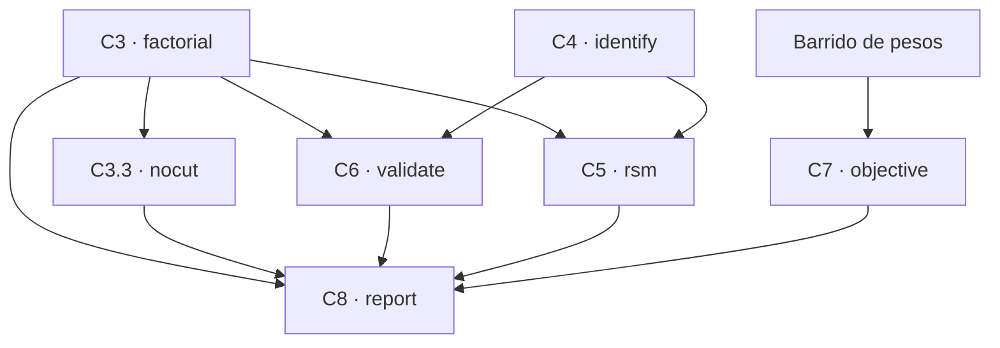

# Pipeline de calibración — réplica y resultados

| Campo | Valor |
|-------|-------|
| **Propósito** | (1) Re-ejecutar el pipeline de calibración metodológica sobre **otro dataset** (el definitivo) sin romper nada, y (2) dejar por escrito **qué resultados dio la corrida vigente** |
| **Fecha** | 2026-09-18 |
| **Relación** | [plan-calibracion-metodologica.md](./plan-calibracion-metodologica.md) (el *porqué* de cada fase) · [backlog](./backlog-calibracion-metodologica.md) (el *qué* y el *estado*) · [evidencia-calibracion-metodologica.md](./evidencia-calibracion-metodologica.md) (las tablas T1–T9, **regenerable**) |
| **Ámbito** | `backend/` (CLI, servicios, tests) y la vista `/settings/calibration`. **No se toca el algoritmo**: `aco_parallel.py` y `_aco_cvrp` quedan intactos |

> **Regla de oro:** todo el pipeline es **repetible desde la BD sin CPU** (`--reuse` / `--run-id`) y **solo se corre CPU cuando una fase lo pide**. Si solo quieres leer los resultados vigentes, ve a la §6 y al reporte; no hace falta relanzar nada.

---

## 1. Requisitos previos

```bash
just up              # feromap-db + feromap-api + feromap-frontend
just wait-db
just migrate
just seed            # o: just db-reset   (BD limpia + migrate + seed)
```

- Los barridos corren **dentro del contenedor** vía `just calib-*` (≈12–18 s por corrida).
- Suite backend (host, **no** en el contenedor):

```bash
cd backend && DATA_DIR="/home/victor/Proyectos/trabajo de grado/FEROMAP/data" .venv/bin/python -m pytest tests/ -q
```

- Suite frontend (autorizada explícitamente): `npm test` y `npm run build`.

## 2. Decisiones cerradas del estudio

Estas no se cambian por comodidad; si cambias una, la evidencia deja de ser comparable con la que ya está guardada.

| Decisión | Valor vigente | Nota |
|---|---|---|
| **δ** (materialidad) | **5.07 km** = 1 % de la referencia voraz de C1 | **Al cambiar de dataset se re-deriva y se vuelve a declarar** → §7, paso 2 |
| **n** | **10 semillas** | Cota pesimista pedía 6; 10 da coherencia con C1 e IC más estrechos |
| **Semillas** | `42, 101, 202, 303, 404, 505, 606, 707, 808, 909` | Números aleatorios comunes (CRN): las mismas para todos los puntos |
| **Escenario** | `normal` | Única instancia del estudio; se declara como límite |
| **Barrido en la BD** | `sweep='method'`, fase en `payload["phase"]` | No pisa la evidencia de la vista (`sensitivity`/`objective`/`validation`) |
| **Perfil estándar** | `12×20 · α1 β3 ρ0.12 Q1` | Referencia de todo el estudio |

`δ` es un **umbral declarado antes de ver los resultados**. La regla de derivación (`DEFAULT_DELTA_PCT = 1.0`, 1 % de la referencia voraz) vive en `backend/app/services/calibration_method_service.py`.

## 3. Verificación en dos pasos (obligatoria)

Nunca se lanza una corrida larga sin haber pasado el paso corto:

1. **`--dry-run`** — imprime el plan y el coste estimado, **0 CPU**.
2. **Paso corto con `--seeds 42,101`** — comprueba la fontanería: que el barrido corre, que el payload trae el contexto y que el análisis concluye con números sensatos.
3. **Corrida citable con las 10 semillas** — la que se registra como evidencia.

Los pasos cortos quedan como **verificaciones de fontanería**, no como evidencia: el reporte y la vista leen siempre la corrida **más completa** de cada fase (la de 10 semillas), no la más reciente.

## 4. Cómo correr el pipeline

### 4.1 Dependencias entre fases



- **Dependencias de datos** (las del grafo): `nocut`, `validate` y `rsm` **derivan su diseño** del factorial de referencia (se fija con `--reference-run-id N`; si se omite, se usa la corrida más completa guardada); `validate` y `rsm` además usan la síntesis del perfil recomendado (factorial + identificación); `objective` **no diseña nada** — replica las candidatas del **barrido de pesos** guardado, así que `just phase13-sweep` debe haber corrido antes; `report` necesita el factorial y declara como ausentes las fases sin evidencia, sin romper el documento.
- **C1 (noise) y C3.2 (budget)** no alimentan a ninguna otra fase: se corren primero por orden del protocolo (y C1 es el que deriva δ).

### 4.2 Comandos, coste y evidencia vigente

| Fase | Comando | Corridas (10 semillas) | Coste **medido** | Id vigente |
|---|---|---|---|---|
| C1 · ruido base | `just calib-noise` | 10 | ≈2 min | **2** |
| C3 · factorial 2⁴ | `just calib-factorial` | 200 | 59.3 min | **4** |
| C3.2 · presupuesto | `just calib-budget` | 50 | 17.3 min | **7** |
| C3.3 · sin corte | `just calib-nocut --reference-run-id 4` | 20 | 6.3 min | **9** |
| C4 · razón y Q | `just calib-identify` | 60 | 17.5 min | **11** |
| C6 · validación | `just calib-validate --reference-run-id 4` | 20 | 3.9 min | **13** |
| C7 · pesos del objetivo | `just phase13-sweep` → `just calib-objective` | 17 + 30 | 4.5 + 8.6 min | **18** + **20** |
| C5 · RSM | `just calib-rsm --reference-run-id 4` | 150 | 28.8 min | **15** |
| C8 · reporte | `just calib-report` | 0 | 0 | — |
| AC-3 (aparte) | `just phase13-weekly` | semana demo (5 optimizaciones diarias) | — | — |

**Protocolo completo: ≈540 corridas ≈ 2,4 h de CPU.** El pipeline entero también se puede lanzar como un job con `phase: "all"` **desde la vista** (§5), en el orden `noise → factorial → budget → nocut → identify → validate → objective → rsm`.

Opciones útiles del CLI (`just calib-<fase>`):

| Flag | Para qué |
|---|---|
| `--dry-run` | Plan y coste, sin CPU |
| `--seeds 42,101` | Paso corto de fontanería |
| `--reuse` | Reanaliza la última evidencia guardada de la fase (0 CPU) |
| `--run-id N` | Reanaliza una corrida concreta de `calibration_sweeps` (0 CPU) |
| `--reference-run-id N` | Declara el factorial de referencia (C3.3/C5/C6) |
| `--resume` | Reanuda un barrido cortado desde `data/cache/phase13/` (E0) |
| `--delta X` | Sobrescribe δ en km (por defecto, 1 % de la referencia voraz) |
| `--profile` | (solo `report`) imprime la síntesis del perfil recomendado |
| `--patience N` | Regla de parada de las fases que no la fijan (C1); `0` = sin corte |

> El coste que imprime `--dry-run` usa `12.9 s/corrida` (medido en C1) y es **optimista** para factorial/objective/RSM (en la práctica van a 17–18 s). Toma la columna «Coste medido» de la tabla como referencia.

### 4.3 Regenerar el reporte y las figuras

```bash
just calib-report            # escribe el markdown + los PNG (0 CPU)
just calib-report --profile  # solo la síntesis del perfil, por consola
```

Genera `docs/fase-13/evidencia-calibracion-metodologica.md` y, junto a él, `f1-convergencia.png`, `f2-efectos.png`, `f3-interacciones.png` y `f4-frontera.png`. Es **determinista**: dos corridas seguidas dan el mismo MD5. F1–F3 salen del factorial; F4 solo si hay evidencia de C7.

## 5. Lanzar desde la vista

`/settings/calibration` (pestaña **Protocolo metodológico**):

- **Evidencia**: lee la BD y pinta el perfil por perilla, el veredicto de validación, los criterios AC-1/AC-2 de los pesos, la meseta del RSM y la trazabilidad por fase con su **sello de instancia**. **0 CPU.** Si una fase es de otra instancia, aparece el aviso de sello `stale`.
- **Botón de lanzamiento**: elige *una fase* (o *protocolo completo*), semillas cortas (2) o completas (10), y lanza el job. Un barrido a la vez; el semáforo de calibración lo garantiza.
- **Aplicar perfil recomendado**: copia el perfil a la configuración del motor ACO.
- **Antes de lanzar `all` desde la vista**, asegúrate de que existe el barrido de pesos (`just phase13-sweep`); si no, el job falla con un error explícito.

## 6. Resultados obtenidos (corrida vigente)

Instancia: **180 puntos · 10 vehículos (8 asignables) · escenario `normal`**. Tablas completas en [evidencia-calibracion-metodologica.md](./evidencia-calibracion-metodologica.md) y en [evidencia-multiobjetivo.md](./evidencia-multiobjetivo.md).

### 6.1 Perfil recomendado

**`α1 β5 ρ0.12 Q1 P5 · 12×20`** — se mueve **solo β (3 → 5)**.

| Perilla | Estándar | Recomendado | Motivo |
|---|---|---|---|
| α | 1 | 1 | Inerte con β = 5 (su efecto vive en las esquinas β = 1) |
| β | 3 | **5** | Único efecto material y significativo que sobrevive Holm |
| ρ | 0.12 | 0.12 | Efecto 0.01 km, p = 1.0 → inerte |
| Q | 1 | 1 | Inerte dentro del ruido → sale del ranking |
| P | 5 | 5 | El corte cuesta ≈1.1 km; no hay evidencia para moverlo |
| Presupuesto | 12×20 | 12×20 (`I = 20`) | 40 iteraciones no mejoran > δ |
| Jornada | 12 h | **12 h** | Con 180 puntos la ventana de 8 h no cubre la demanda |

### 6.2 Hallazgos por fase

| Fase (id) | Resultado |
|---|---|
| **C1** (2) | σ = 3.4 km; **δ = 5.07 km**; el umbral heredado (0.94 km) era 3.6× más fino que el ruido real; n = 6 basta |
| **C2** | 0.11 s de ACO por iteración; convergencia mediana en 8 iteraciones, peor caso 20 |
| **C3** (4) | β **−45.8**, α **−35.0**, α×β **+33.1**, paciencia **−6.1** (todos Holm-significativos); ρ **0.01 km, p = 1.0**; curvatura **−18.8 km**; motor determinista con (parámetros, semilla) |
| **C3.2** (7) | **`I = 20`**; el brazo de 40 iteraciones no mejora > δ; los tres repartos de trabajo fijo son equivalentes y el más barato es `(8,30)` |
| **C3.3** (9) | El early-stop cuesta **≈1.1 km** en el estándar (IC [−6.0, 0.0]: sin evidencia de equivalencia); en el mejor de C3 (P10) nunca actuaba |
| **C4** (11) | **H5 refutada**: no gobierna `r = β/α`. Misma r con distinta nitidez → difieren 8.2 km; distinta r con misma β → equivalentes. **Q inerte** |
| **C5** (15) | β lineal **−7.25** (Holm 0.018), curvatura β² **+3.31** (Holm 0.078) → óptimo interior; **meseta** β ∈ [4.7, 10], ρ ∈ [0.06, 0.24], I ∈ [10, 40] |
| **C6** (13) | **`not-comparable`**: Δ −4.6 km, IC [−9.5, +0.25]; Wilcoxon p = 0.049, TOST p = 0.44 |
| **C7** (20 · barrido 18) | **AC-1 no evaluable**, **AC-2 FALLA**, **AC-3 OK** (ver §6.3) |
| **T9** | Friedman χ² = 136.7, p ≈ 1e-21; 14 de 15 configuraciones se distinguen del mejor |

### 6.3 Pesos del objetivo

- Con 180 puntos la jornada de **8 h es infactible**: los 12 puntos del bloque dejan **8–10 puntos sin visitar**. Por eso **AC-2 no se sostiene** (no hay «punto aceptado») y **AC-1 queda no evaluable** (se mide en ese punto aceptado). Las 15 filas con pesos **sí** cumplen la tolerancia de distancia (ratio ≤ 1.099).
- En 8 h los pesos casi no mueven nada: `equidad` 0.5–5 deja la corrida idéntica a la base (165.7 km · 8 veh · 7.96 h); `makespan` 0.5/1/2 empatan (166.0 km); solo `makespan 5` se desvía (+8.9 km).
- En **12 h** (factible, 0 sin cubrir, 6 camiones) hay compromiso: 194.2 → 187.4 km (`makespan 2`) → 198.6 (`equidad 2`). Frontera de Pareto: **1 solución** (`12 h · makespan 2`).
- Réplica con 10 semillas: medianas 163.85 / 164.85 / 170.35 km; hipervolumen de la frontera **7.64 km·h**, IC [6.14, 9.06].
- **AC-3**: `distinctVehiclesWeek=8`, `vehicleDaysUsed=30`, `usageStdDays=0.43`, `rotationIndex=0.88`.

### 6.4 Lo que quedó **sin certificar** (también es un resultado)

1. **C6 `not-comparable`**: el efecto (−4.6 km) está justo por debajo de δ (5.07). No se certifica equivalencia (el IC no cabe en ±δ) ni mejora material (el IC cruza −δ y el cero). El perfil se defiende por **evidencia por factor + meseta + no-empeorar**, no por ganancia de distancia.
2. **AC-1 no evaluable / AC-2 falla** con la instancia de 180 puntos.
3. **C3.3**: la equivalencia del brazo sin corte no se alcanza (IC [−6.0, 0.0]).

---

## 7. Replicar con el dataset definitivo

Checklist en orden. Cada paso dice qué mirar para saber que salió bien.

1. **Cargar el dataset y sellar la instancia.**
   `just db-reset` (o `migrate` + `seed`). Esto escribe un **epoch de seed** nuevo → la huella de instancia cambia → **toda la evidencia anterior queda `stale`** (la vista lo avisa; el CLI no). No reutilices `--reuse` / `--run-id` con evidencia vieja.

2. **Re-derivar δ y volver a declararlo.** Corre C1 (`just calib-noise`) sobre el dataset nuevo; el análisis imprime la DE y el δ derivado (1 % de la **referencia voraz**, que cambia con el dataset). Después actualiza el δ declarado en **dos** sitios:

   - `backend/scripts/calibration_method.py` → `PROTOCOL_DELTA_KM` (hoy `5.07`)
   - `backend/app/services/calibration_evidence_service.py` → `DEFAULT_DELTA_KM` (hoy `5.07`)

   Alternativa sin tocar código: pasar `--delta X` en CLI y `?deltaKm=X` en `GET /benchmarks/calibration/method`. **No cambies `DEFAULT_DELTA_PCT`** (esa es la *regla* de derivación, no el valor).

   > Por qué importa: el bloque de pesos del objetivo usa una **referencia voraz distinta** (la del motor con jornada acotada) que la del perfil estándar. Si δ se dejara derivar por fase, C7 usaría un δ distinto y las tablas dejarían de ser comparables. Por eso C7 recibe el δ declarado explícitamente.

3. **Re-correr el barrido de pesos** (C7 lo replica):
   `just phase13-sweep` (17 corridas ≈ 4.5 min). Guarda una fila `sweep='objective'`.

4. **Correr el protocolo en orden, fase a fase, en dos pasos** (§3 y §4.2):

   ```bash
   # Paso 1 de cada fase: el plan y el coste, sin CPU.
   just calib-noise      --dry-run
   just calib-factorial  --dry-run
   just calib-budget     --dry-run
   just calib-nocut      --dry-run  --reference-run-id <id del factorial>
   just calib-identify   --dry-run
   just calib-validate   --dry-run  --reference-run-id <id del factorial>
   just calib-objective  --dry-run                 # requiere el paso 3
   just calib-rsm        --dry-run  --reference-run-id <id del factorial>
   ```

   Paso 2: repite cada comando **tal cual con `--seeds 42,101`** (fontanería). Paso 3: solo si el corto sale limpio, repítelo **sin `--seeds`** (citable, 10 semillas).

   Un `--dry-run` por fase debe decir **1 / 20 / 5 / 2 / 6 / 2 / N / 15** casos respectivamente (el N del objetivo depende de cuántos puntos no dominados tenga el bloque de 8 h del dataset nuevo: con el vigente son 3).

   La corrida citable también se puede lanzar entera desde la vista (`phase: "all"`, 10 semillas).

5. **Regenerar el reporte y las figuras:** `just calib-report`. Debe citar en T1 los **ids nuevos** de cada fase y escribir los 4 PNG.

6. **(Aparte) AC-3:** `just phase13-weekly` (crea y borra una semana demo a +60 días).

7. **Verificar la réplica:**

   - `--dry-run` con los recuentos del paso 4.
   - El paso corto imprime tablas con números (ningún veredicto «— sin muestra»).
   - T1 del reporte cita los ids nuevos y la vista muestra **`fresh`** en las 8 fases (ningún `stale`).
   - `just calib-report` dos veces seguidas → mismo MD5 (determinismo).
   - `cd backend && DATA_DIR="<repo>/data" .venv/bin/python -m pytest tests/ -q` en verde; `npm test` y `npm run build` en verde.

**Qué es razonable que cambie** con el dataset definitivo: δ, el perfil recomendado (otra perilla puede moverse o ninguna), la factibilidad de la jornada de 8 h (si el dataset es más pequeño, AC-2 puede sostenerse), la frontera de pesos y los ids. **Qué no debe cambiar sin querer:** n, el juego de semillas y el escenario (son las condiciones del estudio).

## 8. Trampas conocidas

- **Un barrido solo escribe al final** (una fila por fase). Si se corta, el salvavidas `data/cache/phase13/method-<fase>.jsonl` permite reanudar con `--resume`. El CLI **no** reanuda por defecto (`resume=false`); el job de la vista **sí** (`resume=true`). El fichero se borra al guardar en la BD.
- **La evidencia vigente no es «la última», es la más completa.** Un paso corto posterior a la citable tiene menos semillas y no debe citarse; por eso el reporte y la vista eligen por nº de semillas y el factorial admite `--reference-run-id`.
- **C7 conserva las filas con puntos sin cubrir** a propósito: que una fila deje puntos fuera es el resultado de AC-2, no un dato a descartar.
- **El nº de candidatas de C7 depende del barrido de pesos** (con el vigente, 3). Si cambia, cambia el coste de la fase; el aviso de `--dry-run` manda.
- No interrumpas un barrido largo: la fila se escribe al terminar (el `--dry-run` y el paso corto son la red).
- No persigas significancia con 30+ semillas: con CRN, n = 10 y δ declarado es la decisión cerrada.
- La evidencia vive en la **BD**; `data/cache/phase13/multiobjective_sweep.json` es un residuo de una versión anterior y **no** se lee.

## 9. Dónde vive cada cosa

| Pieza | Ruta |
|---|---|
| Diseño de casos + análisis (funciones puras) | `backend/app/services/calibration_method_service.py` |
| CLI del protocolo | `backend/scripts/calibration_method.py` |
| Runner de una fase / protocolo completo (jobs) | `backend/app/services/calibration_method_runner.py` |
| Ensamblaje de la evidencia (CLI y API) | `backend/app/services/calibration_evidence_service.py` |
| Figuras F1–F4 (PNG) | `backend/app/services/calibration_figures_service.py` |
| Barrido de pesos del objetivo | `backend/app/services/multiobjective_sweep_service.py` |
| Salvavidas de reanudación (E0) | `data/cache/phase13/method-<fase>.jsonl` |
| Evidencia | tabla `calibration_sweeps` (`sweep='method'` + `phase`; `objective` para los pesos) |
| API | `GET /benchmarks/calibration/method` · `POST /benchmarks/calibration/method/jobs` |
| Vista | `src/features/settings/MethodEvidencePanel.tsx` + `CalibrationPage.tsx` |
| Tests | `backend/tests/test_calibration_method_service.py`, `test_calibration_figures_service.py`, `test_calibration_method_integration.py`, `test_calibration_resume.py` |
