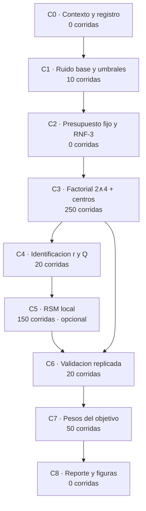

# Plan de calibración metodológica del motor ACO

| Campo | Valor |
|-------|-------|
| **Estado** | Propuesta — pendiente de aprobación |
| **Fecha** | 2026-09-17 |
| **Fase** | 13 — Optimización multiobjetivo (rigor de calibración) |
| **Alcance** | Protocolo experimental, instrumentación del barrido y evidencia estadística del capítulo de resultados |
| **Ejecutable** | El *estado* y el *cómo* viven en [backlog-calibracion-metodologica.md](./backlog-calibracion-metodologica.md); la *réplica paso a paso* y los resultados, en [pipeline-prueba.md](./pipeline-prueba.md) |
| **Código de referencia** | `backend/app/services/aco_sensitivity_service.py` · `backend/app/services/optimization_service.py` · `backend/app/services/aco_parallel.py` · `backend/app/services/instance_fingerprint.py` · `backend/app/services/statistical_validation.py` · `backend/app/services/calibration_sweep_store.py` · `backend/scripts/aco_sensitivity.py` · `justfile` |
| **Relación** | Sustituye el diseño OFAT de [plan-vista-calibracion.md](./plan-vista-calibracion.md) §3 (excluido "barridos con interacciones") y profundiza la decisión D2 de [especificacion-motor-multiobjetivo.md](./especificacion-motor-multiobjetivo.md). Conserva [adr-011-calibracion-en-bd.md](./adr-011-calibracion-en-bd.md) |
| **No incluye** | Cambios al motor ACO ni al modelo CVRP (fuera de alcance, congelado) |

## 1. Objetivo

Que los parámetros del motor dejen de defenderse con *«medí 18 corridas y elegí el mínimo»* y pasen a defenderse con un protocolo reproducible: **diseño declarado, réplicas, comparaciones válidas a presupuesto fijo, incertidumbre cuantificada y umbrales derivados de la medición**.

El resultado declarable al final del plan es una **región de parámetros estadísticamente equivalente** con su incertidumbre, y un **punto elegido dentro de esa región por coste computacional** — no un "óptimo".

## 2. Hallazgos que motivan el plan

Verificados sobre el código actual. Son la justificación de cada fase.

| # | Hallazgo | Evidencia en código | Consecuencia |
|---|---|---|---|
| H1 | El motor **ya calcula** la serie de convergencia por iteración y el barrido la **descarta** | `optimization_service.py:1993-2024` (`acoConvergence` en `engineMetrics`) vs `aco_sensitivity_service.py:128-143` (la corrida solo guarda 4 métricas) | C0: la figura de convergencia es gratis; hoy no existe |
| H2 | La **huella de instancia no cubre** λ_b, λ_t, `minActiveVehicles`, `acoPatience`, `twoOptPasses`, `pheromoneElitist` ni los multiplicadores heurísticos | `instance_fingerprint.py:75-98` | Dos corridas medidas con objetivos distintos se leen ambas como `fresh` |
| H3 | Si λ_b o λ_t > 0, **la métrica del ranking (distancia) no es la función que el motor minimiza** | `optimization_service.py:2427-2432`, `:2453-2457`; métrica reportada en `aco_sensitivity_service.py:137` | El ranking de los 6 ejes podría medir un componente ajeno al objetivo |
| H4 | El eje de iteraciones se declaró **estable (0.0 %)** porque todas sus corridas cortaron por paciencia en el mismo punto | `optimization_service.py:1378-1384`; paciencia heredada de Administración, default 5 (`config.py:88`) | Es una **estabilidad falsa**: nunca se ejecutaron más de ~10 iteraciones |
| H5 | `α` y `β` **no son separables**, pero el mecanismo es otro: con τ₀ = 1/d y `η = 1/d`, el orden inicial depende de `α + β`, y α solo pesa cuando β es bajo (interacción) | C4 (id 11): misma β con r = 2.5 y r = 5 ⇒ **equivalentes** (Δ −0.1 km, p = 1.0); misma r = 2.5 con α distinta ⇒ **difieren 8.2 km** (Holm 0.0078) | **H5 (enunciado de razón) refutada**: α y β se recomiendan **por separado** — β domina y α es inerte con β alto |
| H6 | El eje de hormigas compara **trabajo distinto** (160 / 240 / 400 ant-iteraciones) y con iteraciones efectivas distintas (10 / 9 / 6) | `aco_sensitivity_service.py:26-30`; `resolve_aco_parallel_workers` en `aco_parallel.py:49-57` | «20 hormigas es peor» está confundido con «20 hormigas ejecutó 6 ondas» |
| H7 | El wall time depende de `os.cpu_count()` (pool de hormigas por iteración) | `aco_parallel.py:49-57` | Un presupuesto de **tiempo fijo no es reproducible** entre máquinas |

`Q` merece nota aparte: la selección es invariante ante un escalado uniforme de τ, y τ₀ = 1/d ya codifica el heurístico. El 0.0 % medido es plausible y `Q` se trata como **validación de implementación**, no como eje de calibración (C5).

## 3. Definiciones y convenciones

| Símbolo | Significado | Valor / regla |
|---|---|---|
| `n` | Semillas por punto, **emparejadas (CRN)** | **Declarado: 10** (la cota pesimista con δ = 5.07 km pide 6; se usan 10 por coherencia con C1 y para IC más estrechos) |
| `CRN` | Common Random Numbers: el mismo conjunto de semillas en todos los puntos | Obligatorio en todo el plan |
| `I` | Iteraciones configuradas | **Declarado: 20 en C3.1**; `20` vs `40` lo decide C3.2 (regla: sube solo si la mediana con 40 mejora más de δ) |
| `H` | Hormigas | variable solo en el eje de presupuesto (C3.2) |
| `B` | Presupuesto de trabajo = `H × I` | 240 ant-iteraciones en el perfil de calibración |
| `δ` | Diferencia mínima material | **Declarado: 5.07 km** = 1 % de la referencia voraz (2.7 % de la ruta total, ≈18 min de jornada de flota). Queda **por encima** del ruido medido (3.4 km), que es lo que hace que la regla de equivalencia discrimine en lugar de declarar todo indistinguible. **Coste declarado:** no detecta efectos por debajo de ~5 km |
| `r` | Razón de preferencia `β/α` | Reportada junto a `α` en todas las tablas |
| Familia | Conjunto de contrastes para la corrección de multiplicidad | Pre-declarada por fase; Holm |
| Criterio | A presupuesto `B` y `n` semillas: **mediana de la distancia**, IC bootstrap 95 %, Δ pareado vs estándar | Sustituye a «mínima distancia de una corrida» |

**Protocolo declarado (2026-09-17, antes de correr C3):** δ = 5.07 km · n = 10 semillas · I = 20 en C3.1. Las tres cifras se fijan **antes** de ver los resultados: elegirlas después convertiría el umbral en un resultado y la calibración en una selección a posteriori.

**Regla de equivalencia (empates).** Dos niveles son *equivalentes* si el **IC 95 % de la diferencia pareada está contenido en (−δ, +δ)**. Entre equivalentes decide el **coste**: menos hormigas → menos iteraciones → menos pasadas de 2-opt. Nunca "el primero del orden".

**Regla de estabilidad.** Un eje es *estable* si su IC pareado está dentro de ±δ. Un test **no significativo no** declara estabilidad (ausencia de evidencia ≠ evidencia de ausencia).

## 4. Fases

Coste: base de cálculo **12.9 s/corrida de pared**, medido en C1 el 2026-09-17 (128.9 s / 10 corridas). De esos, 3.7 s son de motor —2.2 s de ACO para 20 iteraciones, es decir **~0.11 s por iteración**— y el resto es sobrecarga por corrida (instancia, BD, huella). Un punto con 10 semillas ≈ **2.1 min**.

> La estimación previa (18.9 s/corrida, derivada de los 340 s de las 18 corridas OFAT) sobrevaloraba el coste en ~1.5×. §C2 trae la tabla de compatibilidad con RNF-3 rehecha con la medición.

| Escenario | Corridas | Tiempo de pared (medido) |
|---|---|---|
| Mínimo defendible (C0–C4, C6–C8) | 350 | **≈ 1.3 h** |
| Recomendado (con C5) | 500 | **≈ 1.8 h** |
| Con paralelismo por semilla y C núcleos | 500 | ÷ ~C |

---

### C0 — Congelar y registrar el contexto de medición

**Objetivo.** Que la evidencia diga *con qué* se midió. Sin esto, ninguna fase posterior es interpretable.

**Cambios**

| Archivo | Cambio |
|---|---|
| `backend/app/services/aco_sensitivity_service.py:158-254` | Al dict de cada corrida: `seed`, `workUnits`, `acoConvergence`, `acoPatience`, `twoOptPasses`, `pheromoneElitist`, λ_b, λ_t, `minActiveVehicles`, `maxRouteHoursTarget`. Los dos de 2-opt/elitista **no existían** en `engineMetrics`: ver Anexo A |
| `backend/app/services/aco_sensitivity_service.py:257-352` | `seeds: list[int]` (réplicas con CRN), `cases` (lista de casos), `phase` y `sweep`; los hiperparámetros que un caso no varía se **fijan** al valor estándar; λ_b = λ_t = 0 explícitos; `seeds`/`budget`/`phase` en la raíz del payload |
| `backend/app/services/instance_fingerprint.py:81-131,157` | Bloque `engine` en la huella: ACO (α, β, ρ, Q, elitista, hormigas, iteraciones, paciencia, 2-opt), objetivo (λ_b, λ_t, flota mínima, jornada objetivo, peso de rebose) y heurísticos |
| `backend/app/services/optimization_service.py:1996-1997,2014-2015,2299-2301,2408-2430,3128-3129` | `twoOptPasses` y `pheromoneElitist` en `engineMetrics`, y `aco_patience`/`two_opt_passes`/`pheromone_elitist` como parámetros por corrida (`None` = heredar), con el mismo patrón que α/β/ρ/Q |
| `backend/scripts/calibration_method.py` | **Nuevo.** CLI por fase (`noise|factorial|budget|identify|rsm|validate|objective|report`) con `--dry-run`, `--seeds` y `--patience`; C1 implementada, el resto son firmas con su referencia al plan |
| `justfile:115-150` | Recetas `calib-*` |
| `src/features/settings/CalibrationHistoryPanel.tsx:18-35` | El historial de esta vista filtra los barridos que no sabe renderizar (el protocolo `method` se lee en su reporte) |

**Auditoría previa.** λ_b y λ_t vigentes en `algorithm_settings` (defaults 0.0 / 0.0 / `None`, `config.py:113-118`, `schemas/admin.py:133-138`). No hace falta consultarla para decidir: el barrido **fija** λ_b = λ_t = 0 de forma incondicional, que es inocuo si ya eran 0 y correctivo si no lo eran (así el ranking por distancia es el objetivo que el motor minimiza de verdad).

**Límite que queda.** `minActiveVehicles` **no** se puede neutralizar: pasar `min_active_vehicles=1` activaría la ruta multiobjetivo del motor (`objective_requested`, `optimization_service.py:2471-2475`), que es un cambio de algoritmo y no de instrumentación. Se **registra** su valor efectivo: si en la evidencia aparece no nulo, el ranking de distancia no es distancia pura y hay que limpiarlo en Administración antes de medir.

**Criterio de aceptación.** Una corrida deja en `calibration_sweeps.payload_json` los 10 campos de contexto por corrida (incluidos `twoOptPasses` y `pheromoneElitist`) más `seeds`/`budget`/`phase` en la raíz. `just phase3-report` sigue funcionando. La evidencia previa pasa a `stale` (esperado y correcto: hoy no es verificable).

**Coste.** 0 corridas nuevas · ~30 min de implementación.

---

### C1 — Ruido base y umbrales

**Objetivo.** Derivar `δ` y `n` de una medición, no de una convención. Sustituye el umbral arbitrario de 0.5 %.

**Ejecución.** `just calib-noise` (perfil estándar 12×20, α1 β3 ρ0.12 Q1, × 10 semillas, con `acoPatience = 0` —sin corte— por defecto en el CLI). Incluye la semilla histórica 42, así que la evidencia previa queda reutilizada como una réplica más. El **análisis va incluido** y se puede repetir sin CPU con `--reuse`.

**Salidas**

| Salida | Definición |
|---|---|
| `s_marginal` | DE de la distancia entre semillas |
| `s_diff` | DE de la **diferencia pareada** estándar vs sí mismo con CRN (piso de ruido real) |
| Semiancho IC | ≈ 1.96 · `s_diff` / √n |
| `δ` | Materialidad operativa **declarada**: p. ej. 1 % de la distancia de referencia voraz, o su equivalente en minutos de jornada. Se escribe con la justificación, no como porcentaje redondo |
| `n` | El menor `n` con semiancho ≤ δ; si 10 no alcanza, subir (cada semilla ≈ 19 s) |

**Criterio de aceptación.** `δ` y `n` documentados con la tabla que los deriva; el semiancho del IC ≤ δ. Si no se cumple con n=10, se sube `n` y se registra el cambio.

**Coste.** 10 corridas ≈ **2.1 min** (128.9 s medidos) · el análisis no cuesta CPU (`--reuse`).

**Resultado (2026-09-17).** DE entre semillas **3.4 km (1.76 %)** frente al umbral heredado de 0.94 km → **3.62× el umbral**: la regla de «eje estable» al 0.5 % vivía por debajo del ruido. δ = 5.07 km (1 % de la referencia voraz de 506.6 km); con la DE medida bastan **n = 6** semillas para el peor caso pareado, así que las 10 usadas dan margen. Convergencia: mediana en la **iteración 8**, **peor caso la 20** (evidencia que sostiene la decisión de §C2).

---

### C2 — Protocolo de presupuesto fijo y compatibilidad con RNF-3

**Objetivo.** Eliminar H4/H6/H7: comparar a esfuerzo comparable y declarado, no a un corte adaptativo y no reproducible.

**Decisiones**

1. `I = 20` fijo en **todos** los puntos del diseño (el eje de presupuesto lo trata C3.2).
2. Presupuesto de calibración `B = (H, I)` declarado por punto; `H × I` se reporta como trabajo efectivo.
3. La paciencia **dejó de ser herencia** *(implementada en C0)* y es **factor declarado**: `acoPatience ∈ {2, 10}` en C3, más un brazo de control sin corte (`acoPatience = 0`) en C3.3.
4. `acoIterationsRun` y `acoStoppedEarly` se reportan por punto: la iteración efectiva es un dato, no un secreto.

**Compatibilidad con RNF-3 (15 s), con coste medido** (C1, 12 hormigas, 20 iteraciones, 2026-09-17):

| Medición | Valor |
|---|---|
| ACO por iteración | **0.11 s** |
| ACO con `I = 20` | 2.2 s |
| Motor por corrida (`I = 20`) | 3.7 s |
| Pared por corrida (barrido completo) | 12.9 s |
| `I` máximo con el motor ≤ 15 s | **~130** |

→ RNF-3 **no aprieta el presupuesto**: `I = 40` gastaría ~4.4 s de ACO y ~7 s de motor. El límite real es la sobrecarga por corrida (9 s de pared), no el algoritmo.

**Evidencia de convergencia (C1, 10 semillas).** La mediana de las corridas alcanza el 1 % de su valor final en la **iteración 8**, pero el **peor caso llegó a la 20** (seguía mejorando en la última onda). Lectura para el presupuesto: `I = 20` basta para la mediana y queda **justo** para la cola, así que C3.2 debe incluir un nivel con más iteraciones (40) para decidir si el presupuesto de comparación sube.

**Criterio de aceptación.** Tabla de presupuesto escrita; ninguna corrida del plan supera 15 s de `acoSeconds` (verificado con el payload de C1; si alguna lo supera, se baja `I`). Un presupuesto de **tiempo fijo** queda explícitamente descartado como criterio de comparación (H7).

**Coste.** 0 corridas.

---

### C3 — Diseño factorial 2⁴ + centros

**Objetivo.** Lo que el OFAT no puede dar: efectos principales **e interacciones** de los cuatro hiperparámetros, sin aliasing, resolviendo H4, H5 y H6.

#### C3.1 — Factorial completo 2⁴ (α, β, ρ, paciencia) + 4 centros

Diseño factorial **completo** de 4 factores: 16 corridas + 4 centros = **20 puntos**. Al ser completo, **ningún efecto principal ni interacción de dos factores está aliaseado** — es la afirmación más fuerte y más barata disponible (resolución V por construcción).

| Factor | −1 | +1 | Centro |
|---|---|---|---|
| A · α | 0.5 | 2 | 1 |
| B · β | 1 | 5 | 3 |
| C · ρ | 0.05 | 0.30 | 0.12 |
| D · `acoPatience` | 2 | 10 | 5 |

Generación: `itertools.product([-1, 1], repeat=4)` → 16 corridas; **4 centros idénticos al perfil estándar**, así que el control queda integrado en el diseño en lugar de ser una corrida aparte. En cada punto se reporta `r = β/α` junto a α y β; C4 mide si es `r` lo que gobierna el orden (**no lo es**).

**Qué hacen los centros bajo números aleatorios comunes.** Las 4 réplicas comparten semillas, así que son la **misma corrida repetida**: (i) verifican que el motor es **determinista** con (parámetros, semilla) —sin eso se cae el emparejamiento en el que se apoyan todas las comparaciones del plan—, y (ii) dan la comparación centros-vs-esquinas para la **curvatura**. Lo que **no** dan es un error puro clásico: para eso harían falta semillas distintas por réplica, y eso rompería el emparejamiento. Se declara como límite; el error de la fase se estima con la DE entre semillas.

**Coste.** 20 puntos × 10 semillas = 200 corridas. **Medido: 59.3 min** (17.8 s/corrida), no los 43 min estimados: las configuraciones con β = 1 construyen rutas mucho peores (~270 km) y las de paciencia 10 agotan las 20 ondas. El coste por corrida depende del diseño (12.9 s en el perfil estándar de C1), así que este diseño usa 17.8 s como cota alta.

#### C3.2 — Eje de presupuesto

`(H, I) ∈ {(8,30), (12,20), (20,12)}`, todos con `H × I = 240` y el resto en el perfil estándar. Esto es lo que hace interpretable el eje de hormigas (H6): la evidencia anterior compara 160 / 240 / 400 ant-iteraciones con 10 / 9 / 6 ondas ejecutadas.

**Brazo de presupuesto creciente** (`(12,40)` y `(20,40)`): la convergencia de C1 dejó el peor caso en la iteración 20, y `I = 40` cabe de sobra en RNF-3 (~4.4 s de ACO). Sin este brazo no se puede decidir si el presupuesto de comparación sube.

**Coste.** 5 puntos × 10 semillas = 50 corridas ≈ **11 min**.

#### C3.3 — Brazo de control sin corte

Perfil estándar y mejor configuración de C3.1, ambas con `acoPatience = 0`: cuantifica cuánta calidad deja sobre la mesa la regla de parada. Convierte el early-stop de confusor en resultado operativo.

**Coste.** 2 puntos × 10 semillas = 20 corridas ≈ **4 min**.

#### Análisis (implementado)

- **Contrastes ortogonales por semilla**: en un factorial completo el efecto de un factor es `(1/8)·Σ signo·y` sobre las 16 esquinas, calculado una vez **por semilla**. Da `n` estimaciones por efecto en lugar de una sola y respeta el emparejamiento por números aleatorios comunes.
- **Familia de 10 contrastes** (4 principales + 6 interacciones de dos factores) ajustada con **Holm**, con IC bootstrap de la mediana por contraste.
- **Curvatura**: centros frente al promedio de esquinas, pareado por semilla. **Determinismo**: se comprueba que las 4 réplicas del centro dan exactamente lo mismo (es lo que sostiene el emparejamiento por semilla).
- **Selección**: región estadísticamente equivalente (IC 95 % del Δ pareado contenido en ±δ) y la más barata dentro de ella. Nunca "el primero del orden".
- **Convergencia**: iteración en la que cada corrida alcanza el 1 % de su valor final; la serie completa queda en el payload para las figuras de C8.
- Las tablas salen en markdown desde `calibration_method_service.format_factorial_analysis`, así que C8 las reutiliza en lugar de reimplementarlas.

**Criterio de aceptación.** Tabla de efectos con IC y *p* ajustado; los 2FI de (α, β) y (β, ρ) estimados; región equivalente declarada; series de convergencia persistidas. **Pendiente:** las figuras (C8).

**Coste C3 total.** 250 corridas ≈ **54 min** (12.9 s/corrida medidos).

---

### C4 — Lecturas de identificación: `r = β/α` y validación de `Q`

**Objetivo.** Convertir dos omisiones en dos resultados: separar **razón** (`r`) de **nitidez** (α), y validar `Q`.

**Ejecución.** Seis puntos nuevos (ρ = 0.12, paciencia = 5, presupuesto 12×20), contrastes **pre-declarados** y pareados por semilla:

| Contraste | Puntos | Qué se declaró esperar |
|---|---|---|
| `r` constante: (α1, β5) vs (α2, β10) → ambos `r = 5` | 2 | Equivalentes: el orden lo fijaría `r`; `α` no lo cambia |
| `r` constante: (α1, β2.5) vs (α2, β5) → ambos `r = 2.5` | (α2, β5) ya medido en C3 | Equivalentes: la misma razón con distinta nitidez |
| `r` distinto: (α2, β5) vs (α1, β5) → `r = 2.5` vs `r = 5` | 1 | Debe diferir más de δ si gobierna `r` |
| `Q ∈ {0.5, 2}` a presupuesto fijo (Q = 1 = centro) | 2 | Efecto dentro de δ → justifica retirar `Q` del ranking |

**Resultado (2026-09-18, `calibration_sweeps` id 11, 60 corridas, 17.5 min).** El enunciado de razón de H5 **queda refutado**:

| Contraste | Δ km | IC 95 % | p Holm | Veredicto |
|---|---|---|---|---|
| (α1 β5) vs (α2 β10), r = 5 | +2.1 | [0.1, 7.4] | 0.1875 | no equivalente (mediana < δ) |
| (α1 β2.5) vs (α2 β5), r = 2.5 | +8.15 | [4.6, 12.5] | 0.0078 | **difiere** |
| (α2 β5) vs (α1 β5), r 2.5 vs 5 | −0.1 | [−2.5, 4.3] | 1.0 | **equivalente** |
| Q0.5 vs Q2 | +0.5 | [−0.35, 3.1] | 0.75 | equivalente |

**Salida.**

- **`Q` inerte dentro del ruido**: sale del ranking y queda como validación de implementación (Q = 1).
- **La razón no gobierna el orden**: α y β se recomiendan **por separado**. Lo que ordena es **β** (β = 5 ≈ β = 10 ≈ 189–191.6 km; β = 2.5 → 200.2; β = 1 ya era ≫ 200 en C3), y **α solo actúa con β bajo** (la interacción +33.1 km de C3 vive en las esquinas β = 1). Con β = 5, α1 y α2 son equivalentes.
- Consecuencia para el OFAT: la combinación `α2 β5` **sí** es defendible, pero no porque conserve `r`, sino porque α es inerte con β = 5.
- La conclusión sigue acotada a una instancia y un escenario, y β = 10 es **extrapolación** del rango de C3 (β ∈ {1, 5}).

**Coste.** 6 puntos × 10 semillas = 60 corridas ≈ **17.5 min** medidas (no 20: α1 β5 no está en C3.1, cuyos niveles de α son 0.5/2, no 1).

---

### C5 — Superficie de respuesta local (Box-Behnken) — *opcional / recortable*

**Objetivo.** Sustentar los valores finales con curvatura y con una región de equivalencia, en lugar de con "el mínimo de 3 niveles".

**Diseño.** Box-Behnken de 3 factores (**β**, `ρ`, `I`) alrededor de la mejor región de C3: 12 corridas + 3 centros = 15 puntos. Box-Behnken esférico y sin vértices extremos: 15 puntos en lugar de los 27 de un 3³. El primer factor es **β** y no `r = β/α` porque C4 refutó que la razón gobierne; α se fija en el valor recomendado por C6.

**Análisis.** Coeficientes del modelo de segundo orden; superficies de contorno y la **meseta** dentro de ±δ.

**Criterio de aceptación.** La región equivalente declarada explícitamente: "mover `r` y `ρ` dentro de este rango no degrada más de δ".

**Coste.** 15 puntos × 10 semillas = 150 corridas ≈ 47 min. **Si el plazo aprieta, esta fase se recorta: C0–C4 + C6–C8 siguen siendo defendibles.**

---

### C6 — Validación replicada de la combinación

**Objetivo.** Reparar la validación actual (2 corridas, 1 semilla, incapaz de detectar nada) y cerrar el *winner's curse* de "el mínimo de cada eje" (H5).

**Ejecución.** Dos optimizaciones con **misma instancia y las mismas n semillas (CRN)**: perfil estándar (control) vs combinación recomendada.

**Análisis**

| Salida | Regla |
|---|---|
| Veredicto | `better` / `equal` / `worse` **con IC**, no por umbral de 0.5 % |
| Umbral de empate | El mismo `δ` de C1 (coherencia con la regla de estabilidad) |
| Contraste | Wilcoxon de rangos con signo sobre las diferencias pareadas + IC bootstrap |
| Equivalencia | **TOST** contra ±δ (no un no-significativo) |
| Efecto | Δ mediano y % de cambio |

**Criterio de aceptación.** Veredicto emitido con IC y con el mismo `δ` del resto del plan. Si el veredicto es `equal`, la recomendación se sostiene **por coste, no por distancia** — y eso se declara así.

**Coste.** 2 puntos × 10 semillas = 20 corridas ≈ 6 min.

---

### C7 — Pesos del objetivo: réplica de las candidatas

**Objetivo.** Que la frontera de Pareto y los criterios AC-1/AC-2 dejen de apoyarse en una corrida única.

**Ejecución.** Replicar **solo las filas candidatas** del bloque de jornada de 8 h (`w=0`, mejor punto aceptado, y el otro punto de la frontera) con `n` semillas. El bloque de 12 h sigue siendo referencia, no candidato. AC-3 se mantiene en su test aparte.

**Análisis.** AUC de la frontera con IC; AC-1 evaluado sobre la **mediana** con IC (no sobre un valor puntual); AC-2 igual.

**Coste.** ~5 filas × 10 semillas = 50 corridas ≈ 16 min.

**Resultado (2026-09-18, `calibration_sweeps` id 20, 30 corridas, 8.6 min).** El barrido de 17 pesos (id 18, 6×10) dejó **todos** los puntos del bloque de 8 h sin cubrir (8–10 puntos): con esta instancia AC-2 **no se sostiene** y no existe «punto aceptado». Las candidatas se derivan del bloque como la referencia (`w=0`) más un representante por punto no dominado (distancia ↓, makespan ↓, flota activa ↑): `base 8 h`, `makespan 0.5` y `makespan 5`.

| Fila (mediana) | KM | IC 95 % | Máx. h | Veh. | Sin cubrir | Δ vs ref | IC 95 % Δ | AC-1 | AC-2 |
|---|---|---|---|---|---|---|---|---|---|
| `8 h · w=0` | 163.85 | [162.6, 166.8] | 7.94 | 8 | 8 | referencia | — | — | no |
| `8 h · makespan 0.5` | 164.85 | [163.5, 166.15] | 7.93 | 8 | 8 | +1.2 | [−2.0, 2.4] | sí | no |
| `8 h · makespan 5` | 170.35 | [166.5, 175.6] | 7.89 | 8 | 9 | +8.0 | [−1.1, 12.0] | sí | no |

**Salida.**

- **AC-1 se cumple sobre la mediana** en las tres candidatas (todas ≤ 1.15× la referencia).
- **AC-2 no se sostiene**: ninguna fila del bloque de 8 h deja 0 puntos sin cubrir (hasta 9), así que no hay punto de operación aceptado con la jornada de 8 h.
- La frontera de medianas la forman las tres filas; su área dominada (hipervolumen distancia × makespan) es 7.64 km·h, IC 95 % [6.14, 9.06].
- `makespan 0.5` es **equivalente** a la referencia dentro de δ; `makespan 5` mueve 8.0 km con un IC que cruza el umbral y el cero (lectura OFAT: la mediana supera δ; no es el veredicto estricto de C6).
- **δ = 5.07 km declarado, no derivado**: la referencia voraz del bloque de 8 h (387 km) no es la del perfil estándar (507 km), y 1 % de ella habría cambiado el umbral del estudio en silencio.

---

### C8 — Reporte y figuras

**Objetivo.** Producir las piezas del capítulo de resultados por comando (`just calib-report`), desde la BD.

| # | Salida | Qué compara contra qué |
|---|---|---|
| T1 | **Protocolo y trazabilidad** | Semillas, escenario, huella, λ_b/λ_t, paciencia, 2-opt, elitista, presupuesto `B`, versión |
| T2 | **Ruido base** | Perfil estándar × `n`: mediana, `s_marginal`, `s_diff`, semiancho, `δ`, `n` |
| T3 | **Identificación `r = β/α`** | (α1,β5) vs (α2,β10); (α1,β2.5) vs (α2,β5); (α2,β5) vs (α1,β5) |
| T4 | **`Q` como validación** | Q ∈ {0.5, 1, 2} a presupuesto fijo |
| T5 | **Efectos e interacciones (2⁴)** | Por punto: mediana, IQR, Δ vs estándar, IC, *p* Wilcoxon, *p* Holm, delta de Cliff, iteraciones efectivas |
| T6 | **Eje de presupuesto a trabajo fijo** | (8,30) / (12,20) / (20,12) |
| F1 | **Curvas de convergencia** | Mejor-hasta-`k` vs `k`, mediana + IQR, un panel por factor |
| F2 | **Efectos principales** | Mediana vs nivel, con IC |
| F3 | **Interacciones** | β × ρ; β × paciencia |
| T7 | **RSM local** | Coeficientes del Box-Behnken y región equivalente |
| T8 | **Validación de la combinación** | Control vs combinación, `n` semillas CRN, veredicto + TOST |
| F4 | **Frontera de Pareto (pesos)** | Distancia↓ / makespan↓ / activos↑ con IC; regiones AC-1/AC-2 |
| T9 | **Estadístico global** | Friedman + post-hoc Holm |

> Las **figuras F1–F4** se generan como **PNG** (`matplotlib`, backend `Agg`) junto al informe y se referencian por ruta relativa: `docs/fase-13/f1-convergencia.png`, `f2-efectos.png`, `f3-interacciones.png` y `f4-frontera.png`. F1–F3 salen del factorial de referencia; F4 requiere la evidencia replicada de C7 (id 20) y no se inventa si falta.

> En esta tabla, `F1`–`F4` son **figuras**; las fases del plan se numeran `C0`–`C8` (antes `F0`–`F8`, renombradas en D3 para no chocar con las fases del proyecto).

**Cadena argumental de los valores finales**, para el capítulo:

> C3 midió que **ρ es inerte** (0.01 km, p = 1.0), así que la recomendación honesta **mantiene ρ en el estándar** (0.12) en lugar de proponer ρ = 0.3: no hay evidencia para desviarse. La síntesis definitiva del perfil recomendado —qué perilla se mueve y cuál se queda— la produce **E4** del [backlog](./backlog-calibracion-metodologica.md).

1. T2 fija el ruido → los umbrales no son arbitrarios.
2. T5 muestra que β es el eje dominante y que su efecto **sobrevive Holm** → β=5 tiene efecto real.
3. T3/C4 muestran que α y β no son separables, pero **no** porque gobierne `r = β/α`: lo que ordena es `β` (β = 5 ≈ β = 10), y `α` solo pesa con β bajo. Por eso el perfil mueve **β** y deja `α` en el estándar, no un par acoplado.
4. T7 muestra que el β recomendado y ρ están en una **meseta**: robustez, no puntería.
5. T8 confirma que la combinación es al menos equivalente al control, con IC acotado.
6. `Q = 1` (T4) y `8 hormigas` (T6) se defienden **por coste dentro de la región equivalente**.

**Coste.** 0 corridas.

---

## 5. Anexo A — Cambios de código mínimos

Ningún cambio toca el algoritmo (`aco_parallel.py`, `_aco_cvrp`): la construcción, el 2-opt, el objetivo y la actualización de feromona quedan intactos. Las dos entradas de `optimization_service.py` son de **resolución de parámetros** y de **métricas**: cuando no se pasan los parámetros nuevos, el comportamiento es idéntico al anterior.

| # | Archivo | Líneas (revisión tras C0) | Cambio | Fase |
|---|---|---|---|---|
| 1 | `backend/app/services/aco_sensitivity_service.py` | 158-254 | Persistir `seed`, `workUnits`, `acoConvergence` + parámetros efectivos de ACO y objetivo por corrida | C0 |
| 2 | `backend/app/services/aco_sensitivity_service.py` | 257-352 | `seeds`/`cases`/`phase`/`sweep`; fijar los hiperparámetros no variados y λ = 0; persistir `seeds`/`budget`/`phase` | C0 |
| 3 | `backend/app/services/instance_fingerprint.py` | 81-131, 157 | Bloque `engine` en la huella | C0 |
| 4 | `backend/scripts/calibration_method.py` | nuevo | CLI por fase + escritura en `calibration_sweeps` + markdown | C0 |
| 5 | `justfile` | 115-150 | Recetas `calib-*` | C0 |
| 6 | `backend/app/services/optimization_service.py` | 1996-1997, 2014-2015, 3128-3129 | `twoOptPasses` y `pheromoneElitist` en `engineMetrics` (no viajaban en la revisión anterior) | C0 |
| 7 | `backend/app/services/optimization_service.py` | 2299-2301, 2408-2430 | `aco_patience`/`two_opt_passes`/`pheromone_elitist` por corrida (`None` = heredar de Administración) | C0 |
| 8 | `src/features/settings/CalibrationHistoryPanel.tsx` | 18-35 | El historial de la vista filtra los barridos que no sabe renderizar | C0 |
| 9 | `backend/app/services/statistical_validation.py` | 225-347 | **Bloque de contrastes reutilizables**: `paired_wilcoxon` (bilateral, `zero_method` explícito), `holm_adjust`, `bootstrap_ci`, `mean_ci`, `required_n`, `cliffs_delta` | C3 |
| 10 | `backend/app/services/calibration_method_service.py` | nuevo | **Nuevo.** Diseño del factorial 2⁴ + centros, análisis de C1 (δ y n) y de C3 (efectos, curvatura, selección, convergencia) y formato markdown de ambas tablas | C1, C3 |
| 11 | `backend/app/services/calibration_sweep_store.py` | 134-153 | `latest_payload_of_phase`: lectura vigente **por fase** (el protocolo comparte el barrido `method`) | C1, C3 |
| 12 | `backend/tests/test_calibration_method_service.py` | nuevo | 20 tests del análisis sobre payloads sintéticos con efectos conocidos (sin motor ni BD) | C1, C3 |

Opcional: columnas `seeds` / `budget` en `calibration_sweeps` vía migración `036_*`. **No es necesario**: el payload íntegro ya se guarda (ADR-011) y el reporte lee de ahí.

**Notas de implementación de C0** (para quien continúe el plan):

- **El servicio del barrido no lee configuración de Administración**: solo consume lo que el motor reporta en `engineMetrics`. Leerla desde el servicio rompería los tests que inyectan un `MagicMock` como sesión (`{**DEFAULT_ALGORITHM, **MagicMock}` lanza `TypeError`) y duplicaría la resolución de parámetros que ya vive en el motor.
- **`method` entra en `CALIBRATION_SWEEPS`** *(actualizado 2026-09-18, Camino B)*: la vista lanza **una fase por job** (`POST /benchmarks/calibration/method/jobs` con `phase`, `seeds` y `resume`), así que el identificador tiene runner propio (`calibration_method_runner.run_calibration_method_phase`) y el CLI sigue disponible para las siete fases. Un job del protocolo entero (~2,5 h) sería un solo punto de fallo y dejaría la vista sin progreso útil.
- **La huella es del planificador, no del caso de estudio**: cubre lo que Administración controla. `priorityFillLevel` y `timeWindowEnabled` son por caso y ya viajan sellados por simulación en `appliedRouteConstraints`; incluirlos marcaría obsoleta evidencia válida sin ganar comparabilidad.

## 6. Anexo B — Reutilización del módulo de Wilcoxon

`backend/app/services/statistical_validation.py` ya implementa la prueba correcta (rango con signo sobre diferencias). Tres ajustes antes de reutilizarla:

| Ajuste | Hoy | Necesario |
|---|---|---|
| Alternativa | `alternative="greater"` hardcodeado (`:104-118`) | Bilateral (o la dirección del contraste declarado) |
| Tamaño mínimo | `len(non_zero) >= 5` | `n` derivado de C1 (≥ 8), no el mínimo estadístico |
| Ceros | Default de `scipy` (descarta) | Declarar `zero_method` explícitamente: con empates exactos el descarte silencioso come muestra |
| Extra | — | IC bootstrap (numpy ya presente) + TOST contra ±δ |

Sin dependencias nuevas: `scipy.stats.wilcoxon`, `scipy.stats.friedmanchisquare`, `numpy`.

## 7. Anexo C — Qué NO hacer

| No hacer | Por qué |
|---|---|
| Factorial 3⁶ completo (729 puntos) | ×10 semillas ≈ 38 h. El 2⁴ + RSM da lo relevante en ~2 h |
| Modelo sustituto (GP / kriging) | A 18.9 s/corrida no se justifica; es más caro de defender que de ejecutar |
| ANOVA clásico sobre distancias | Residuos no normales y diseño bloqueado por semilla; usar Friedman / rangos / bootstrap |
| Sustituir o añadir otro metaheurístico "para comparar" | Fuera de alcance (congelado) y no valida la parametrización del ACO |
| Presupuesto de **tiempo** fijo como criterio de comparación | No reproducible entre máquinas (H7) |
| Escalar a 30+ semillas para "lograr significancia" | Valor marginal decreciente; con CRN, `n`=10 y `δ` declarado es defendible |
| Replicar el barrido completo de 17 pesos | Solo las 2-3 filas candidatas (C7) |
| Interpretar "ahorro % vs voraz" como evidencia del *tuning* | Mezcla mérito del algoritmo con dificultad de la instancia; es métrica operativa, va en otro capítulo |
| Quitar el early-stop del producto | Es una buena función operativa; se saca del **protocolo de comparación**, no del runtime |
| Volver a tunear tras ver resultados | *p*-hacking. Diseño, semillas, métrica, `δ` y regla de decisión se fijan antes |
| Declarar "estable" con un test no significativo | Ausencia de evidencia ≠ evidencia de ausencia (usar IC/TOST) |
| Declarar `Q` inerte con la evidencia actual (1 semilla, truncada) | Sostenerlo con T4 o no afirmarlo |
| Fijar `δ` por debajo del ruido medido | Clasificaría de "estable" lo que solo es indistinguible (lo que ocurre hoy con 0.5 %) |
| Tocar la huella geométrica sin motivo | Invalidaría sin causa. **Sí** ampliarla al bloque `engine`, asumiendo el `stale` masivo una sola vez |

## 8. Anexo D — Riesgos y decisiones abiertas

| # | Riesgo / decisión | Mitigación |
|---|---|---|
| R1 | λ_b/λ_t vigentes ≠ 0 (H3) | **Resuelto en C0**: el barrido fija λ_b = λ_t = 0 incondicionalmente y registra el λ efectivo |
| R2 | La evidencia previa pasa a `stale` al ampliar la huella | Asumido: hoy no es verificable. Se regenera en C1–C3 |
| R3 | ~14 s/corrida de coste no-ACO (18.9 s de barrido vs 4.7 s de ACO) | Diagnosticar con `graphLoadSeconds`, `overheadSeconds`, `matrixCacheHit` (ya persistidos). Si es caché de matriz, compartirla entre corridas multiplica el presupuesto por ~4 |
| R4 | Solo 1 instancia, 1 escenario | Se declara como limitación. La robustez entre instancias queda como trabajo futuro; no se añaden instancias (fuera de alcance) |
| R5 | `n`=10 insuficiente para `δ` | C1 lo detecta con el semiancho; se sube `n` y se registra |
| R6 | Holm deja sin significancia a ejes de efecto pequeño | Es un resultado, no un fallo: se reporta con IC y se declara "sin evidencia de efecto material" |

## 9. Criterios de aceptación global

- [x] Toda corrida del plan registra semilla, presupuesto `B`, paciencia, 2-opt, elitista, λ_b, λ_t y `minActiveVehicles`. *(C0)*
- [x] La huella de instancia cubre el bloque `engine`: dos corridas con objetivos distintos no se leen como comparables. *(C0)*
- [ ] Ninguna comparación del capítulo usa una sola corrida como evidencia.
- [ ] Ninguna corrida del diseño supera 15 s de `acoSeconds` (RNF-3).
- [ ] `δ` y `n` tienen una tabla que los deriva.
- [ ] Los empates se deciden por equivalencia (IC ⊆ ±δ) y después por coste.
- [ ] `Q` sale del ranking con evidencia, o no se afirma nada sobre `Q`.
- [ ] La combinación final se valida con `n` semillas CRN, Wilcoxon pareado, IC y TOST.
- [ ] Todo reproducible por comando (`just calib-*`) y regenerable desde la BD.
- [ ] El texto del capítulo dice "región equivalente con incertidumbre", no "óptimo".

## 10. Estado de avance

> **El estado operativo y el backlog ejecutable viven en [backlog-calibracion-metodologica.md](./backlog-calibracion-metodologica.md)**, que es la fuente autorizada del «qué falta». Esta tabla se mantiene como índice histórico de la metodología.

| Fase | Estado | Corridas | Notas |
|---|---|---|---|
| C0 · Contexto y registro | **Completada** (2026-09-17) | 0 | Instrumentada y sin barrer: 10 campos por corrida, `budget` en la raíz y huella `engine` |
| C1 · Ruido base y umbrales | **Medida y analizada** (2026-09-17) | 10 | DE 3.4 km frente a un umbral heredado de 0.94 km (3.62×); δ = 5.07 km; `n` = 6 basta y se usaron 10. Análisis repetible sin CPU (`--reuse`) |
| C2 · Presupuesto y RNF-3 | **Decidido con coste medido** | 0 | 0.11 s de ACO por iteración; `I = 40` cabe en RNF-3 → C3.2 lo incluye |
| C3 · Factorial 2⁴ + centros | **Corrida y analizada** (2026-09-18) | 200 | 4 contrastes significativos con Holm: β −45.8 km, α −35.0 km, α×β +33.1 km y paciencia −6.1 km. ρ inerte (0.01 km). Curvatura −18.8 km (β tiene óptimo interior) y motor determinista con (parámetros, semilla). Corrida `calibration_sweeps` id 4 |
| C3.2 · Eje de presupuesto | **Medido y decidido** (2026-09-18) | 50 | Trabajo fijo 3/3 equivalentes; brazo de 40 iteraciones no mejora > δ → `I = 20`. Más barato por coste declarado: `(8,30)`. Id 7 |
| C3.3 · Brazo sin corte | **Medido** (2026-09-18) | 20 | El early-stop cuesta ≈1.1 km en el estándar (IC [−6.0, 0.0]: sin evidencia de equivalencia); en el mejor de C3 (P10) el corte nunca actuaba. Id 9 |
| C4 · Identificación `r` y `Q` | **Medida** (2026-09-18) | 60 | **H5 (razón) refutada**: r = 2.5 vs r = 5 con la misma β son equivalentes; misma r con α distinta difiere 8.2 km. Q inerte. Id 11 |
| C5 · RSM local (opcional) | **Medida** (2026-09-18) | 150 | Meseta β ∈ [4.7, 10]; ρ e I planos dentro de δ; β² material al 5 % sin corregir (Holm 0.078) → óptimo interior. Id 15 |
| C6 · Validación replicada | **Medida** (2026-09-18) | 20 | Δ = −4.6 km IC [−9.5, 0.25]: ni equivalente ni mejora material (no concluyente). Id 13 |
| C7 · Pesos del objetivo | **Medido** (2026-09-18) | 30 | Réplica de las candidatas del bloque de 8 h (referencia + un representante por punto no dominado: `makespan 0.5`, `makespan 5`) con el presupuesto del protocolo. **AC-1 se cumple** sobre la mediana; **AC-2 no se sostiene** (8–9 puntos sin cubrir → no hay punto aceptado); frontera de medianas con hipervolumen 7.64 km·h IC [6.14, 9.06]. δ declarado (5.07 km), no derivado. Id 20 |
| C8 · Reporte y figuras | **Generado** (2026-09-18) | 0 | `just calib-report` → `docs/fase-13/evidencia-calibracion-metodologica.md`, reejecutable desde la BD. **T1–T9** incluido (Friedman χ² = 136.7, p ≈ 1e-21; 14 de 15 pares se distinguen del mejor) y las **figuras F1–F4 en PNG** junto al documento |

---

> **Ejecución.** Los barridos se lanzan **por comando** (`just calib-*`, uno por fase, y cada uno deja su fila en `calibration_sweeps`) **o desde la vista de calibración**, que lanza una fase por job y lee la evidencia guardada por `GET /benchmarks/calibration/method`. En ambos casos la validación es la evidencia registrada en la BD y las tablas de C8; no se ejecutan pruebas automatizadas como validación de este plan.
