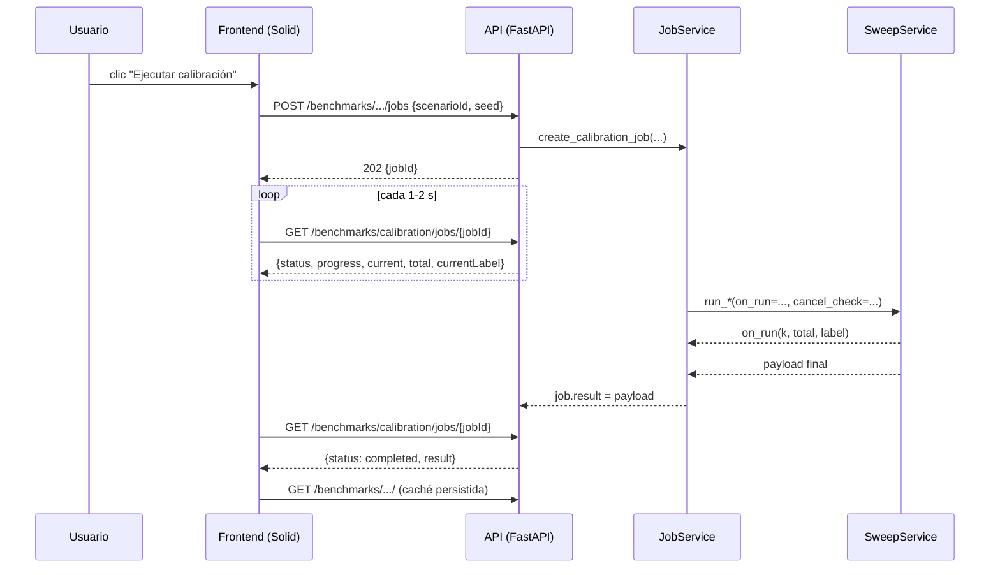
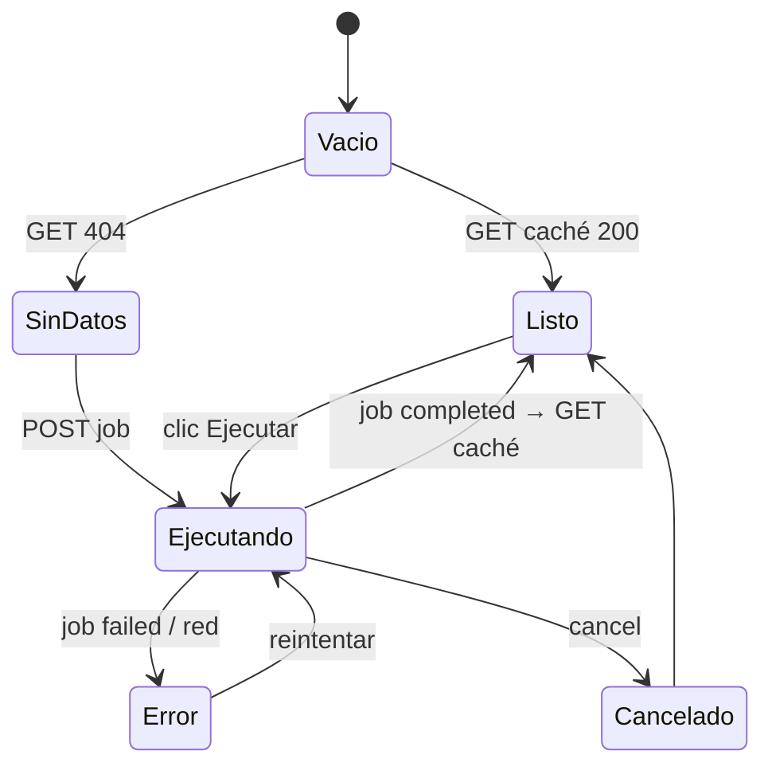

# Plan de implementación — Vista de Calibración del motor

| Campo | Valor |
|-------|-------|
| **Estado** | Propuesta — pendiente de aprobación |
| **Fecha** | 2026-09-17 |
| **Fase** | 13 — Optimización multiobjetivo (UI de calibración) |
| **Alcance** | UI (SolidJS) + API + jobs asíncronos para ejecutar y visualizar los barridos de calibración del motor ACO |
| **Código de referencia** | `backend/app/api/v1/benchmarks.py` · `backend/app/services/aco_sensitivity_service.py` · `backend/app/services/multiobjective_sweep_service.py` · `backend/app/services/optimization_job_service.py` · `src/features/optimization/` · `src/core/api/` |
| **Relación** | Consume la evidencia de [especificacion-motor-multiobjetivo.md](./especificacion-motor-multiobjetivo.md); documenta decisiones D1/D2/D3 de [../fase-3/README-rigor.md](../fase-3/README-rigor.md) |

## 1. Objetivo

Dar al planificador/administrador una **consola de calibración** que:

1. **Ejecute** los dos barridos del motor desde la UI (sin depender de `just`/consola).
2. **Visualice** los resultados con la **métrica primaria declarada: distancia optimizada (D2)**.
3. **Evidencie** de forma reproducible (escenario + semilla) para el capítulo de resultados.
4. **No bloquee** la interfaz: ejecución asíncrona con progreso y cancelación.

## 2. Decisiones tomadas (entrada de este plan)

| # | Decisión | Valor elegido | Consecuencia |
|---|---|---|---|
| D-A | **Modo** | Incluye **ambos**: sensibilidad ACO (α/β/ρ/Q + hormigas/iteraciones) **y** barrido de pesos del objetivo + frontera de Pareto | Añade endpoints y modelos para el barrido de pesos (hoy solo script) |
| D-B | **Ejecución** | **Asíncrona con job + progreso y cancelación** | Requiere hooks de progreso en los servicios de barrido y un runner de job genérico |
| D-C | **Ubicación** | **`/settings/calibration`** (sub-ruta de Configuración) | Hereda permisos de `/settings` y agrupa con los parámetros del motor |
| D-D | **KPI primario** | **Distancia optimizada**; makespan y rebose como guardarraíles | El ranking y la lectura se ordenan por distancia |

### 2.1 Justificación de la ubicación (`/settings/calibration`)

| Criterio | `/optimization/calibration` | **`/settings/calibration`** |
|---|---|---|
| Naturaleza | Flujo operativo del día | Configuración/experimentación del motor |
| Coherencia con parámetros que calibra | Media | Alta (vive junto a α/β/ρ/Q, pesos, umbrales) |
| Permisos | `administrador`, `planificador` | `administrador`, `planificador` (hereda de `/settings`) |
| Ruido en la operación diaria | Añade pestaña técnica al “Plan del día” | Aislado; no ensucia el flujo de despacho |
| Descubribilidad | Alta para uso operativo | Alta para tesis/demo (“Configuración → Calibración”) |

La ruta se centraliza en una constante para poder moverla sin tocar componentes.

## 3. Alcance

**Incluido**

- Página de calibración con: configuración del barrido, botón de ejecución, progreso, resumen, resultados por eje, frontera de Pareto, lectura automática, export.
- Jobs asíncronos con progreso y cancelación.
- Endpoints de resultados en caché (lectura) y de creación de jobs.
- i18n, permisos, navegación, `data-testid`, accesibilidad básica.
- Tests backend (pytest) y frontend (vitest).

**Excluido**

- Editar la configuración de Administración desde esta vista (sigue en `/settings`).
- Escribir el markdown de evidencia desde la UI (sigue siendo server-side).
- Barridos con interacciones entre parámetros (el diseño es OFAT / un factor a la vez).
- Robustez multi-semilla/multi-instancia (se anota como trabajo futuro).

## 4. Arquitectura



**Principios**

- El barrido **no se recalcula** en el frontend: se dispara y se renderiza.
- La caché (JSON en `data/cache/`) es la fuente de verdad de los resultados mostrados.
- Los jobs reutilizan la infraestructura existente (`OptimizationJob`, persistencia, historial).
- Un job de calibración **no escribe** la caché si se cancela o falla.

## 5. Contrato de API

Prefijo real: `/api/v1`. Todos los endpoints requieren rol `administrador` o `planificador` (`PlannerOrAdmin`).

### 5.1 Ya existente (se conserva por compatibilidad)

| Método | Ruta | Nota |
|---|---|---|
| `GET` | `/benchmarks/aco/sensitivity` | Payload en caché; `404` si no existe |
| `POST` | `/benchmarks/aco/sensitivity` | Síncrono (~315 s). **Se conserva**; la UI usará la variante async |
| `GET/POST` | `/benchmarks/aco` | Benchmark 5×3 escenarios |
| `GET` | `/simulations/jobs?jobType=calibration` | Historial (reuso del store de jobs) |

### 5.2 Nuevo — creación de jobs

| Método | Ruta | Cuerpo | Respuesta |
|---|---|---|---|
| `POST` | `/benchmarks/aco/sensitivity/jobs` | `{ scenarioId?: str, seed?: int, refresh?: bool }` | `202 { jobId }` |
| `POST` | `/benchmarks/objective/sweep/jobs` | `{ scenarioId?: str, seed?: int, durationHours?: int }` | `202 { jobId }` |

### 5.3 Nuevo — estado y cancelación (compartidos)

| Método | Ruta | Respuesta |
|---|---|---|
| `GET` | `/benchmarks/calibration/jobs/{jobId}` | `{ jobId, jobType, status, phase, progress, current, total, currentLabel, startedAt?, finishedAt?, result?, error? }` |
| `POST` | `/benchmarks/calibration/jobs/{jobId}/cancel` | `{ jobId, status }` |

Estados: `pending` · `running` · `completed` · `cancelled` · `failed`.

### 5.4 Nuevo — resultados en caché

| Método | Ruta | Respuesta |
|---|---|---|
| `GET` | `/benchmarks/objective/sweep` | `{ generatedAt, durationSeconds, scenarioId, seed, maxRouteHoursTarget, runs[], paretoFrontier[], acceptance{} }`; `404` si no existe |

`GET /benchmarks/aco/sensitivity` ya devuelve el payload de sensibilidad.

### 5.5 Cambios de compatibilidad

- El `POST` síncrono de sensibilidad **acepta ahora** `scenarioId` y `seed` (parámetros opcionales). No cambia su respuesta.
- No se elimina ningún endpoint; solo se añaden.

## 6. Fases de implementación

Cada fase es **desplegable y verificable** por separado, y deja el sistema en verde.

### Fase 0 — Preparación (sin comportamiento nuevo)

**Entregables**
- Fijar la ruta en una constante (`CALIBRATION_ROUTE = '/settings/calibration'`).
- Corregir la referencia obsoleta a `OptimizationAcoSensitivityPanel.tsx` en `docs/fase-3/README-rigor.md` (el archivo no existe).

**Definition of Done:** docs consistentes; sin cambios de runtime.

---

### Fase 1 — Backend: hooks de progreso y cancelación en los barridos

**Cambios**
- `aco_sensitivity_service.run_aco_sensitivity(db, *, scenario_id, seed, on_run=None, cancel_check=None)`.
  - `on_run(index: int, total: int, label: str)` se invoca **antes** de cada corrida.
  - Si `cancel_check()` es verdadero entre corridas → detener sin guardar caché y señalar cancelación.
- Análogo en `multiobjective_sweep_service.run_multiobjective_sweep(...)`.
- Tipo de excepción interna `SweepCancelled` (o retorno con bandera) para distinguir cancelación de error.

**Contrato interno**

```python
def run_aco_sensitivity(db, *, scenario_id="normal", seed=42,
                        on_run=None, cancel_check=None) -> dict: ...
# on_run(k, total, label)  ·  k ∈ [0, total)
# cancel_check: () -> bool
```

**DoD:** tests unitarios con `on_run` y `cancel_check` mockeados; la caché no se escribe al cancelar; suite en verde.

---

### Fase 2 — Backend: runner de job genérico y endpoints async

**Cambios**
- Runner `_run_calibration_job` que:
  - mapea `on_run` → `job.progress` (0–100), `job.phase` (etiqueta) y `job.logs`;
  - consulta `job.cancel_requested` como `cancel_check`;
  - persiste el snapshot con el throttling existente.
- Creación `create_calibration_job(sweep, scenario_id, seed, ...)` que reutiliza `start_background_job`.
- Semaforo de calibración con **máximo 1** job concurrente (los barridos son intensivos).
- Endpoints §5.2 y §5.3 en `benchmarks.py`.
- Ampliación **aditiva** de `_serialize_job` con `jobType`, `current`, `total`, `currentLabel` (o un serializador específico de calibración).

**DoD:** `POST` devuelve `202` con `jobId`; `GET` refleja progreso creciente; `cancel` deja el job en `cancelled` sin escribir caché; el historial lo lista con `jobType="calibration"`.

---

### Fase 3 — Backend: barrido de pesos por API

**Cambios**
- `GET /benchmarks/objective/sweep` (lectura de caché, análogo a sensibilidad).
- `POST /benchmarks/objective/sweep/jobs` (creación del job; usa Fase 2).
- El payload ya lo produce `run_multiobjective_sweep` (incluye `paretoFrontier` y `acceptance`).

**DoD:** el barrido de pesos se puede lanzar y leer por API; `acceptance` expone AC-1/AC-2/AC-3.

---

### Fase 4 — Frontend: shell, ruta, i18n y navegación

**Archivos**
- `src/features/settings/CalibrationPage.tsx` (shell) o `src/features/optimization/CalibrationPage.tsx` según ubicación final.
- Ruta en `src/app/App.tsx`; entrada en `ROUTE_PERMISSIONS` y en el nav de `src/core/auth/permissions.ts`.
- Claves i18n en `src/core/i18n/dictionaries.ts` (`nav.calibration`, `calibration.*`).

**DoD:** la ruta es accesible solo a `administrador`/`planificador`, aparece en el sidebar y renderiza el shell vacío con estado “Sin datos”.

---

### Fase 5 — Frontend: controles + ejecución asíncrona

**Archivos**
- `src/core/api/benchmarks.ts` (cliente: crear job, consultar, cancelar, leer caché).
- `src/features/settings/CalibrationRunControls.tsx` (modo, escenario, semilla, reusar caché, botón).
- `src/features/settings/CalibrationProgress.tsx` (barra, `k/total`, etiqueta, ETA, cancelar).

**Comportamiento**
- Poll cada 1–2 s mientras `status ∈ {pending, running}`; detener al llegar a estado final.
- Al completar, leer la caché y pasar a resultados.
- Deshabilitar inputs durante la ejecución; `aria-live="polite"` en el progreso.

**DoD:** se puede lanzar, ver progreso real (no indeterminado), cancelar, y al terminar se cargan resultados sin recargar la página.

---

### Fase 6 — Frontend: resultados de sensibilidad

**Archivos**
- `src/features/settings/CalibrationResults.tsx`
- `src/features/settings/CalibrationAxisChart.tsx` (línea con `solid-chartjs`)

**Contenido**
- **Resumen:** `KpiCard` con mejor distancia, eje más sensible, eje estable.
- **Pestañas por eje:** `α`, `β`, `ρ`, `Q`, hormigas, iteraciones.
- **Gráfico:** distancia vs nivel del eje seleccionado.
- **Tabla** del eje seleccionado (nivel, CPU, distancia, iteraciones ejecutadas, early-stop).
- **Lectura automática:** bullets derivados de los datos (ver §7).

**DoD:** con el payload real, resumen/gráfico/tabla son coherentes; corridas con `error` o `uncoveredPoints>0` quedan fuera del ranking y visibles como aviso.

---

### Fase 7 — Frontend: resultados del barrido de pesos y Pareto

**Archivos**
- `src/features/settings/CalibrationObjectiveResults.tsx`
- `src/features/settings/ParetoFrontierChart.tsx` (dispersión distancia vs makespan, tamaño/color por vehículos)

**Contenido**
- Tabla de runs (pesos, distancia, vehículos activos, máx. horas, holgura, `finishUnderTargetPct`, equidad).
- Frontera de Pareto (no dominadas) destacada.
- Tarjetas AC-1 / AC-2 / AC-3 con estado `ok`.

**DoD:** la frontera y los criterios provienen del payload; no se recalculan reglas distintas a las del backend.

---

### Fase 8 — Frontend: export, estados y pulido

**Contenido**
- Export **JSON** (payload crudo) y **CSV** (tabla del eje o de runs).
- Estados: vacío (404), ejecutando, completado, cancelado, error con reintento.
- Declaración visible: “métrica primaria = distancia · 1 instancia · 1 semilla · OFAT”.
- `data-testid` por sección; foco visible; encabezados de tabla.

**DoD:** todos los estados son alcanzables y no bloquean la UI; export coincide con lo mostrado.

## 7. Modelo de datos y derivaciones

### 7.1 Sensibilidad (payload en caché)

`generatedAt`, `durationSeconds`, `scenarioId`, `seed`, `standardProfile{acoAnts,acoIterations}`, `standardHyperparameters{acoAlpha,acoBeta,acoRho,pheromoneQ}`, `runs[]`:

```
{ label, axis ∈ {ants,iterations,alpha,beta,rho,q},
  acoAnts, acoIterations,
  acoAlpha?, acoBeta?, acoRho?, pheromoneQ?,
  computationSeconds, acoSeconds,
  distanceKmOptimized, distanceKmBaseline, savingPct,
  acoIterationsRun, acoStoppedEarly, uncoveredPoints }
```
(o `{ label, axis, error }`).

### 7.2 Pesos (payload en caché)

`runs[]`: `{ label, durationHours, workloadBalanceWeight, makespanWeight, minActiveVehiclesRequested, minActiveVehicles, distanceKmOptimized, distanceKmBaseline, savingPct, activeVehicles, fleetUtilizationPct, maxRouteHours, shiftSlackHours, finishUnderTargetPct, workloadStdHours, fairnessIndex, vehicleWorkloadHours, uncoveredPoints, computationSeconds }`, más `paretoFrontier[]` y `acceptance{ac1,ac2,ac3}`.

### 7.3 Derivaciones en el frontend (no vienen del backend)

| Derivado | Regla |
|---|---|
| Mejor por eje | Mínimo `distanceKmOptimized` entre niveles del eje, excluyendo `error` y `uncoveredPoints>0` |
| Amplitud por eje | `máx − mín` de distancia → ordena sensibilidad |
| Eje estable | Amplitud ≤ 0,5 % del mejor → “insensible” |
| Aviso de calidad | Mejor corrida con `acoStoppedEarly=false` y `acoIterationsRun` alto → “sin early-stop” |
| Filtro de validez | Nunca rankear corridas con `error` o `uncoveredPoints>0` |

## 8. Estados de la vista



## 9. Criterios de aceptación

1. Con caché existente, la vista muestra resultados **sin** ejecutar nada.
2. El botón lanza el barrido elegido (sensibilidad o pesos) con escenario/semilla y muestra **progreso real** (`k/total`) y ETA.
3. Cancelar detiene el job y **no** sobrescribe la caché previa.
4. Los resultados se agrupan por `axis`; cada eje tiene tabla y gráfico.
5. El resumen identifica correctamente mejor nivel y eje más sensible.
6. Ninguna corrida con `error` o `uncoveredPoints>0` entra en el ranking.
7. El barrido de pesos muestra la frontera de Pareto y el estado de AC-1/AC-2/AC-3.
8. Export JSON/CSV coincide con el payload mostrado.
9. Se declara en la UI: métrica primaria = distancia · 1 instancia · 1 semilla · OFAT.
10. La vista es accesible solo a `administrador`/`planificador` y no deja la UI bloqueada en error/cancelado.

## 10. Plan de pruebas

### Backend (pytest)

| Fase | Prueba |
|---|---|
| 1 | `on_run` se invoca `total` veces con índices crecientes; `cancel_check` corta y no guarda caché |
| 2 | `POST` → `202`; `GET` refleja `progress` creciente; `cancel` → `cancelled`; historial con `jobType="calibration"`; concurrencia limitada a 1 |
| 3 | `GET /benchmarks/objective/sweep` devuelve `paretoFrontier` y `acceptance`; `404` si no hay caché |
| 2–3 | Regresión: los `POST` síncronos existentes siguen funcionando |

### Frontend (vitest)

| Fase | Prueba |
|---|---|
| 4 | Ruta protegida por rol; nav i18n |
| 5 | Derivación del estado desde el poll; deshabilitado durante ejecución; cancelar |
| 6 | Derivaciones por eje (mejor, amplitud, estable) con payload sintético |
| 7 | Frontera y AC renderizadas desde payload |
| 8 | Export JSON/CSV; estados vacío/error |

## 11. Riesgos y mitigaciones

| Riesgo | Mitigación |
|---|---|
| Barridos largos (sensibilidad ~315 s; pesos ~15 corridas) | Job async, ETA, cancelación, límite de 1 job concurrente |
| Cancelación a mitad de corrida no interrumpe el ACO en curso (solo entre corridas) | Declararlo en UI (“se cancelará tras la corrida actual”) |
| Escritura de caché parcial/corrupta | Escribir solo al completar con éxito; `load_*` ya tolera JSON corrupto |
| Conflicto con `src/**` en WIP | Implementar por fases y en archivos nuevos; no tocar paneles existentes sin coordinar |
| Endpoints síncronos antiguos usados por scripts | No eliminarlos; añadir la variante async en paralelo |
| Semilla/escenario no reproducibles si se omiten | Defaults explícitos (`seed=42`, `scenarioId="normal"`) visibles en la UI |

## 12. Entregables por fase

| Fase | Backend | Frontend | Verificación |
|---|---|---|---|
| 0 | — | — | Docs |
| 1 | hooks `on_run`/`cancel_check` | — | pytest |
| 2 | runner de job + endpoints async | — | pytest |
| 3 | `GET`/`POST` del sweep de pesos | — | pytest |
| 4 | — | shell + ruta + i18n + nav | vitest + build |
| 5 | — | controles + progreso/poll/cancel | vitest |
| 6 | — | resultados sensibilidad | vitest |
| 7 | — | resultados pesos + Pareto + AC | vitest |
| 8 | — | export + estados | vitest + build |

## 13. Fuera de alcance / trabajo futuro

- Robustez **multi-semilla** y multi-instancia (el barrido actual es 1 instancia, 1 semilla).
- Estudios de **interacción** entre parámetros (hoy es OFAT).
- Exportar/reemplazar el markdown de `evidencia-aco.md` desde la UI.
- Unificación de la partición sectorial (D3c) para calibrar cruzando esa frontera.
- Promoción del **rebose a objetivo** (requiere alinear su reloj y añadirlo a `objective_active`).
