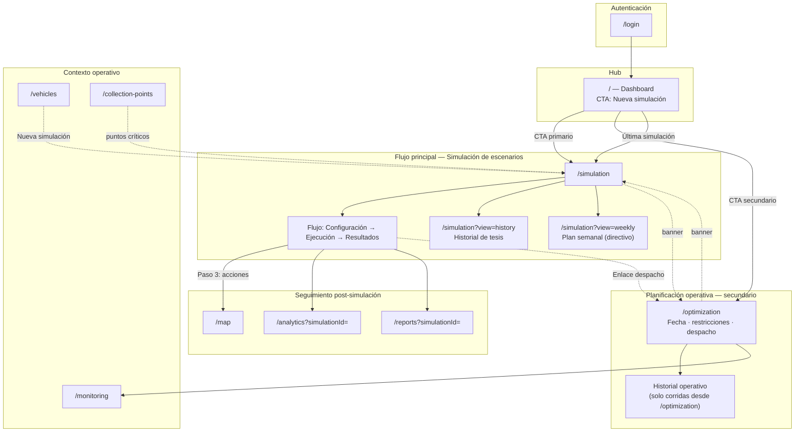

# Diagrama de navegación final — Opción A

**Estado:** vigente tras Fases 1–5  
**Fecha:** 2026-08-08

## Vista general

## Leyenda de responsabilidades

| Color / grupo | Módulo | Propósito |
|---------------|--------|-----------|
| **tesis** | Simulación | Evaluar escenarios y desempeño del algoritmo |
| **evidencia** | Mapa, Analítica, Reportes | Continuar análisis tras una corrida |
| **operacion** | Planificación operativa | Rutas del día y despacho |
| **soporte** | Vehículos, Puntos, Monitoreo | Datos maestros y seguimiento |

## Deep links

| URL | Efecto |
|-----|--------|
| `/simulation?simulationId={id}` | Abre resultados de una simulación |
| `/simulation?view=history` | Pestaña Historial (tesis) |
| `/simulation?view=weekly` | Pestaña Plan semanal (directivo) |
| `/optimization?date=YYYY-MM-DD` | Plan del día administrativo |
| `/analytics?simulationId={id}` | Analítica con banner de contexto |
| `/reports?simulationId={id}` | Reportes con banner de contexto |

## Menú lateral (planificador)

1. Dashboard  
2. **Simulación de escenarios** ← principal  
3. Mapa GIS, Vehículos, Puntos…  
4. — *Operación* —  
5. **Planificación operativa** ← secundario  
6. — *Resultados* —  
7. Reportes, Analítica  

Ver también: [reglas-navegacion.md](../fase-5/reglas-navegacion.md), [matriz-responsabilidades-modulos.md](../fase-5/matriz-responsabilidades-modulos.md).
