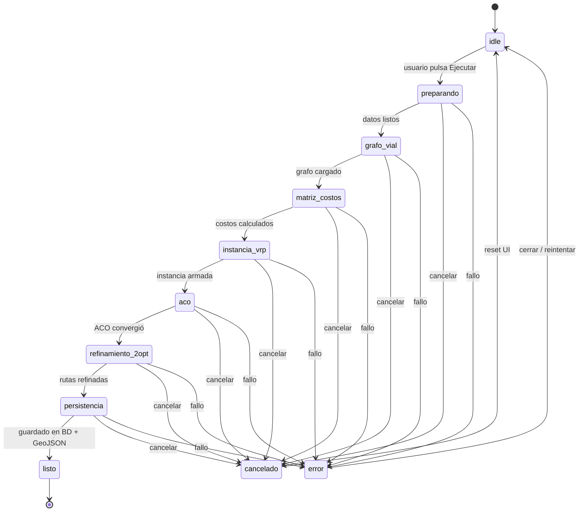

# Máquina de estados — Ejecución de simulación

Contrato de fases para el paso 2 de `/simulation`. Implementación de referencia: `src/features/simulation/executionPhases.ts`.

## Diagrama de estados

## Fases (orden canónico)

| # | `phaseId` | Etiqueta UI (corta) | Peso progreso |
|---|-----------|---------------------|---------------|
| 1 | `preparando` | Preparando escenario | 5 % |
| 2 | `grafo_vial` | Grafo vial | 10 % |
| 3 | `matriz_costos` | Matriz de costos | 15 % |
| 4 | `instancia_vrp` | Instancia VRP | 10 % |
| 5 | `aco` | Optimización ACO | 35 % |
| 6 | `refinamiento_2opt` | Refinamiento 2-opt | 15 % |
| 7 | `persistencia` | Guardando resultados | 8 % |
| 8 | `listo` | Listo | 2 % |

Los pesos suman 100 % y se usan para la barra de progreso en **Fase 1** (corto plazo: avance simulado por fase).

## Estados terminales

| Estado | Significado | UI |
|--------|-------------|-----|
| `idle` | Sin ejecución en curso | Botón «Ejecutar simulación» habilitado |
| `listo` | Optimización exitosa | Avance automático a paso 3 o CTA resultados |
| `cancelado` | Usuario canceló | Mensaje informativo; permanece en paso 2 |
| `error` | Fallo API o motor | Banner rojo + opción reintentar |

## Eventos

| Evento | Origen | Efecto |
|--------|--------|--------|
| `START` | Click «Ejecutar simulación» | `idle` → `preparando` |
| `ADVANCE` | Timer frontend / evento SSE | fase N → fase N+1 |
| `COMPLETE` | Respuesta API exitosa | → `listo` |
| `CANCEL` | Click «Cancelar ejecución» | fase actual → `cancelado` |
| `FAIL` | Error HTTP / excepción motor | fase actual → `error` |
| `RESET` | Nueva simulación / salir paso 2 | → `idle` |

## Mapeo a logs existentes

### Backend (`optimization_service._optimization_logs`)

| Mensaje (fragmento) | Fase |
|---------------------|------|
| `Iniciando optimización` | `preparando` |
| `Cargando grafo OSMnx` | `grafo_vial` |
| `Construyendo matriz de costos` | `matriz_costos` |
| `Instancia VRP` | `instancia_vrp` |
| `metaheurística ACO` | `aco` |
| `2-opt local` | `refinamiento_2opt` |
| `Persistiendo rutas` | `persistencia` |
| `Optimización completada` | `listo` |

### Mock frontend (`optimizationLogMessages`)

| Índice aprox. | Fase sugerida |
|---------------|---------------|
| Inicializando grafo / Cargando puntos | `grafo_vial` |
| Aplicando ACO / Evaluando soluciones | `aco` |
| Re-priorizando críticos | `instancia_vrp` o `aco` |
| Convergente / Ruta optimizada | `refinamiento_2opt` → `listo` |

La función `resolvePhaseFromLogMessage()` en el contrato TS centraliza este mapeo.

## Reglas de transición (corto plazo)

Mientras el `POST /simulations/optimize` sea **síncrono**:

1. Al `START`, la UI avanza por fases con **timers** acordes al peso de cada fase (duración total objetivo: 8–15 s en demo).
2. Si la API responde antes de llegar a `listo`, se **acelera** el stepper hasta `listo`.
3. Si la API tarda más que la animación, la UI se **detiene en `aco`** (fase más larga) hasta recibir respuesta.
4. Los logs del response se muestran en el panel inferior **en orden**, resaltando la fase activa.

## Reglas de transición (mediano plazo — ADR-002)

Con jobs + SSE:

1. Cada evento `{ phaseId, progress, message }` del backend dispara `ADVANCE` o actualiza sub-progreso dentro de `aco`.
2. `CANCEL` envía `POST /simulations/jobs/{id}/cancel` y espera `status: cancelled`.
3. El mapa animado sigue el mismo `phaseId`; solo cambia la fuente del evento.
