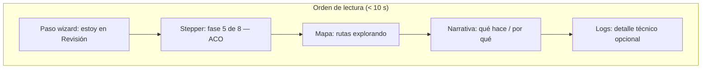

# Wireframe — Paso 2: Revisión y ejecución

Pantalla: `/simulation` con `step=2` y ejecución en curso (`isOptimizing === true`).

## Layout general (desktop ≥ xl)

```text
┌─────────────────────────────────────────────────────────────────────────────┐
│ Header: Simulación de escenarios                          [fecha] [🔔] [↻]  │
├──────────┬──────────────────────────────────────────────────────────────────┤
│ Sidebar  │  [1 Config] ─── [2 Revisión ●] ─── [3 Resultados]                │
│          │                                                                  │
│          │  ┌─ Resumen config (col 3) ─┐  ┌─ Área principal (col 9) ───────┐ │
│          │  │ Escenario: Lluvia        │  │ ┌─ Stepper + progreso ────────┐ │ │
│          │  │ Vehículos: 7             │  │ │ Fase 5/8 · Optimización ACO │ │ │
│          │  │ Puntos: 20               │  │ │ ████████░░░░░░░░  62%       │ │ │
│          │  └──────────────────────────┘  │ └─────────────────────────────┘ │ │
│          │                                  │ ┌─ Mapa animado ──────────────┐ │ │
│          │                                  │ │  · contenedores pulsando    │ │ │
│          │                                  │ │  · rutas punteadas (explor) │ │ │
│          │                                  │ │  · leyenda fase actual      │ │ │
│          │                                  │ └─────────────────────────────┘ │ │
│          │                                  │ ┌─ Narrativa IA ──────────────┐ │ │
│          │                                  │ │ Qué hace: Ejecuta ACO…      │ │ │
│          │                                  │ │ Por qué: núcleo de tesis…   │ │ │
│          │                                  │ └─────────────────────────────┘ │ │
│          │                                  │ ┌─ Logs ──────────────────────┐ │ │
│          │                                  │ │ 14:32:01 Instancia VRP…     │ │ │
│          │                                  │ │ 14:32:04 ACO 47/150…        │ │ │
│          │                                  │ └─────────────────────────────┘ │ │
│          │                                  └─────────────────────────────────┘ │
│          │  ┌─ Stepper vertical (dentro panel izq. ejecución o flotante) ───┐  │
│          │  │ ✓ Preparando escenario                                      │  │
│          │  │ ✓ Grafo vial                                                │  │
│          │  │ ✓ Matriz de costos                                          │  │
│          │  │ ✓ Instancia VRP                                             │  │
│          │  │ ● Optimización ACO          ← activa                        │  │
│          │  │ ○ Refinamiento 2-opt                                        │  │
│          │  │ ○ Guardando resultados                                      │  │
│          │  │ ○ Listo                                                     │  │
│          │  └─────────────────────────────────────────────────────────────┘  │
│          │                                                                  │
│          │  [← Anterior]              [Cancelar ejecución]  [Ejecutando… ⟳] │
└──────────┴──────────────────────────────────────────────────────────────────┘
```

## Componentes (mapeo a implementación futura)

| Zona wireframe | Componente Fase | Archivo previsto |
|----------------|-----------------|------------------|
| Stepper vertical 8 pasos | Fase 1 | `SimulationExecutionStepper.tsx` |
| Barra + «Fase X/8» | Fase 1 | `ExecutionPanel.tsx` |
| Mapa animado | Fase 2 | `SimulationMapPanel.tsx` o `SimulationExecutionMap.tsx` |
| Bloque «Qué hace / Por qué» | Fase 1 | `ExecutionNarrative.tsx` |
| Lista de logs | Existe | `ExecutionPanel.tsx` |
| Cancelar ejecución | Fase 3 | botón en `index.tsx` + `cancelOptimization()` en store |

## Stepper vertical — estados visuales

| Estado | Icono | Estilo |
|--------|-------|--------|
| Completada | ✓ | Texto verde, línea conectora sólida |
| Activa | ● o spinner | Fondo `fero-green/10`, borde verde, texto bold |
| Pendiente | ○ | Texto `text-muted`, opacidad 60 % |
| Cancelada / error | — | Stepper congelado; banner superior |

## Mapa animado — por fase (Fase 2)

| Fase | Elementos en mapa |
|------|-------------------|
| `preparando` | Sin animación; overlay «Preparando datos…» |
| `grafo_vial` | Sectores con fade-in; aristas del grafo parpadean |
| `matriz_costos` | Líneas tenues entre contenedores (muestra de pares) |
| `instancia_vrp` | Contenedores críticos pulsan ámbar/rojo |
| `aco` | Rutas punteadas grises que «exploran»; iconos camión en movimiento |
| `refinamiento_2opt` | Ruta gris sólida + tramos verdes que reemplazan segmentos |
| `persistencia` | Spinner discreto en esquina del mapa |
| `listo` | Ruta optimizada verde completa; fade-out de exploración |

## Mobile (stack vertical)

Orden de apilamiento:

1. Wizard steps (horizontal compacto)
2. Stepper vertical colapsable («Ver etapas del motor»)
3. Barra de progreso + narrativa
4. Mapa (altura fija `h-72`)
5. Logs (max 6 líneas, scroll)
6. Botones: Anterior | Cancelar | Ejecutando

## Botón «Cancelar ejecución»

| Propiedad | Valor |
|-----------|-------|
| Variante | `outline` + borde ámbar/rojo suave |
| Visible | Solo `isOptimizing === true` |
| Posición | Entre «Anterior» y el CTA principal |
| Confirmación | Opcional Fase 5: diálogo «¿Detener el cálculo?» |
| Acción corto plazo | `AbortController` + reset fase a `cancelado` |
| Acción mediano plazo | `POST .../jobs/{id}/cancel` |

## Wireframe mermaid (flujo de atención del evaluador)



## Criterio wireframe

Un evaluador sin contexto técnico debe poder responder:

1. ¿En qué paso del wizard estoy? → Barra superior 1-2-3
2. ¿Qué está haciendo el motor ahora? → Stepper + título «Fase 5/8»
3. ¿Dónde lo veo en el territorio? → Mapa animado
4. ¿Puedo detenerlo? → Botón «Cancelar ejecución»
