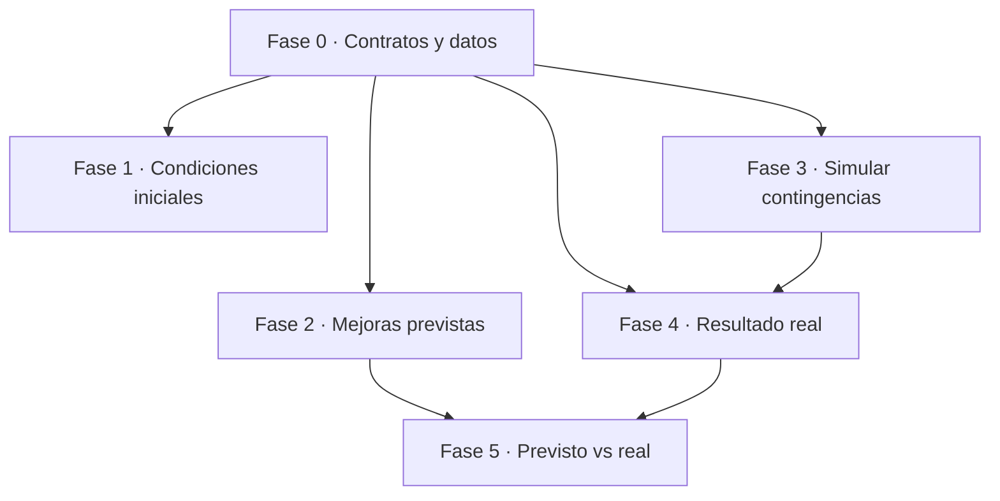

# Plan de flujo operativo — condiciones → plan → previsto → contingencia → real

| Campo | Valor |
|-------|-------|
| **Estado** | MVP — Fases 0–5 implementadas |
| **Fecha** | 2026-09-10 |
| **Alcance** | Encadenar el ciclo operativo: condiciones iniciales de la semana, plan ACO, mejoras previstas, simulación diaria con contingencias y resultado real |
| **Código de referencia** | `src/features/planning/weekly/*` · `src/features/optimization/*` · `src/features/monitoring/*` · `src/core/stores/*` · `backend/app/services/*` |
| **Relación** | Complementa [estado-modulos.md](./estado-modulos.md) y [ux/arquitectura-navegacion.md](./ux/arquitectura-navegacion.md) |

## Propósito

El sistema ya implementa las piezas sueltas del ciclo (**semana → plan → ejecución → monitoreo**), pero no forman un ciclo cerrado *previsto vs. real* con contingencias integradas en la simulación diaria. Este documento fija el plan por fases para lograrlo y sirve de fuente de verdad del avance.

**Ciclo objetivo (flujo lógico):**

1. Al inicio de la semana se establecen las **condiciones iniciales** (zonas/puntos por día, flota por tipo, escenario, caso de estudio).
2. El **algoritmo ACO** traza un **plan de ejecución**.
3. Se presenta el plan con las **mejoras previstas** (línea base vs. IA).
4. Cada día se **simula el recorrido**, sujeto a **contingencias** (avería, contenedor crítico).
5. De ahí se obtiene el **resultado real**, comparable contra lo previsto.

## Mapa de fases

| Fase | Etapa del ciclo | Resultado observable | Estado |
|---|---|---|---|
| **0** | Fundación | Contratos tipados de "previsto" y "real" + almacenamiento + migración | ✅ Implementada |
| **1** | 1. Condiciones iniciales | Viabilidad y condiciones visibles antes de ejecutar el algoritmo | ✅ Implementada |
| **2** | 2–3. Plan + mejoras previstas | Ahorro/cobertura por día persistidos (sobreviven al recargar) | ✅ Implementada |
| **3** | 4. Simular con contingencias | Plan alternativo **sin despachar** (dry-run) | ✅ Implementada |
| **4** | 4–5. Ejecución y resultado real | KPI real por día al cerrar | ✅ Implementada |
| **5** | 5. Resultado real | Reporte previsto vs. real con desviaciones | ✅ Implementada |

---

## Alcance MVP

El **producto mínimo viable** es el ciclo completo de las fases 0–5 (todas ✅):

1. **Semana**: condiciones iniciales + pre-flight de viabilidad.
2. **Plan ACO** de la semana.
3. **Mejoras previstas** persistidas (sobreviven al recargar).
4. **Simulación diaria con contingencias** (dry-run) antes de comprometer rutas.
5. **Resultado real** consolidado al cerrar el día.
6. **Reporte previsto vs. real** exportable.

**Definición de terminado (entorno):** `just migrate` (aplica `026_daily_plan_kpis`) + `just seed`, y verificación del flujo (`just demo-verify` / e2e). Con eso el MVP queda operativo y verificable.

---

## Fase 0 — Contratos y datos (fundación) ✅

**Objetivo:** definir una sola vez los contratos que consumen el resto de las fases.

- **`PlanForecast`** (previsto): por día y agregado semanal → `distanceKm`, `durationHours`, `baselineDistanceKm`, `savingPct`, `scheduledPoints`, `coveredPoints`, `uncoveredPoints`, `coveragePct`, `vehicleCount`.
- **`PlanVsReal`** (real): `planned/actualDistanceKm`, `planned/actualDurationMin`, `scheduledPoints`, `servedPoints`, `collectedKg`, `completionPct`.

**Implementación:**
- Backend: `backend/app/domain/plan_kpis.py` (contratos + constructores *duck-typing* + parseo seguro de JSON).
- Almacenamiento: `daily_plans.planned_kpis_json` y `daily_plans.actual_kpis_json` (migración `026_daily_plan_kpis`); `weekly_plans.expected_kpis_json` pasa a ser un `WeeklyPlanForecast` estructurado.
- Serialización: `_daily_plan_payload` expone `plannedKpis`/`actualKpis`.
- Seeds: el demo optimizado calcula el previsto desde sus rutas.
- Frontend: tipos en `src/core/api/planning.ts` y normalizadores en `src/core/planning/planKpis.ts`.

**Criterio de aceptación:** contratos en TS y Python, migración aplicada, seeds coherentes y pruebas unitarias verdes.

**Riesgo:** no romper los consumidores de `expectedKpis` (hoy sin lectura en frontend).

---

## Fase 1 — Condiciones iniciales explícitas (semana) ✅

**Objetivo:** que el paso 1 muestre las condiciones con las que se ejecutará el algoritmo, no solo la edición.

**Implementación:**
- Backend: endpoint `POST /api/v1/planning/weekly/{id}/preflight` que recalcula y persiste `preflight_weekly_feasibility` (demanda vs. capacidad, `overloaded`/`insufficientFleet`) sin correr el motor ACO.
- `WeeklyPlanConditionsPanel` montado en el paso «Configurar días»: escenario, caso de estudio, flota por tipo, puntos/zonas/días activos y **resultado del pre-flight** con botón «Revisar viabilidad».
- `WeeklyPlanPreflightWarningPanel` en el paso «Validar»: avisa de los días con problemas de viabilidad antes de validar.
- Store: `preflight` + `isLoadingPreflight` + `refreshWeeklyPlanPreflight()`, recargado al abrir/guardar/autocompletar la semana.

**Criterio cumplido:** el planificador ve condiciones + viabilidad y no descubre el problema al aprobar.

---

## Fase 2 — Plan de ejecución y mejoras previstas persistidas ✅

**Objetivo:** presentar el plan con sus mejoras y que sobreviva al recargar (hoy `validationSummary` vive en memoria).

**Implementación:**
- `buildWeeklyPlanForecastFromValidation` (`weeklyPlanUx.ts`) construye el `WeeklyPlanForecast` (semana + desglose por día) desde la validación ACO.
- Al aprobar, `approveCurrentWeeklyPlan` envía `expectedKpis` a `POST …/approve`, que persiste `weekly_plans.expected_kpis_json`.
- `WeeklyPlanForecastPanel` («Mejoras previstas»): en el paso Aprobar lee la validación en curso; en el paso final lee `plan.expectedKpis` (persistido).
- Columna **Ahorro** en la tabla Camión × Día (`WeeklyPlanOperationalSection`) y en la tabla por día (`WeeklyPlanApprovedDayTable`), con la línea base del previsto.

**Criterio cumplido:** al recargar la semana aprobada siguen visibles km, cobertura y ahorro por día.

---

## Fase 3 — Simular el recorrido del día con contingencias (sin despachar) ✅

**Objetivo:** que la simulación diaria sea sujeto de contingencias antes de comprometer rutas.

**Implementación:**
- `contingency_service.py`: `handle_vehicle_breakdown` se parte en `_run_vehicle_breakdown(dry_run=…)` + envoltorios «aplicar» (`handle_vehicle_breakdown`, confirma) y «simular» (`simulate_vehicle_breakdown`, revierte). El recálculo usa `auto_dispatch=not dry_run` y no confirma en dry-run.
- `operational_recalc_service.py`: mismo patrón para contenedor crítico (`simulate_critical_container_recalc`); en simulación se admite cualquier punto y se omiten notificaciones.
- `simulate_daily_contingency` (nuevo): resuelve el vehículo/punto por defecto si no se indica y devuelve un contrato normalizado (antes/después km, reasignados, mensaje).
- Endpoint `POST /api/v1/planning/daily/{id}/simulate-contingency` (job asíncrono, `contingency_simulation`), con `ContingencySimulationRequest`.
- Frontend: `simulateDailyContingency` en `src/core/api/contingencies.ts`; estado y acciones en `optimizationStore` (`simulateContingency`, `clearContingencySimulation`, `applyContingencySimulation`); `OptimizationContingencySimulator` en un Drawer del toolbar de `/optimization` (botón «Simular contingencia»), con **Aplicar contingencia real** → endpoints reales de `/contingencies`.

**Criterio cumplido:** se ve el plan alternativo sin tocar rutas reales; al confirmar, se aplica con el flujo real.

**Pendiente menor:** el playback del plan alternativo (geometría) requeriría que el dry-run devolviera las rutas; hoy se muestra la comparación (antes/después/reasignados).

---

## Fase 4 — Ejecución y resultado real ✅

**Objetivo:** consolidar el resultado real al cerrar el día.

**Implementación:**
- `operations_service.route_actual_distance_km(route)`: deriva la distancia real recorrida entre las paradas completadas usando el grafo vial (`graph_service`); devuelve `None` si hay <2 paradas o el grafo no está disponible.
- `plan_kpis.plan_vs_real_from_routes(..., actual_distance_km=…)`: acepta la distancia real ya derivada y arma `PlanVsReal` (previsto, real, servidos, kg, duración real desde llegadas, cumplimiento).
- `close_daily_plan`: al cerrar, calcula y **persiste** `daily_plans.actual_kpis_json`, y ahora precarga `waypoints.collection_point` para poder derivar la distancia.
- Frontend: `OptimizationDayActualsPanel` (banner del día) muestra **previsto vs. real** cuando el día está cerrado; `closeOptimizationDay` recarga el plan para traer `actualKpis`.

**Decisión:** no se añaden columnas `actual_*` a `optimized_routes`; las métricas reales se derivan al cerrar y se guardan en el contrato `PlanVsReal` del día (opción permitida por el plan).

**Criterio cumplido:** al cerrar el día, el sistema tiene previsto y real del día.

---

## Fase 5 — Comparación previsto vs. real ✅

**Objetivo:** cerrar y explotar el ciclo.

**Implementación:**
- `planning_analytics_service.plan_vs_real_report(...)`: reporte por día (rango semanal) con previsto/real de km, desviación y **causa** (contingencias de `VehicleIncident` agrupadas por plan del día vía sus rutas), más un `summary` (desviación media, cumplimiento medio, días con incidencia). `plan_vs_real_csv(...)` genera el CSV exportable.
- Endpoints: `GET /api/v1/planning/analytics/plan-vs-real` y `…/plan-vs-real.csv` (planner/admin).
- `planning_analytics_summary` incorpora el bloque `planVsReal` (reutilizado por la analítica).
- Frontend:
  - `PlanningHistoryPlanVsRealSection` (dentro de la vista semanal de `/planning/history`): tabla por día con desviaciones, causa y **Descargar CSV**.
  - `ReportsPlanVsRealCard` en `/reports`: resumen (días, desviación media, cumplimiento, incidencias) + export CSV.
  - `DashboardPlanVsRealKpi`: KPI **«Desviación media previsto vs. real»** en el dashboard.

**Criterio cumplido:** reporte exportable con desviaciones por día.

---

## Transversales

- **Máquina de estados del día:** formalizar `draft → optimized → dispatched → closed/partial` (`DailyPlan.status`).
- **Gating y permisos:** despacho y contingencias reales para planner/admin; el dry-run puede permitirse a planner.
- **Migraciones + seeds:** cada fase con Alembic y datos demo coherentes (`just db-reset && just seed`).
- **Testing:** unit de `PlanForecast`/`PlanVsReal` y e2e por fase (`weekly-operational.spec.ts` es lento con motor real).
- **Riesgos:** el despacho/notificación es irreversible y el dry-run **debe** garantizar no-commit; el motor ACO es costoso (jobs en background).

## Orden sugerido

`Fase 0 → Fase 2 → Fase 3 → Fase 4 → Fase 5`, con `Fase 1` intercalable. La Fase 0 desbloquea 2/3/4; la Fase 5 requiere 2 y 4 juntas.
