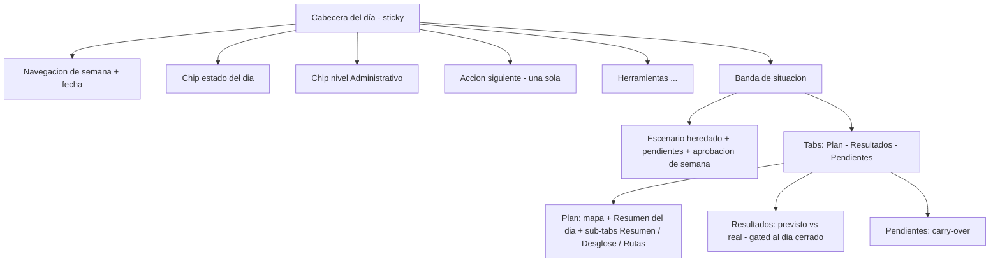

# Layout del Plan del día — contrato de organización de `/optimization`

| Campo | Valor |
|-------|-------|
| **Estado** | Borrador propuesto (2026-09-24) — pendiente de aprobación |
| **Alcance** | Organización interna de la pantalla `/optimization` (Plan del día): zonas, jerarquía de acciones y deduplicación de datos |
| **Código de referencia** | `src/features/optimization/index.tsx` · `OptimizationHeaderChrome.tsx` · `optimizationLayoutUx.ts` |
| **Complementa** | [arquitectura-navegacion.md](./arquitectura-navegacion.md) §4 (pestañas por módulo) y §6 (rutas) |
| **Aprobación** | [ ] Victor Astudillo — fecha: ____ · [ ] Mariana Mora — fecha: ____ |

Documento **fuente de verdad** de la disposición interna de la pantalla del día. Todo cambio de
layout en `/optimization` debe partir de aquí. No cambia rutas ni contratos de API.

## 1. Diagnóstico que motiva este documento

1. **Barra superior sobrecargada:** ~10 controles mezclan navegación temporal, estado, acciones de
   negocio y feedback, sin jerarquía.
2. **Estado del día duplicado en tres sitios:** el texto de la fecha (`optimizationToolbarSummary`
   incluye el estado), el chip de estado y el banner de despacho.
3. **Métricas duplicadas:** «Resumen operativo del día» (`ScenarioInfoCard`) y los *tiles* del plan
   (`summaryTiles`) repiten distancia y duración; los puntos aparecen además en el texto de la fecha.
4. **Acciones de negocio al nivel de la navegación:** Generar, Simular día, Simular contingencia y
   Cerrar día compiten con «semana anterior/siguiente».
5. **Doble navegación:** tabs de primer nivel + sub-tabs + dos *drawers* + menú `⋯`, sin una lógica
   explícita de qué vive dónde.

## 2. IA objetivo

**Zonas**

| Zona | Contenido | Regla |
|------|-----------|-------|
| **Cabecera del día** (sticky) | Navegación de semana, fecha, chip de estado, chip de nivel y **una sola acción siguiente** | Solo acciones primarias; el resto va a Herramientas |
| **Banda de situación** | Escenario heredado del plan semanal, pendientes y estado de aprobación | Una sola banda, encima de los tabs |
| **Tabs** | `Plan` · `Resultados` · `Pendientes` | Máximo 3 destinos de primer nivel |
| **BDC (banda de estado contextual)** | Despacho, cierre, error o aviso | Como máximo una activa a la vez |
| **Herramientas (⋯)** | Simular día (diálogo: condiciones + modo ver animación / 2º plano), Simular contingencia, Reenviar notificación, Exportar PDF, Ver en mapa operativo | Acciones secundarias y de consulta |

## 3. Inventario: elemento → zona actual → zona objetivo → acción

| Elemento (archivo / testid) | Zona actual | Zona objetivo | Acción |
|---|---|---|---|
| Navegación temporal `‹ ›` (día anterior/siguiente), fecha `optimization-date-trigger` + popover | Cabecera fila 1 | Cabecera fila 1 | **Ajustar** (`‹ ›` = día; la semana se salta solo dentro del calendario) |
| `optimizationToolbarSummary` (texto «… · estado · N pts») | Cabecera fila 1 | Cabecera fila 1 **sin estado** | **Fusionar** (quitar estado) |
| `optimization-status-chip` | Cabecera fila 1 | Cabecera fila 1 (único estado) | Mantener |
| `optimization-level-chip` | Cabecera fila 1 | Cabecera fila 1 | Mantener |
| `optimization-scenario-chip` (escenario heredado) | Cabecera fila 1 | Cabecera fila 1 | **Añadir** (P1, E) |
| `optimization-compact-chip` (estado + nivel en móvil) | Cabecera fila 1 | Cabecera fila 1 (`sm:hidden`) | **Añadir** (P2, G/H) |
| `optimization-experience-chip` + drawer `OptimizationExperienceStepper` | Cabecera | Cabecera (chip `lg+`, icono `optimization-experience-icon` < `lg`); oculto en día despachado/cerrado | Mantener (acceso móvil, P2) |
| `optimization-generate-route` | Cabecera | Cabecera — **única acción siguiente**, solo en día borrador | Mantener (único botón «Generar») |
| `optimization-cancel-toolbar` | Cabecera | Cabecera (solo durante el job) | Mantener |
| `optimization-monitoring-route` | Cabecera | Cabecera — acción siguiente al despachar | Mantener |
| `optimization-close-day-action` **y** `optimization-menu-close-day` | Cabecera + ⋯ | **Un solo sitio** | **Fusionar** |
| `optimization-contingency-open` + drawer | Cabecera | Herramientas (⋯) | **Mover** |
| `optimization-day-simulation-open` | Cabecera | Herramientas (⋯) | **Mover** |
| `optimization-notify-indicator` | Cabecera | Cabecera como **texto de estado** (oculto mientras la banda BDC de despacho está visible) | Mantener (no botón) |
| `optimization-week-context` + chips aprobada/sin aprobar | Cabecera fila 2 | BDC («semana sin aprobar») | Fusionado |
| `optimization-approval-dialog` (gate) | Cabecera | Acción siguiente / banda | Mantener |
| `daily-scenario-banner` (escenario + pendientes) | Banner | Cabecera (chip `optimization-scenario-chip`) + pestaña Pendientes | **Fusionar** (P1, E) |
| `OptimizationContextBand` (error · semana sin aprobar · despacho · cierre) | Banner + Tab Plan | **BDC (única)** | ✅ Fusionado |
| `optimization-contextual-cta` (`closeNotice`) | Tab Plan | BDC | Fusionado |
| Alerta de error (`optimizationState.error`) | Tab Plan | BDC | Fusionado |
| Tabs `plan-day-tabs` (Plan / Resultados / Pendientes) | Navegación | `Plan` · `Resultados` · `Pendientes` | Mantener (persistidos en `?tab=`) |
| `optimization-page-menu` (⋯) | Navegación | Herramientas **agrupadas** (Simulación · Notificación y exportación · Navegación) | Mantener (agrupa) |
| `ScenarioInfoCard` («Resumen operativo del día») | Tab Plan | **Resumen del día** | **Fusionar** |
| `summaryTiles` (Distancia / Duración / Toneladas / Ahorro) | Sub-tab Resumen | **Resumen del día** | **Fusionar** |
| `OptimizationRouteMap` + playback | Tab Plan | Plan (protagonista) | Mantener |
| Parámetros: `
` (xl) y `OptimizationParametersSheet` | Tab Plan | — | **Retirar** (2026-09-26: el escenario pasa a «Simular día») |
| Sub-tabs `optimization-plan-tabs` | Sub-navegación | — | **Retirar** (2026-09-25: el Plan ya no tiene sub-tabs) |
| `optimization-comparison-panel` (línea base del turno) | Sub-tab Balance | **Tab Resultados → «Previsto»** | **Mover** (2026-09-25) |
| `UncoveredPointsActionsPanel` | Sub-tab Balance | Tab Plan (alerta sobre las rutas) | **Mover** (2026-09-25) |
| `optimization-results-forecast` (bloque Previsto: comparación + `DurationBreakdownPanel`) | — | Tab Resultados | **Añadir** (2026-09-25) |
| `DurationBreakdownPanel` | Sub-tab Desglose | **Tab Resultados → «Previsto»** | **Mover** (2026-09-25) |
| `optimization-routes-table` | Sub-tab Rutas | **Tab propio «Rutas por vehículo»** | **Mover** (2026-09-26) |
| `optimization-generate-route-form` | Formulario de parámetros | — | **Retirar** (el CTA sticky es el único «Generar») |
| `optimization-empty-results` | Tab Plan | — | **Retirar** (lo reemplaza `optimization-next-step`, P3) |
| `optimization-next-step` (guía por estado) | — | Tab Plan (solo en día borrador) | **Añadir** (P3) |
| `optimization-results-*`, `optimization-day-actuals` | Tab Resultados | Resultados (gated) | Mantener |
| `optimization-pending-section`, `pending-management-panel` | Tab Pendientes | Pendientes (panel directo, sin `
`) | Mantener (J) |
| `optimization-close-day-confirm` | Diálogo | Diálogo | Mantener |
| `/optimization/simulation` (`DaySimulationPage`) | Ruta hermana | Sin cambios internos | Mantener |

## 4. Inventario de duplicados (cerrado)

| Dato / acción | Repeticiones hoy | Queda en |
|---|---|---|
| Estado del día | Texto de fecha + chip + banner de despacho | **Chip de estado** (cabecera) |
| Puntos programados | Texto de fecha («N pts») + `ScenarioInfoCard` | **Resumen del día** |
| Distancia / duración | `ScenarioInfoCard` + `summaryTiles` | **Resumen del día** |
| Cerrar día | Cabecera + menú ⋯ + estado vacío de Resultados | **Cabecera** (único punto) |
| Simular día / contingencia | Cabecera (a la par de la navegación) | **Tab Plan (botón visible) + Resultados · Previsto (enlace) + Herramientas (⋯)** |

> Excepción deliberada: el **escenario** aparece dos veces con propósitos distintos — resumen de
> solo lectura (chip de la cabecera) y edición (diálogo **Simular día**).

## 5. Reglas

1. **Un solo estado del día** visible: el chip de la cabecera. Ningún otro texto lo repite.
2. **Una sola acción siguiente** primaria, derivada del estado: *sin resultados* → **Generar**;
   *despachado* → **Monitoreo** + **Cerrar día**; *cerrado* → **Ver resultados**.
3. **Cada métrica del día aparece una sola vez**, en la tarjeta «Resumen del día».
4. **Herramientas secundarias** (simular, contingencia, reenviar, PDF, mapa, historial) viven solo en
   el menú **Herramientas (⋯)**.
5. **Máximo 3 destinos de primer nivel** (`Plan` · `Resultados` · `Pendientes`); las sub-tabs solo
   existen dentro de `Plan`.
6. **Como máximo una banda de estado contextual** activa a la vez (BDC).
7. El **despacho es automático**: la UI informa, no despacha con botón primario (ver
   [reglas-navegacion §5](../fase-5/reglas-navegacion.md)).

## 6. Mapeo a fases de implementación

| Fase | Alcance | Reglas que cierra | Estado |
|------|---------|-------------------|--------|
| **B** | Cabecera del día: agrupar, un solo estado, una sola acción siguiente, Herramientas | R1, R2, R4 | ✅ Implementada |
| **C** | Fusionar «Resumen operativo del día» + tiles en una tarjeta | R3 | ✅ Implementada |
| **D** | Tabs definitivos y punto único de drawers | R5 | ✅ Implementada |
| **E** | Banda de estado contextual única | R6 | ✅ Implementada |
| **F** | Responsive y jerarquía del mapa | — | ✅ Implementada |
| **G** | Verificación (e2e/a11y) y actualización de docs | — | ✅ Implementada |

> **Fase B implementada (2026-09-24):** `optimizationToolbarSummary` ya no incluye el estado;
> la cabecera agrupa `‹ ›` + fecha + chip de estado + chip de nivel + chip «sin plan semanal aprobado»;
> una sola acción siguiente (Generar → Monitoreo + Cerrar día → Ver resultados); «Simular día (dry-run)»
> y «Simular contingencia» viven en el menú **⋯**; «Cerrar día» queda solo en la cabecera (sin
> duplicado en ⋯) y el indicador de notificación es texto de estado, no botón.
>
> **Fase C implementada (2026-09-24):** «Resumen operativo del día» (`ScenarioInfoCard`) y los tiles
> del sub-tab Resumen se consolidan en una sola tarjeta **«Resumen del día»**
> (`DaySummaryCard`, `data-testid="optimization-day-summary"`) sobre el mapa, en rejilla de 2
> columnas. Distancia y duración dejan de repetirse; se añaden toneladas y ahorro vs. línea base.
> El sub-tab **Resumen** queda con la línea base del turno y los puntos no cubiertos.
>
> **Fase D implementada (2026-09-24):** tabs definitivos **Plan** · **Resultados** · **Pendientes**
> (se renombra «Planificar día» → **Plan**; el id pasa de `optimize` a `plan`, testid
> `plan-day-tab-plan`). **Decisión (R5):** *Resultados* se mantiene como destino de primer nivel
> **gated** al día cerrado — no pasa a sub-tab — porque es la vista de cierre de jornada y no
> comparte estado con las sub-tabs de `Plan`. Las sub-tabs **Resumen / Desglose / Rutas** viven
> dentro de `Plan`. Cada drawer tiene un único punto de acceso: **Experiencia del día** → chip de la
> cabecera (`optimization-experience-chip`); **Contingencia** → menú **⋯**
> (`optimization-menu-contingency`). No hay disparadores duplicados en los componentes de drawer.
>
> **Fase E implementada (2026-09-24):** los tres avisos dispersos —`OptimizationDispatchBanner`,
> la CTA de cierre (`closeNotice`) y la alerta de error— más el recordatorio de aprobación de
> «Situación del día» y el chip `optimization-week-unapproved-chip` de la cabecera se unifican en
> **`OptimizationContextBand`** (`src/features/optimization/OptimizationDispatchBanner.tsx`),
> resuelta por `resolveOptimizationContextBand` en `optimizationLayoutUx.ts` con prioridad
> **error > semana sin aprobar > despacho > cierre** (una sola banda a la vez, sobre los tabs).
> `DailyScenarioBanner` queda solo como «Situación del día» (escenario + pendientes).
>
> **Fase F implementada (2026-09-24):** en móvil (360–420 px) el **mapa va primero** —la columna
> principal es `flex flex-col` y el mapa/summary usan `order` (`mapa` móvil 1 / xl 2; `Resumen del
> día` móvil 2 / xl 1), con el pulsador de **Parámetros** (hoja) y el estado vacío después—; la
> cabecera (subheader en `Header`, `sticky top-0`) envuelve (`flex-wrap`) y el indicador de
> notificación trunca, para no generar **scroll horizontal**. El mapa conserva altura fluida
> (`h-[min(55vh,420px)] min-h-80 lg:min-h-95`) y la hoja de Parámetros gana `role="dialog"`,
> `aria-modal` y safe-area inferior.
>
> **Fase G implementada (2026-09-24) — cierre del plan.** Verificación en e2e: `daily-planning`
> (tabs **Plan/Resultados/Pendientes**, sin el id legado `optimize`; leyenda `optimization-status-legend`;
> **una sola** banda contextual; en 390 px el mapa va antes que «Resumen del día» y sin scroll
> horizontal), `route-playback` y `day-simulation` (abren el tab **Plan**), y `a11y-planner` (barrido
> base + caso extra con el calendario y su leyenda abiertos). Docs alineados: esta página,
> [arquitectura-navegacion.md](./arquitectura-navegacion.md) §4, `fase-5/reglas-navegacion.md` §5,
> `fase-6/manual-usuario.md` §5 y `fase-b/guion-demo-defensa-10min.md` (bloque 4).
>
> **P0 implementado (2026-09-25) — desambiguación de navegación y acciones.** Tres ajustes
> sobre lo ya cerrado en las fases B–G:
>
> 1. **Navegación temporal (R2/UX).** Las flechas `‹ ›` de la cabecera pasan de mover la *semana*
>    a mover el **día** (`shiftDayNav` → `navigateToDate` + `selectOperationDate`), con
>    `aria-label` «Día anterior/siguiente». El salto de semana queda solo dentro del calendario del
>    popover (`OptimizationWeekCalendar`), eliminando la doble semántica y el «clic que no hacía
>    nada visible».
> 2. **Dos niveles de pestañas distinguibles (R5).** Los *tabs* de primer nivel
>    (`plan-day-tabs`: **Plan · Resultados · Pendientes**) siguen subrayados; las sub-pestañas
>    (`optimization-plan-tabs`) pasan a **segmented control** (píldoras con fondo `bg-app` y activa
>    en `bg-surface`) y «Resumen» se renombra a **«Balance»** para no chocar con la tarjeta
>    «Resumen del día».
> 3. **Una sola acción «Generar» (R2).** El CTA sticky de la cabecera
>    (`optimization-generate-route`) es el **único** botón primario. Se retiran
>    `optimization-generate-route-form` (formulario de parámetros) y `optimization-empty-generate`
>    (estado vacío); ambos sustituyen el botón por copy que apunta a la barra superior con el mismo
>    texto («Generar rutas del día»). El hook `useGenerateButtonVisibility` queda obsoleto y se
>    elimina.
>
> **P1 implementado (2026-09-25) — estructura de la información.**
>
> 1. **Franjas superiores consolidadas (E).** Se elimina la tarjeta violeta permanente
>    «Situación del día» (`DailyScenarioBanner` / `OptimizationDailyBanner`): el **escenario**
>    heredado pasa a un chip en la cabecera (`optimization-scenario-chip`) y el **conteo de
>    pendientes** a la etiqueta de la pestaña **Pendientes** (`Pendientes (N)`). Queda como única
>    franja la **BDC** (`OptimizationContextBand`), que ya solo aparece si aporta (error · semana sin
>    aprobar · despacho · cierre).
> 2. **Pestañas persistidas en la URL (L).** `?tab=plan|results|pending&view=resumen|desglose|rutas`;
>    la URL es la única fuente de verdad (`planTab`/`planViewTab` derivados de `searchParams`,
>    `optimizationHrefFrom` preserva el query al navegar). `‹ ›`, el calendario y el gate conservan
>    la pestaña y reinician la sub-vista a **Balance**.
> 3. **Menú ⋯ agrupado (I).** Secciones con encabezado (`role="group"`): **Simulación** (Simular día,
>    Simular contingencia, Simular ejecución del día), **Notificación y exportación** (Reenviar, Exportar PDF) y **Navegación**
>    (Ver en mapa operativo). Se retira «Historial de planificación» por duplicar el sidebar
>    («Historial unificado»).
> 4. **Pendientes en un solo nivel (J).** La pestaña **Pendientes** muestra
>    `PendingManagementPanel` directamente (sin `
` intermedio); el deep-link `#pendientes`
>    activa la pestaña (`?tab=pending`).
>
> **P2 implementado (2026-09-25) — pulido y accesibilidad.**
>
> 1. **Contexto en móvil (G/H).** Los chips de estado/nivel/escenario siguen en `sm+`, pero en
>    pantallas pequeñas aparecen condensados en `optimization-compact-chip` (`sm:hidden`, estado +
>    nivel con el escenario vía icono/tooltip), de modo que la cabecera nunca queda sin contexto.
> 2. **Acceso al stepper en móvil (G/H).** «Experiencia del día» mantiene el chip en escritorio
>    (`optimization-experience-chip`, `lg+`) y gana un icono propio
>    (`optimization-experience-icon`, `< lg`) que abre el mismo drawer.
> 3. **Parámetros estables (K).** El panel de Parámetros se renderiza siempre (columna xl / sheet
>    móvil), no solo sin resultados: la columna principal deja de saltar de ancho. Con resultados,
>    el formulario se muestra **bloqueado** (`fieldset[disabled]`, `locked`) con aviso de solo
>    lectura, y el hint «usa Generar…» desaparece (el CTA ya no aplica).
> 4. **Naming unificado.** El título de la página pasa de «Planificación operativa» a **«Plan del
>    día»** (`optimizationPageMeta`), idéntico al sidebar (`nav.day`). La URL `/optimization` se
>    mantiene por compatibilidad.
> 5. **Ruido de tesis (M).** Ya no existe ninguna tarjeta permanente con la aclaración «no afecta la
>    Simulación ACO (tesis)»: `DailyScenarioBanner` se eliminó en P1; la orientación tesis ↔ operación
>    vive en `/simulation` (`ThesisVsOperationsNotice`) y en la ayuda contextual.
>
> **P3 implementado (2026-09-25) — guía proactiva.**
>
> 1. **Onboarding de un paso (día borrador).** Cuando el día no tiene rutas
>    (`isDraftDay`, `status === 'draft'`), el tab **Plan** muestra un único bloque
>    `optimization-next-step` («Siguiente paso: generar las rutas del día») en lugar del mapa, la
>    tarjeta «Resumen del día», el estado vacío y el formulario de parámetros: se oculta la
>    simultaneidad que confundía. El CTA primario sigue siendo el de la cabecera
>    (`optimization-generate-route`); el bloque solo lo señala.
> 2. **Parámetros progresivos (compatible con R/K).** Dentro del mismo bloque, «Parámetros de
>    optimización» queda tras un desplegable (xl) o el sheet (móvil), así siguen accesibles sin
>    competir con la acción del día.
> 3. **Revelado por estado.** Al generar (u optimizar en curso) el tab Plan pasa al layout completo
>    (mapa + Resumen del día + parámetros bloqueados + sub-tabs **Balance/Desglose/Rutas**); al cerrar
>    el día, **Resultados** muestra el previsto vs. real. El estado vacío `optimization-empty-results`
>    se retira (absorbido por `optimization-next-step`).
>
> **Parámetros simplificados (2026-09-25).** El formulario del plan del día se reduce a la
> **condición operativa** (escenario heredado). Se retiran del flujo diario la **hora de salida de
> la flota** (tráfico), **Mostrar resultados por** (narrativa de KPIs), las notas académicas
> («Simulación ACO (tesis)», «12 hormigas × 20 iteraciones») y las secciones **Restricciones**,
> **Objetivo de servicio** y **Flota**: ese ajuste fino vive en el Plan semanal, `/simulation` y
> `/settings` (reglas-navegacion §5, regla 2). También se elimina el título duplicado
> «Parámetros / Parámetros de optimización» (queda una sola etiqueta). El panel conserva la barra de
> **Progreso** del job y el estado de **solo lectura** con resultados.
>
> **Panel de parámetros retirado; escenario movido a «Simular día» (2026-09-26).** Se elimina del
> plan del día el bloque **«Parámetros de optimización»** (`
`, `OptimizationParametersSheet`,
> `optimization-parameters-sheet-trigger` y el aviso de solo lectura): ya solo contenía el selector
> de **escenario**. Ese selector pasa al diálogo **Simular día** (`day-simulation-dialog`), que ahora
> empieza por **Escenario del día** y sigue con condiciones extraordinarias y modo de visualización.
> La barra de **progreso** (`OptimizationProgressPanel`) se conserva, movida al inicio del tab Plan.
> Los componentes `OptimizationParametersForm.tsx` y `OptimizationParametersSheet.tsx` quedan
> **eliminados** por falta de uso.
>
> **Simular día (2026-09-25).** Se unifica la simulación de la jornada en un diálogo
> (`DaySimulationDialog`, `data-testid="day-simulation-dialog"`) accesible desde un botón visible en
> el tab **Plan** (`optimization-simulate-day`) y desde ⋯ → **Simular día…**
> (`optimization-menu-simulate-day`). El diálogo ofrece:
> - **Condiciones extraordinarias**: «Sin incidencias» / «Con incidencias extraordinarias».
> - **Cómo verlo**: **Ver la animación** (navega a `/optimization/simulation?condition=` — la página
>   filtra los eventos guionados: `none` reproduce solo el plan base) o **Calcular en 2º plano**
>   (calcula la secuencia dry-run y muestra solo el resumen de resultados en el propio diálogo).
>
> La simulación sigue siendo de **solo lectura** (no despacha ni muta el plan). **Resultados**
> (previsto vs. real) continúa siendo la pestaña gated al día cerrado.
>
> **Simular día reoptimiza bajo el escenario elegido (2026-09-26).** El diálogo empieza por
> **Escenario del día**; si el escenario elegido difiere del del plan, `GET
> /planning/daily/{id}/simulation?scenarioId=` **reoptimiza la jornada bajo ese escenario** antes de
> guionar la secuencia (p. ej. `rain`: 439.8 → 483.0 km, +43.2 km). El recálculo corre **en la
> sesión** (`auto_commit=False`, rutas vigentes apartadas con `_supersede_plan_routes`) y se revierte
> al terminar: no se persiste ni se sustituye el plan del día. La respuesta añade `scenario`
> (`id`, `label`, `trafficMultiplier`, `fillLevelBoost`, `distanceKm`, `baselineDistanceKm`,
> `durationHours`); el diálogo lo muestra como «Escenario simulado» y la animación lo lleva en
> `?scenario=` (chip `day-simulation-scenario-chip`). Si el escenario coincide con el del plan no hay
> recálculo.
>
> **Previsto movido a Resultados (2026-09-25).** La comparativa «línea base del turno vs. plan»
> (`optimization-comparison-panel`) sale del tab Plan y pasa al tab **Resultados** como bloque
> **Previsto** (`optimization-results-forecast`), visible tras ejecutar **Simular día** para esa
> fecha (gateado por `simulatedDayDate`); el bloque
> **Real** (previsto vs. real) sigue **gated** al día cerrado. El tab **Plan** queda con el mapa, la
> tarjeta «Resumen del día» y las sub-tabs **Desglose / Rutas**; la sub-tab «Balance» desaparece y
> `UncoveredPointsActionsPanel` (alerta condicional de cobertura) se muestra directamente en el tab
> Plan, sobre las sub-tabs. Cubre la regla 5 de [reglas-navegacion](../fase-5/reglas-navegacion.md).
>
> **Ajustes de barra por estado (2026-09-25).** `optimization-generate-route` se decide por el
> **estado del plan**, no por `kpis`: solo aparece en día **borrador**, nunca despachado/cerrado (en
> un día sembrado despachado los KPIs pueden no estar hidratados y el botón aparecía por error).
> `optimization-experience-chip`/`-icon` (guía «Experiencia del día») se ocultan cuando el día está
> **despachado o cerrado**, y `optimization-notify-indicator` se oculta mientras la banda BDC de
> despacho está visible (evita el duplicado: queda como único aviso). Además,
> `canHydrateDailySimulation` hidrata también el día **cerrado** (`partial`/`completed`), de modo que
> al recargar persisten las sub-tabs del Plan y el bloque **Previsto** de Resultados.
>
> **Desglose y sub-tabs retiradas (2026-09-25).** El «Desglose de duración»
> (`DurationBreakdownPanel`) es también una comparación **actual vs. optimizado** (previsto), así que
> se mueve al bloque **Previsto** de la pestaña **Resultados**, junto a `optimization-comparison-panel`.
> Con eso la pestaña **Plan** se queda sin sub-tabs: muestra el mapa, la tarjeta «Resumen del día»,
> la alerta de cobertura y la tabla **Rutas por vehículo** directamente. Desaparece el parámetro de
> URL `view` (`optimization-plan-tabs`, `PLAN_TABS`, `planViewTab`).
>
> **Cierre y encabezado del Previsto unificados (2026-09-25).** «Cerrar día» queda **solo** en la
> barra superior (se retiró el duplicado del estado vacío de Resultados, que ahora remite a la
> cabecera). El tab **Resultados → Previsto** concentra el encabezado «Previsto · línea base del
> turno vs. plan» (con nota de que *no* es la simulación) y un enlace secundario **Simular día** al
> mismo drawer que el botón del tab Plan; el panel `optimization-comparison-panel` deja de repetir
> ese título y solo rotula la métrica destacada.
>
> **Cierre y encabezado del Previsto unificados (2026-09-25).** «Cerrar día» queda **solo** en la
> barra superior (se retiró el duplicado del estado vacío de Resultados, que ahora remite a la
> cabecera). El tab **Resultados → Previsto** concentra el encabezado «Previsto · línea base del
> turno vs. plan» (con nota de que *no* es la simulación) y un enlace secundario **Simular día** al
> mismo drawer que el botón del tab Plan; el panel `optimization-comparison-panel` deja de repetir
> ese título y solo rotula la métrica destacada.
>
> **Rutas por vehículo como tab y estados vacíos unificados (2026-09-26).** `optimization-routes-table`
> (con su total y la nota de toneladas/combustible) deja de ser sección del Plan y pasa a **tab de
> primer nivel** propio (`?tab=routes`, `plan-day-tab-routes`), con el disparador «Simular día» en su
> cabecera. En Resultados, los dos estados vacíos previos («Aún no has simulado el día» + «Aún no
> hay resultados reales») se funden en **una sola tarjeta** (`optimization-results-empty`) que explica
> ambos pasos (simular → cerrar); con la simulación hecha y el día sin cerrar se mantiene el mismo
> testid para el aviso de «real» pendiente, ahora **compacto** y explícito («La simulación del día
> ya se calculó; el comparativo previsto vs. real aparecerá al cerrar el día») para no leerse como
> si la simulación no hubiera hecho nada.
>
> **Ejecución simulada del día (2026-09-26).** `simulate_day_execution` (ya existente en el backend,
> antes sin exponer) se publica en `POST /planning/daily/{id}/simulate-execution` y en la UI como
> **⋯ → Simulación → Simular ejecución del día** (`optimization-menu-simulate-execution`) y botón en
> **Resultados → Real** cuando el día tiene `servedPoints = 0` (`optimization-simulate-execution`).
> Marca las paradas como visitadas (con `confirmation_source='simulated'`), consolida `actualKpis`
> y **no cierra el día**. Resuelve el «previsto vs. real» todo a 0 de un cierre sin datos de campo:
> sin ejecución registrada no hay distancia, duración ni peso reales.
>
> **DoD global (actualizado)** — **Plan · Rutas por vehículo · Resultados · Pendientes** (4 destinos de
> primer nivel); cada métrica
> del día aparece una sola vez («Resumen del día»); **una sola banda** de estado a la vez y **una
> sola acción siguiente** por estado; a11y sin violaciones `critical`/`serious`.

## Referencias

- [Arquitectura de navegación](./arquitectura-navegacion.md) — IA de módulos y rutas.
- [Reglas de navegación (Simulación vs operación)](../fase-5/reglas-navegacion.md) — despacho automático, previsto vs real.
- Código: `src/features/optimization/*`, `src/core/stores/optimizationStore.ts`.
