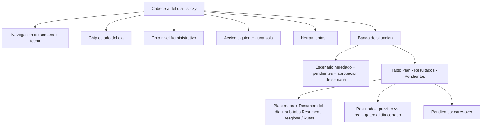

# Layout del Plan del día — contrato de organización de `/optimization`

| Campo | Valor |
|-------|-------|
| **Estado** | Borrador propuesto (2026-09-24) — pendiente de aprobación |
| **Alcance** | Organización interna de la pantalla `/optimization` (Plan del día): zonas, jerarquía de acciones y deduplicación de datos |
| **Código de referencia** | `src/features/optimization/index.tsx` · `OptimizationHeaderChrome.tsx` · `optimizationLayoutUx.ts` |
| **Complementa** | [arquitectura-navegacion.md](./arquitectura-navegacion.md) §4 (pestañas por módulo) y §6 (rutas) |
| **Aprobación** | [ ] Victor Astudillo — fecha: ____ · [ ] Mariana Mora — fecha: ____ |

Documento **fuente de verdad** de la disposición interna de la pantalla del día. Todo cambio de
layout en `/optimization` debe partir de aquí. No cambia rutas ni contratos de API.

## 1. Diagnóstico que motiva este documento

1. **Barra superior sobrecargada:** ~10 controles mezclan navegación temporal, estado, acciones de
   negocio y feedback, sin jerarquía.
2. **Estado del día duplicado en tres sitios:** el texto de la fecha (`optimizationToolbarSummary`
   incluye el estado), el chip de estado y el banner de despacho.
3. **Métricas duplicadas:** «Resumen operativo del día» (`ScenarioInfoCard`) y los *tiles* del plan
   (`summaryTiles`) repiten distancia y duración; los puntos aparecen además en el texto de la fecha.
4. **Acciones de negocio al nivel de la navegación:** Generar, Simular día, Simular contingencia y
   Cerrar día compiten con «semana anterior/siguiente».
5. **Doble navegación:** tabs de primer nivel + sub-tabs + dos *drawers* + menú `⋯`, sin una lógica
   explícita de qué vive dónde.

## 2. IA objetivo

**Zonas**

| Zona | Contenido | Regla |
|------|-----------|-------|
| **Cabecera del día** (sticky) | Navegación de semana, fecha, chip de estado, chip de nivel y **una sola acción siguiente** | Solo acciones primarias; el resto va a Herramientas |
| **Banda de situación** | Escenario heredado del plan semanal, pendientes y estado de aprobación | Una sola banda, encima de los tabs |
| **Tabs** | `Plan` · `Resultados` · `Pendientes` | Máximo 3 destinos de primer nivel |
| **BDC (banda de estado contextual)** | Despacho, cierre, error o aviso | Como máximo una activa a la vez |
| **Herramientas (⋯)** | Simular día (dry-run), Simular contingencia, Reenviar notificación, Exportar PDF, Ver en mapa operativo, Historial, Cerrar día | Acciones secundarias y de consulta |

## 3. Inventario: elemento → zona actual → zona objetivo → acción

| Elemento (archivo / testid) | Zona actual | Zona objetivo | Acción |
|---|---|---|---|
| Navegación de semana `‹ ›`, fecha `optimization-date-trigger` + popover | Cabecera fila 1 | Cabecera fila 1 | Mantener |
| `optimizationToolbarSummary` (texto «… · estado · N pts») | Cabecera fila 1 | Cabecera fila 1 **sin estado** | **Fusionar** (quitar estado) |
| `optimization-status-chip` | Cabecera fila 1 | Cabecera fila 1 (único estado) | Mantener |
| `optimization-level-chip` | Cabecera fila 1 | Cabecera fila 1 | Mantener |
| `optimization-experience-chip` + drawer `OptimizationExperienceStepper` | Cabecera | Cabecera (chip) | Mantener |
| `optimization-generate-route` | Cabecera | Cabecera — **acción siguiente** | Mantener |
| `optimization-cancel-toolbar` | Cabecera | Cabecera (solo durante el job) | Mantener |
| `optimization-monitoring-route` | Cabecera | Cabecera — acción siguiente al despachar | Mantener |
| `optimization-close-day-action` **y** `optimization-menu-close-day` | Cabecera + ⋯ | **Un solo sitio** | **Fusionar** |
| `optimization-contingency-open` + drawer | Cabecera | Herramientas (⋯) | **Mover** |
| `optimization-day-simulation-open` | Cabecera | Herramientas (⋯) | **Mover** |
| `optimization-notify-indicator` | Cabecera | Cabecera como **texto de estado** | Mantener (no botón) |
| `optimization-week-context` + chips aprobada/sin aprobar | Cabecera fila 2 | BDC («semana sin aprobar») | Fusionado |
| `optimization-approval-dialog` (gate) | Cabecera | Acción siguiente / banda | Mantener |
| `daily-scenario-banner` (escenario + pendientes) | Banner | Banda de situación | Mantener |
| `OptimizationContextBand` (error · semana sin aprobar · despacho · cierre) | Banner + Tab Plan | **BDC (única)** | ✅ Fusionado |
| `optimization-contextual-cta` (`closeNotice`) | Tab Plan | BDC | Fusionado |
| Alerta de error (`optimizationState.error`) | Tab Plan | BDC | Fusionado |
| Tabs `plan-day-tabs` (Plan / Resultados / Pendientes) | Navegación | `Plan` · `Resultados` · `Pendientes` | Mantener (implementado) |
| `optimization-page-menu` (⋯) | Navegación | Herramientas | Mantener (agrupa) |
| `ScenarioInfoCard` («Resumen operativo del día») | Tab Plan | **Resumen del día** | **Fusionar** |
| `summaryTiles` (Distancia / Duración / Toneladas / Ahorro) | Sub-tab Resumen | **Resumen del día** | **Fusionar** |
| `OptimizationRouteMap` + playback | Tab Plan | Plan (protagonista) | Mantener |
| Parámetros: `
` (xl) y `OptimizationParametersSheet` | Tab Plan | Plan (secundario; sheet en móvil) | Mantener |
| Sub-tabs `optimization-plan-tabs` (Resumen / Desglose / Rutas) | Sub-navegación | Dentro de `Plan` | Mantener |
| `optimization-comparison-panel` (línea base del turno) | Sub-tab Resumen | Sub-tab Resumen | Mantener |
| `UncoveredPointsActionsPanel` | Sub-tab Resumen | Sub-tab Resumen | Mantener |
| `DurationBreakdownPanel` | Sub-tab Desglose | Sub-tab Desglose | Mantener |
| `optimization-routes-table` | Sub-tab Rutas | Sub-tab Rutas | Mantener |
| `optimization-empty-results` / `optimization-empty-generate` | Tab Plan | Tab Plan | Mantener |
| `optimization-results-*`, `optimization-day-actuals` | Tab Resultados | Resultados (gated) | Mantener |
| `optimization-pending-section`, `pending-management-panel` | Tab Pendientes | Pendientes | Mantener |
| `optimization-close-day-confirm` | Diálogo | Diálogo | Mantener |
| `/optimization/simulation` (`DaySimulationPage`) | Ruta hermana | Sin cambios internos | Mantener |

## 4. Inventario de duplicados (cerrado)

| Dato / acción | Repeticiones hoy | Queda en |
|---|---|---|
| Estado del día | Texto de fecha + chip + banner de despacho | **Chip de estado** (cabecera) |
| Puntos programados | Texto de fecha («N pts») + `ScenarioInfoCard` | **Resumen del día** |
| Distancia / duración | `ScenarioInfoCard` + `summaryTiles` | **Resumen del día** |
| Cerrar día | Cabecera + menú ⋯ | **Un solo sitio** |
| Simular día / contingencia | Cabecera (a la par de la navegación) | **Herramientas (⋯)** |

> Excepción deliberada: el **escenario** aparece dos veces con propósitos distintos — resumen de
> solo lectura (banda de situación) y edición (`OptimizationParametersForm`).

## 5. Reglas

1. **Un solo estado del día** visible: el chip de la cabecera. Ningún otro texto lo repite.
2. **Una sola acción siguiente** primaria, derivada del estado: *sin resultados* → **Generar**;
   *despachado* → **Monitoreo** + **Cerrar día**; *cerrado* → **Ver resultados**.
3. **Cada métrica del día aparece una sola vez**, en la tarjeta «Resumen del día».
4. **Herramientas secundarias** (simular, contingencia, reenviar, PDF, mapa, historial) viven solo en
   el menú **Herramientas (⋯)**.
5. **Máximo 3 destinos de primer nivel** (`Plan` · `Resultados` · `Pendientes`); las sub-tabs solo
   existen dentro de `Plan`.
6. **Como máximo una banda de estado contextual** activa a la vez (BDC).
7. El **despacho es automático**: la UI informa, no despacha con botón primario (ver
   [reglas-navegacion §5](../fase-5/reglas-navegacion.md)).

## 6. Mapeo a fases de implementación

| Fase | Alcance | Reglas que cierra | Estado |
|------|---------|-------------------|--------|
| **B** | Cabecera del día: agrupar, un solo estado, una sola acción siguiente, Herramientas | R1, R2, R4 | ✅ Implementada |
| **C** | Fusionar «Resumen operativo del día» + tiles en una tarjeta | R3 | ✅ Implementada |
| **D** | Tabs definitivos y punto único de drawers | R5 | ✅ Implementada |
| **E** | Banda de estado contextual única | R6 | ✅ Implementada |
| **F** | Responsive y jerarquía del mapa | — | ✅ Implementada |
| **G** | Verificación (e2e/a11y) y actualización de docs | — | ✅ Implementada |

> **Fase B implementada (2026-09-24):** `optimizationToolbarSummary` ya no incluye el estado;
> la cabecera agrupa `‹ ›` + fecha + chip de estado + chip de nivel + chip «sin plan semanal aprobado»;
> una sola acción siguiente (Generar → Monitoreo + Cerrar día → Ver resultados); «Simular día (dry-run)»
> y «Simular contingencia» viven en el menú **⋯**; «Cerrar día» queda solo en la cabecera (sin
> duplicado en ⋯) y el indicador de notificación es texto de estado, no botón.
>
> **Fase C implementada (2026-09-24):** «Resumen operativo del día» (`ScenarioInfoCard`) y los tiles
> del sub-tab Resumen se consolidan en una sola tarjeta **«Resumen del día»**
> (`DaySummaryCard`, `data-testid="optimization-day-summary"`) sobre el mapa, en rejilla de 2
> columnas. Distancia y duración dejan de repetirse; se añaden toneladas y ahorro vs. línea base.
> El sub-tab **Resumen** queda con la línea base del turno y los puntos no cubiertos.
>
> **Fase D implementada (2026-09-24):** tabs definitivos **Plan** · **Resultados** · **Pendientes**
> (se renombra «Planificar día» → **Plan**; el id pasa de `optimize` a `plan`, testid
> `plan-day-tab-plan`). **Decisión (R5):** *Resultados* se mantiene como destino de primer nivel
> **gated** al día cerrado — no pasa a sub-tab — porque es la vista de cierre de jornada y no
> comparte estado con las sub-tabs de `Plan`. Las sub-tabs **Resumen / Desglose / Rutas** viven
> dentro de `Plan`. Cada drawer tiene un único punto de acceso: **Experiencia del día** → chip de la
> cabecera (`optimization-experience-chip`); **Contingencia** → menú **⋯**
> (`optimization-menu-contingency`). No hay disparadores duplicados en los componentes de drawer.
>
> **Fase E implementada (2026-09-24):** los tres avisos dispersos —`OptimizationDispatchBanner`,
> la CTA de cierre (`closeNotice`) y la alerta de error— más el recordatorio de aprobación de
> «Situación del día» y el chip `optimization-week-unapproved-chip` de la cabecera se unifican en
> **`OptimizationContextBand`** (`src/features/optimization/OptimizationDispatchBanner.tsx`),
> resuelta por `resolveOptimizationContextBand` en `optimizationLayoutUx.ts` con prioridad
> **error > semana sin aprobar > despacho > cierre** (una sola banda a la vez, sobre los tabs).
> `DailyScenarioBanner` queda solo como «Situación del día» (escenario + pendientes).
>
> **Fase F implementada (2026-09-24):** en móvil (360–420 px) el **mapa va primero** —la columna
> principal es `flex flex-col` y el mapa/summary usan `order` (`mapa` móvil 1 / xl 2; `Resumen del
> día` móvil 2 / xl 1), con el pulsador de **Parámetros** (hoja) y el estado vacío después—; la
> cabecera (subheader en `Header`, `sticky top-0`) envuelve (`flex-wrap`) y el indicador de
> notificación trunca, para no generar **scroll horizontal**. El mapa conserva altura fluida
> (`h-[min(55vh,420px)] min-h-80 lg:min-h-95`) y la hoja de Parámetros gana `role="dialog"`,
> `aria-modal` y safe-area inferior.
>
> **Fase G implementada (2026-09-24) — cierre del plan.** Verificación en e2e: `daily-planning`
> (tabs **Plan/Resultados/Pendientes**, sin el id legado `optimize`; leyenda `optimization-status-legend`;
> **una sola** banda contextual; en 390 px el mapa va antes que «Resumen del día» y sin scroll
> horizontal), `route-playback` y `day-simulation` (abren el tab **Plan**), y `a11y-planner` (barrido
> base + caso extra con el calendario y su leyenda abiertos). Docs alineados: esta página,
> [arquitectura-navegacion.md](./arquitectura-navegacion.md) §4, `fase-5/reglas-navegacion.md` §5,
> `fase-6/manual-usuario.md` §5 y `fase-b/guion-demo-defensa-10min.md` (bloque 4).
>
> **DoD global** — ≤ 3 destinos de primer nivel (**Plan · Resultados · Pendientes**); cada métrica
> del día aparece una sola vez («Resumen del día»); **una sola banda** de estado a la vez y **una
> sola acción siguiente** por estado; a11y sin violaciones `critical`/`serious`.

## Referencias

- [Arquitectura de navegación](./arquitectura-navegacion.md) — IA de módulos y rutas.
- [Reglas de navegación (Simulación vs operación)](../fase-5/reglas-navegacion.md) — despacho automático, previsto vs real.
- Código: `src/features/optimization/*`, `src/core/stores/optimizationStore.ts`.
